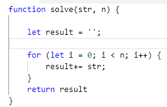
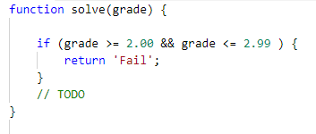
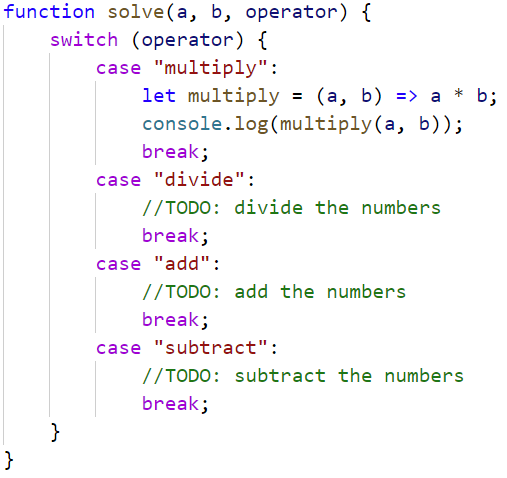
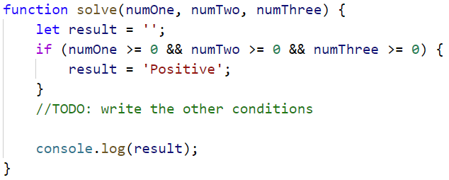

Lab: Functions
=======

Problems for in-class lab for the ["JS Fundamentals" course \@
SoftUni](https://softuni.bg/trainings/2343/js-fundamentals-may-2019). Submit
your solutions in the SoftUni Judge system at
<https://judge.softuni.bg/Contests/1230/Functions-Lab>.

01\. Repeat String
-------------

Write a function that receives a **string** and a **repeat count n**. The
function should return a new string (the old one repeated **n** times).

### Examples

| **Input** | **Output**   |
|-----------|--------------|
| abc 3     | abcabcabc    |
| String 2  | StringString |

### Hints

1.  Firstly create a function and initialize the two parameters.  
    

    

2.  In the main function, print the result.

02\. Grades
------

Write a function that **receives a grade** between **2.00** and **6.00** and
**prints** the corresponding grade in **words**

-   2.00 - 2.99 - "**Fail**"

-   3.00 - 3.49 - "**Poor**"

-   3.50 - 4.49 - "**Good**"

-   4.50 - 5.49 - "**Very good**"

-   5.50 - 6.00 - "**Excellent**"

### Examples

| **Input** | **Output** |
|-----------|------------|
| 3.33      | Poor       |
| 4.50      | Very good  |
| 2.99      | Fail       |

### Hints 

03\. Math Power
----------

Write a function that **calculates** and **returns** the value of a number
**raised** to a **given power**:

### Examples

| **Input** | **Output** |
|-----------|------------|
| 2 8       | 256        |
| 3 4       | 81         |

### Hints

-   Create a function which will have **two parameters** - the **number** and
    the **power**, and will **return** a **result**.

-   **Print** the result.

04\. Orders
------

Write a function that calculates the **total price** of an order and prints it
on the console. The function should receive one of the following products:
**coffee, coke, water, snacks**; and a **quantity** of the product. The
**prices** for a single piece of each product are:

-   coffee - 1.50

-   water - 1.00

-   coke - 1.40

-   snacks - 2.00

Print the result **formatted** to the **second decimal place**.

### Example

| **Input** | **Output** |
|-----------|------------|
| water 5   | 5.00       |
| coffee 2  | 3.00       |

### Hints

-   Create a function and pass the two variables in.

-   Print the result in the method.

05\. Simple Calculator
---------------------

Write a function that receives **three parameters** and write an **arrow
function** that calculate result depending of operator. Operator can be **'multiply'**, **'divide'**, **'add'**, **'subtract'**.

### Input

The input comes as parameters named **numOne, numTwo, operator**.

### Examples

| **Input**        | **Output** |
|------------------|------------|
| 5 5 'multiply'   | 25         |
| 40 8 'divide'    | 5          |
| 12 19 'add'      | 31         |
| 50 13 'subtract' | 37         |

### Hints

-   Use **switch** statements for the different operators.

    

06\. Wrong Result
------------

You are given a function, that calculate the result of **numOne \* numTwo \* numThree** (the product) is **negative** or **positive**.

Try to do this **WITHOUT** multiplying the 3 numbers.

The input comes as parameters named **numOne, numTwo, numThree**.

### Example

| **Input**  | **Output** |
|------------|------------|
| 5 12 -15   | Negative   |
| \-6 -12 14 | Positive   |
| \-1 -2 -3  | Negative   |
| \-1 0 1    | Positive   |

### Hints

-   Check all the different variantions for the three numbers.

