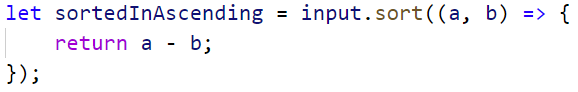
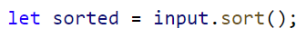
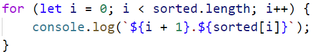
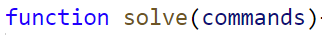
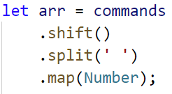
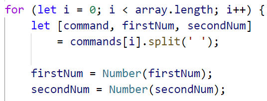
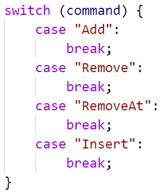
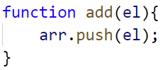
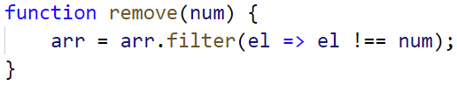
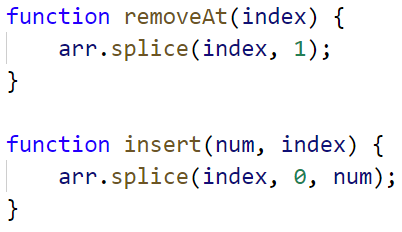

Lab: Arrays Advanced
===========

Problems for in-class lab for the ["JS Fundamentals" course \@
SoftUni](https://softuni.bg/trainings/2343/js-fundamentals-may-2019).

Submit your solutions in the SoftUni judge system at:
[Arrays-Advanced-Lab](https://judge.softuni.bg/Contests/1254/Arrays-Advanced-Lab)

01\. Sum First Last
--------------

Write a function that calculates and prints the **sum** of the **first** and the **last** elements in an array.

The **input** comes as array of string elements holding numbers.

The **output** is the return value of your function.

### Examples

| **Input**          | **Output** |   | **Input**   | **Output** |
|--------------------|------------|---|-------------|------------|
| ['20', '30', '40'] | 60         |   | ['5', '10'] | 15         |

02\. Negative / Positive Numbers
----------

Write a function that processes the elements in an **array** one by one and
produces a **new** array. **Prepend** each **negative** element at the front of
the result and **append** each **positive** (or **0**) element at the end of the result.

The **input** comes as array of number elements.

The **output** is printed on the console, each element on a new line.

**Examples**

| **Input**     | **Output** |   | **Input**      | **Output** |
|---------------|------------|---|----------------|------------|
| [7, -2, 8, 9] | \-2 7 8 9  |   | [3, -2, 0, -1] | \-1 -2 3 0 |

**Hints**

-   Use **unshift()** to add an element at the **first** position

-   Use **push()** to add an element at the **last** position

03\. First and Last K Numbers
----------------

Write a function that prints the first **k** and the last **k** elements from an **array of numbers**.

The **input** comes as **array of number** elements. The first element
represents the number **k**, all other elements are from the array that needs to be processed.

The **output** is printed on the console on two lines. On the first line print
the **first k** elements, separated by space. On the second line print the
**last k** elements, separated by space.

**Examples**

| **Input**        | **Output** |   | **Input**           | **Output**  |
|------------------|------------|---|---------------------|-------------|
| [**2**, 7, 8, 9] | 7 8 8 9    |   | [**3**, 6, 7, 8, 9] | 6 7 8 7 8 9 |

### Hints

-   Use **slice()** to split the array into two parts

04\. Last K Numbers Sequence
-------------

You are given two integers **n** and **k**. Write a function that generates and
prints the following sequence:

-   The first element is **1.**

-   Every following element equals the sum of the previous **k** elements.

-   The length of the sequence is **n** elements.

The **input** comes as two number arguments. The first element represents the
number **n**, and the second – the number **k**.

The **output** is printed on the console on a single line, separated by space.

**Examples**

| **Input** | **Output**   |   | **Input** | **Output**        |
|-----------|--------------|---|-----------|-------------------|
| 6, 3      | 1 1 2 4 7 13 |   | 8, 2      | 1 1 2 3 5 8 13 21 |

### Hints

The 2nd element (1) is the sum of the 3 elements before it, but there is only 1,
so we take that. The third element, is the sum of the first 2 (1 and 1) and the
4th – the sum of 1, 1 and 2. The 5th element is the sum of the 2nd, 3rd and 4th
(1, 2 and 4) and so on.

05\. Process Odd Numbers
------------

You are given an **array of numbers**. Write a function that prints the elements
at **odd positions** from the array, **doubled** and in **reverse** order.

The **input** comes as array of number elements.

The **output** is printed on the console on a single line, separated by space.

**Examples**

| **Input**        | **Output** |   | **Input**           | **Output** |
|------------------|------------|---|---------------------|------------|
| [10, 15, 20, 25] | 50 30      |   | [3, 0, 10, 4, 7, 3] | 6 8 0      |

### Hints

-   Counting in arrays starts from 0

-   For example –we receive 10, 15, 20, 25

-   The elements at odd positions are 15 (index 1) and 25 (index 3)

-   We need to take these two elements and multiply them \* 2

-   Finally, we print them on the console in reversed order

06\. Smallest Two Numbers
----------

Write a function that prints the **two smallest** elements from an **array of numbers**.

The **input** comes as array of number elements.

The **output** is printed on the console on a single line, separated by space.

**Examples**

| **Input**       | **Output** |   | **Input**           | **Output** |
|-----------------|------------|---|---------------------|------------|
| [30, 15, 50, 5] | 5 15       |   | [3, 0, 10, 4, 7, 3] | 0 3        |

### Hints

-   You can use the following function to sort the numbers in the array:

-   Afterwards the **first two** elements in the array are the **smallest**

-   You can use **slice()** to take the first two numbers

07\. List of Products
------------

You will receive an **array of products**. Print a **numbered array** of all the products **ordered by name**.

**Example**

| **Input**                                    | **Output**                              |
|----------------------------------------------|-----------------------------------------|
| ["Potatoes", "Tomatoes", "Onions", "Apples"] | 1.Apples 2.Onions 3.Potatoes 4.Tomatoes |

**Hints**

-   The **sort function** rearranges the array in ascending order

-   Finally, we have to **print our sorted** array. To do that we **loop through
    the array**

-   We use **i + 1**, because we want to **start counting from 1**

08\. Array Manipulations
-----------

Write a function that manipulates an **array of numbers**.

-   **Add {number}:** add a number to the **end** of the array

-   **Remove {number}:** remove number from the array

-   **RemoveAt {index}:** removes number at a **given index**

-   **Insert {number} {index}:** inserts a number at a **given index**

**Note: All the indices will be valid!**

Print the final state of the array (**separated by single space**).

The **input** comes as **array of strings**. First element will be a string
containing the **array to manipulate**. Every other **command** you receive will
also be a string.

The **output** is the manipulated array printed on the console on a single line,
**separated by space**.

**Example**

| **Input**                                                           | **Output**    |
|---------------------------------------------------------------------|---------------|
| ['4 19 2 53 6 43', 'Add 3', 'Remove 2', 'RemoveAt 1', 'Insert 8 3'] | 4 53 6 8 43 3 |

**Hints**

First we receive the whole input:

-   After that we take the **first** element from the commands and **convert**
    it to an **array of numbers**:

-   Then we loop through the commands array and obtain **each element** from the
    command and cast both numbers. This event is called
    [destructuring](https://developer.mozilla.org/en-US/docs/Web/JavaScript/Reference/Operators/Destructuring_assignment):

-   We check if the command is equal to one of the given: "**Add**",
    "**Remove**", etc.

    

-   To add element at the end, use **push()**

-   To remove **all occurrences** of a particular element from the array, you
    can use **filter()**

-   To remove or insert at an index, you can use **splice()**

**Note:** Removing elements with **splice()** receives two parameters:

-   Start Index

-   Count of elements you want to remove

**Note:** Inserting elements with **splice()** receives three parameters:

-   Start Index

-   Count of elements to remove – if none enter 0

-   Elements to insert at that position
