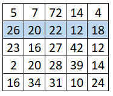
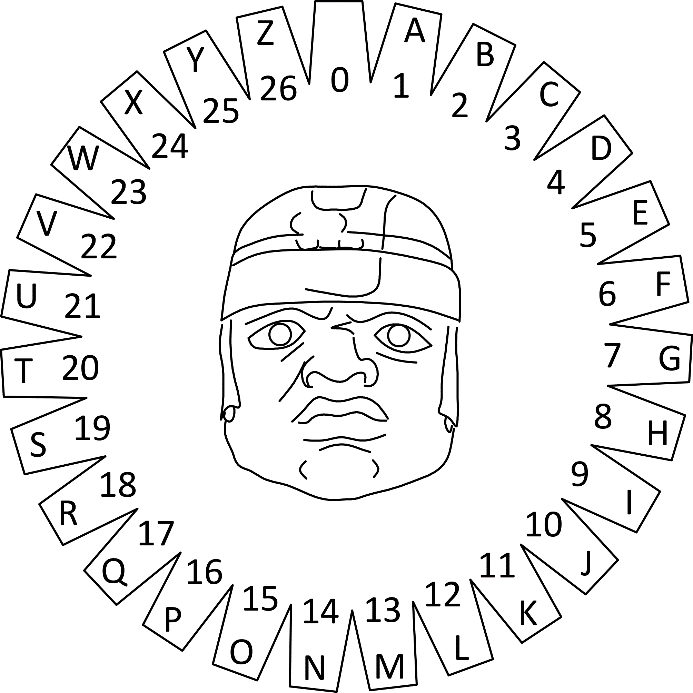

More Exercises: Advanced Arrays
===============================

Problems for exercises and homework for the ["JS Fundamentals" course \@
SoftUni](https://softuni.bg/trainings/2343/js-fundamentals-may-2019).

You can check your solutions here:
[Arrays-Advanced-More-Exercises](https://judge.softuni.bg/Contests/1301/Arrays-Advanced-More-Exercises)

01\. Equal Neighbors
---------------

Write a function that finds the number of equal neighbor pairs inside a matrix
of variable size and type (numbers or strings).

The **input** comes as **array of arrays**, containing string elements (2D
matrix of strings).

The **output** is return **value** of you function. Save the number of equal
pairs you find and return it.

**Examples**

| **Input**                                                                                                    | **Output** |   | **Input**                                                                               | **Output** |
|--------------------------------------------------------------------------------------------------------------|------------|---|-----------------------------------------------------------------------------------------|------------|
| [['2', '3', '4', '7', '0'], ['4', '0', '5', '3', '4'], ['2', '3', '5', '4', '2'], ['9', '8', '7', '5', '4']] | 1          |   | [['test', 'yes', 'yo', 'ho'], ['well', 'done', 'yo', '6'], ['not', 'done', 'yet', '5']] | 2          |

02\. Bunny Kill
----------

*In the underground world of bunnies, mafia and corruption have taken over.
Snowball is on a mission to infiltrate a certain deserted military hanger,
supposedly filled with convict bunnies.*

You will be given a **matrix** of integers, each integer separated by a **single
space**, and each row on a new line, which will represent the current situation
in the hangar. Then on the last line of input you will receive indexes -
**coordinates** to several cells in the hangar separated by a **single space**,
in the following format: **row1,column1 row2,column2 row3,column3…**  
On those cells there are bunnies with **bombs**. Snowball is smart and knows
that the bombs are an easy way to neutralize enemies, especially when they are
the enemy’s own bombs.

Snowball will proceed to eliminate **every bunny with a bomb**, one by one in
the order they were given. When a bunny with a bomb is killed, it **explodes**
and deals damage **equal** to its **own integer value**, to **all** the cells
**around** it (in every direction and in all diagonals). If a bomb bunny is
caught in the explosion and killed, that bomb is no longer valid and will **not
explode**. When a bunny is damaged, it **reduces** its integer value by the
**damage** value. When a bunny’s value reaches **0**, **it dies**. When a bunny
explodes, **it dies**.

When Snowball is done with all the bomb bunnies, he will proceed to kill any
other convict bunny which has remained **alive**. You must count all the
**damage** Snowball did in the hangar. Note that bomb explosion damage **does
not** count as Snowballs damage, but the killing of bomb bunnies and other
bunnies **DOES.** Snowball’s damage for every bunny is equal to the bunny at
that cell’s **integer value**.

### Input

-   The input data is passed to the first function found in your code as an
    **array of strings**.

-   Each entry in the array represents a row of the matrix, in the form of
    integers separated by a space.

-   On the last line you will receive the coordinates of the cells with the bomb
    bunnies.

### Output

-   On the first line you need to print Snowball’s **damage**.

-   On the second line you need to print the amount of bunnies **HE** killed.

### Constraints

-   The size of the matrix will be between **[0…1000].**

-   The coordinates to the bomb bunnies will **always** be in the matrix.

-   The integers of the matrix will be in range **[0…10000].**

-   Allowed time/memory: 250ms/16MB

### Examples

| **Input**                                                              | **Output** | **Comments**                                                                                                                                                                                                                                                                                                                                                                                                                       |
|------------------------------------------------------------------------|------------|------------------------------------------------------------------------------------------------------------------------------------------------------------------------------------------------------------------------------------------------------------------------------------------------------------------------------------------------------------------------------------------------------------------------------------|
| ['10 10 10', '10 10 10', '10 10 10', '0,0']                            | 60 6       | The blue number represents a bunny which is a bomb. The red numbers are bunnies which have been hit by the exploding bunny. Since the exploding bunny has a value of 10, all the damaged bunnies suffer 10 damage. Since their values are also 10, the explosion kills them and they are no longer valid targets for Snowball. So in total Snowball deals 60 dmg (the 5 untargeted bunnies + the exploding one) and kills 6 units. |
| **Input**                                                              | **Output** | **Comments**                                                                                                                                                                                                                                                                                                                                                                                                                       |
| ['5 10 15 20', '10 10 10 10', '10 15 10 10', '10 10 10 10', '2,2 0,1'] | 70 7       | Here the purple bunnies are caught in the explosion, but since their values are bigger than the exploding bunny’s value – they don’t die and are left for Snowball to kill. The damage Snowball deals here is 10 + 10 + 5 + 20 + 10 + 5 + 10 = 70. The values for the bunnies who survived the explosion are 5 because the explosion reduced their initial values 15 (initial) – 10 (exploding bunny) = 5                          |

03\. Air Pollution
-------------

Write a program that tracks the **pollution in the air** above Sofia. You will
receive **two arguments** – the **first** is the **map** of Sofia represented by
a **matrix of numbers** and the second is an **array of strings** representing
the **forces affecting** the **air quality**. The **map** will **always** be
with **5 rows** and **5 columns** in **total of 25 elements - blocks**. Each
block’s particle pollution (PM) is **affected** by **3 forces** received in the
following formats:

-   **"breeze {index}" –** index is **the row** where **all column’s value
    drops** by **15** PM

-   **"gale {index}" –** index is **the column in all rows** where **value
    drops** by **20** PM

-   **"smog {value}" – all blocks** in the map **increase** equally by **the
    given value’s** PM

The threshold in each block is **50** PM. If it is **below that number**, the
block’s air is considered **normal** but if it **reaches or goes over it,** that
block’s air is considered **polluted**. Also note that the **polluted
particles** in a block **cannot go below zero**.

Finally, your program needs to **find** if there are **any polluted blocks** and
**print them** in the format given below.

**Input**

You will receive **two arguments**:

-   The **first** argument is an **array with five strings** – **rows** of the
    matrix with **columns separated by space** that must be parsed as
    **numbers**, representing the **map of Sofia**.

-   The **second** argument is an **array of strings** – each **string**
    consists of one of the **words (breeze/gale/smog)** and a **number separated
    by space**, representing the **different forces**.

**Output**

Print on the **console** a **single line**:

-   If there are **polluted blocks** in the map, **use** their **coordinates**
    in the following format:

-   **"[{rowIndex}-{columnIndex}]"**

Note that you must **start** from the **top left corner** of the map moving
to the **bottom right corner horizontally**. Then **separate** each
**formatted block’s coordinates** with **comma and space** and print them in
a single line in the following format:

-   **"Polluted areas: {block1}, {block2}, {block3}, …"**

-   If there are **no polluted blocks** in the map print:

-   **"No polluted areas"**

**Constraints**

-   The **number** of **rows** and **columns** for the **matrix** will
    **always** be **5**

-   The **number** in each block will be an **integer** in range **[0..1000]
    inclusive**

-   The **number** of **elements** in the **second input argument** will be in
    range **[0..100] inclusive**

-   Given **smog’s value** will be an **integer** in range **[0..100]
    inclusive**

-   Given **indexes** will **always** be **valid**

**Examples**

| **Input**                                                                                                                 | **Output**                                        |
|---------------------------------------------------------------------------------------------------------------------------|---------------------------------------------------|
| ["5 7 72 14 4", "41 35 37 27 33", "23 16 27 42 12", "2 20 28 39 14", "16 34 31 10 24"], ["breeze 1", "gale 2", "smog 25"] | Polluted areas: [0-2], [1-0], [2-3], [3-3], [4-1] |

**Explanation**

Graphic diagram explaining the **first example’s** program flow:

| **Input**                                                                                                                         | **Output**                                               |
|-----------------------------------------------------------------------------------------------------------------------------------|----------------------------------------------------------|
| ["5 7 3 28 32", "41 12 49 30 33", "3 16 20 42 12", "2 20 10 39 14", "7 34 4 27 24"], [ "smog 11", "gale 3", "breeze 1", "smog 2"] | No polluted areas                                        |
| **Input**                                                                                                                         | **Output**                                               |
| ["5 7 2 14 4", "21 14 2 5 3", "3 16 7 42 12", "2 20 8 39 14", "7 34 1 10 24"], ["breeze 1", "gale 2", "smog 35"]                  | Polluted areas: [2-1], [2-3], [3-1], [3-3], [4-1], [4-4] |

05\. Jan's Notation
--------------

Write a program that parses a series of instructions written in **postfix
notation** and executes them (postfix means the operator is written **after**
the operands). You will receive a **series of instructions** – if the
instruction is a **number**, **save it**; otherwise, the instruction is an
**arithmetic operator** (**+-\*/**) and you must apply it to the most two **most
recently saved** numbers. **Discard** these two numbers and in their place,
**save the result** of the operation – this number is now eligible to be an
**operand** in a subsequent operation. Keep going until all input instructions
have been exhausted, or you encounter an **error**.

In the end, if you’re left with a **single saved number**, this is the
**result** of the calculation and you must **print** it. If there are more
numbers saved, then the user supplied **too many instructions** and you must
print "**Error: too many operands!**". If at any point during the calculation
you **don’t have** two number saved, the user supplied **too few instructions**
and you must print "**Error: not enough operands!**". *See the examples for more
details.*

**Input**

You will receive an array with numbers **and** strings – the numbers will be
**operands** and must be saved; the strings will be **arithmetic operators**
that must be applied to the operands.

**Output**

Print on the **console** on a single line the **final result** of the
calculation or an **error message**, as instructed above.

**Constraints**

-   The **numbers** (operands) will be integers

-   The **strings** (operators) will always be one of **+-\*/**

-   The result of each operation will be in range [-253…253-1]
    (**MAX_SAFE_INTEGER** will **never** be exceeded)

**Examples**

| **Input** | **Output** | **Explanation** |
|-----------------------|---------------------------|------------------------------------------------------------------------------------------------------------------------------------------------------------------------------------------------------------------------------------------------------------------------------------------------------------------------------------------------------------------------------------------------------------------------------------------------------------------------------------------------------------------------------|
| [3, 4, '+'] | 7 | The first instruction is a **number**, therefor we **save** it. The next one is also a **number**, we **save** it too. The third instruction is a **string**, so it must be an **operator** – we **remove the last two** numbers we saved, and perform the operation: **3+4=7**. The result of this operation is then **saved** where the two operands **used to be**. We’ve ran out of instructions, so we check the saved values – we only have **one**, so this must be **final result**. We **print** it on the console. |
| [5, 3, 4, '\*', '-'] | \-7 | We save in order **5**, **3** and **4**. The result of the operation **3\*4** is **12**, which we **save in place** of **3** and **4**. Currently we have **5** and **12** saved. The result of the operation **5-12** is **-7**, which we **save in place** of **5** and **12**. We have no more instructions and **only one** value saved, which we **print**. |
| **Input** | **Output** |  |
| [7, 33, 8, '-'] | Error: too many operands! |  |
| **Input** | **Output** | **Explanation** |
| [31, 2, '+', 11, '/'] | 3 | **(31+2)/11** |

06\. Rosetta Stone
-------------

You will be given an **encoded message** and a **template matrix** for
**decoding** it. The decoding is done by overlaying the template on top of the
stone with the message and performing an **arithmetic operation** with the
numbers that overlap. Each pair of numbers (one from the message and one from
the template matrix) is **added** together and the resulting number is located
on the wheel of letters (pictured to the

right), by counting from the beginning (**zero**) and going **clockwise**. You
may count **more than one full revolution** around the wheel (e.g. 6 is the same
as 33 and so on). Repeat this process for all symbols of the message.

If the decoding template matrix is **smaller** than the message, **shift the
template horizontally** by as many cells as it is wide, so it covers the next
section of the message (see example). Once you reach the last column of the
message matrix, if there are more rows left, **shift** the template back to the
**first column**, but **offset it vertically** by as many cells as it is high.
See the example’s explanation for more information.

**Input**

You will receive an **array of strings**. The first element represents a number
**n**, which is the length of the **template matrix** for decoding. The next
**n** elements represent rows in the decoding template matrix, with columns
**separated by space**. The rest of the elements are all rows of the **encoded
message matrix**, with columns in each row **separated by space**.

**Output**

Print the decoded message in **uppercase** on a single line on the **console**.
The final message is joined from all resulting cells, starting from **top
left**, going right, **row by row**. Trailing spaces are **ignored**.

### Examples

| **Input**                                                                                                | **Output**               |
|----------------------------------------------------------------------------------------------------------|--------------------------|
| [ '2', '59 36', '82 52', '4 18 25 19 8', '4 2 8 2 18', '23 14 22 0 22', '2 17 13 19 20', '0 9 0 22 22' ] | I CAME I SAW I CONQUERED |