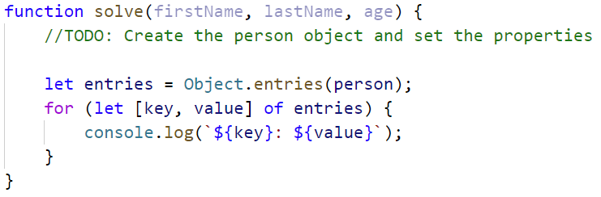
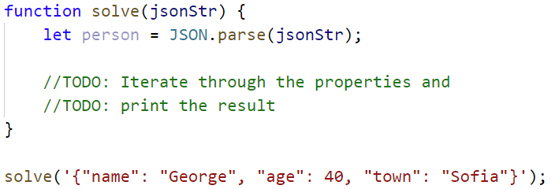
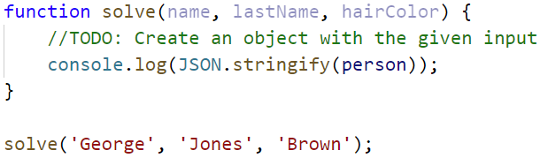
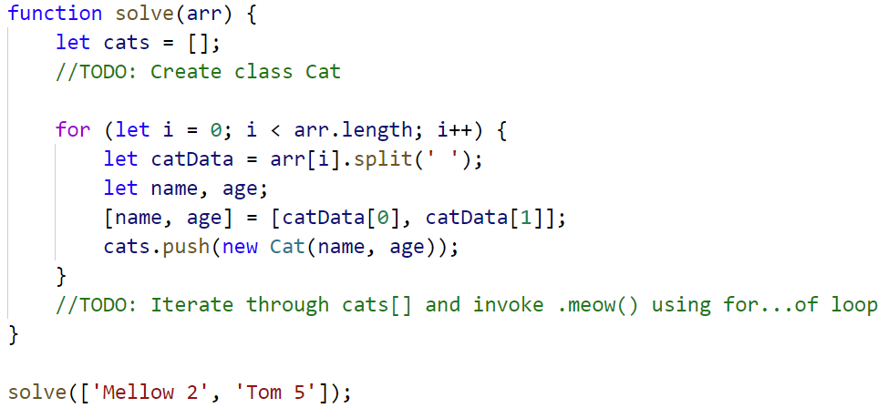
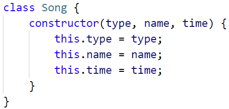
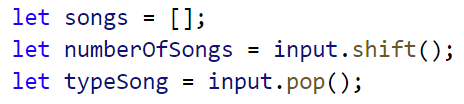
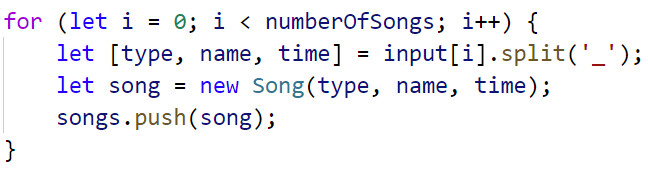
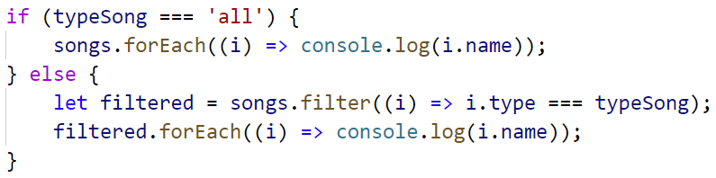

Lab: Objects and Classes
========================

Problems for in-class lab for the ["JS Fundamentals" course \@
SoftUni](https://softuni.bg/trainings/2343/js-fundamentals-may-2019).

Submit your solutions in the SoftUni judge system at:
[Objects-and-Classes-Lab](https://judge.softuni.bg/Contests/1323/Objects-and-Classes-Lab)

01\. Person Info
-----------

Write a function that receives **3 parameters**, sets them to an **object** and
prints the object's entries.

The input comes as **3 separate strings** in the following order: **firstName**, **lastName**, **age**.

### Examples

| **Input**          | **Output**                             |
|--------------------|----------------------------------------|
| "Peter",           | firstName: Peter lastName: Pan age: 20 |
| "Pan",             |                                        |
| "20"               |                                        |

### Hints

02\. City
----

Receive **five single strings**.

Create a **city object** which will hold the city **name**, **area**,
**population**, **country** and **postcode**.

Loop through all the **keys** and print them with their **values** in format:
"**{key} -\> {value}**"

The input will be in the following order: **name**, **area**, **population**,
**country** and **postCode**.

See the examples below.

### Examples

| **Input**                                     | **Output**                                                                                |
|-----------------------------------------------|-------------------------------------------------------------------------------------------|
| "Sofia"," 492", "1238438", "Bulgaria", "1000" | name -\> Sofia area -\> 492 population -\> 1238438 country -\> Bulgaria postCode -\> 1000 |

03\. Convert to Object
-----------------

Write a function that receives a **string** in **JSON format** and converts it to **object**.

Loop through all the keys and print them with their values in format: "**{key}: {value}**"

### Examples

| **Input**                                        | **Output**                       |
|--------------------------------------------------|----------------------------------|
| '{"name": "George", "age": 40, "town": "Sofia"}' | name: George age: 40 town: Sofia |

### Hints

-   Use **JSON.parse()** method to parse JSON string to an object

04\. Convert to JSON
---------------

Write a function that receives name, lastName, hairColor and sets them to an object.

Convert the **object** to **JSON string** and print it.

Input is provided as **3 single strings** in the order stated above.

### Examples

| **Input**                  | **Output**                                               |
|----------------------------|----------------------------------------------------------|
| 'George', 'Jones', 'Brown' | {"name":"George",                                        |
|                            | "lastName":"Jones",                                      |
|                            | "hairColor":"Brown"}                                     |

### Hints

-   Use **JSON.stringify()** to parse the object to JSON string

05\. Cats
----

Write a function that receives **array** of strings in the following format **'{cat name} {age}'**.

Create a **Cat class** that receives in the **constructor** the **name** and the
**age** parsed from the input.

It should also have a function named **"meow"** that will print **"{cat name},
age {age} says Meow"** on the console.

For each of the strings provided you must **create a cat object.**

### Examples

| **Input**             | **Output**                                   |
|-----------------------|----------------------------------------------|
| ['Mellow 2', 'Tom 5'] | Mellow, age 2 says Meow Tom, age 5 says Meow |

### Hints

-   Create a Cat class with properties and methods described above

-   Parse the input data

-   Create all objects using class constructor and the parsed input data, store
    them in an array

-   Loop through the array using **for…of** cycle and **invoke .meow()** method

06\. Songs
-----

Define a **class Song**, which holds the following information about songs:
**typeList**, **name** and **time**.

You will receive the input as an **array**.

The first element **n** will be the number of songs. Next **n** elements will be
the songs data in the following format: **"{typeList}_{name}_{time}"**, and the
the last element will be **Type List** / **"all".**

Print only the **names of the songs** which are from that **Type List** / **All songs**.

**Examples**

| **Input**                                                                                                                                  | **Output**                    |
|--------------------------------------------------------------------------------------------------------------------------------------------|-------------------------------|
| [3, 'favourite_DownTown_3:14', 'favourite_Kiss_4:16', 'favourite_Smooth Criminal_4:01', 'favourite']                                       | DownTown Kiss Smooth Criminal |
| [4, 'favourite_DownTown_3:14', 'listenLater_Andalouse_3:24', 'favourite_In To The Night_3:58', 'favourite_Live It Up_3:48', 'listenLater'] | Andalouse                     |
| [2, 'like_Replay_3:15', 'ban_Photoshop_3:48', 'all']                                                                                       | Replay Photoshop              |

### Solution:

Create a Song class with properties described above

Create new array , where you will store songs

Iterate over the songs:

