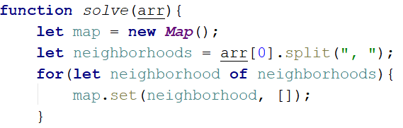

Lab: Associative Arrays
========================

Problems for in-class lab for the ["JS Fundamentals" course \@
SoftUni](https://softuni.bg/trainings/2343/js-fundamentals-may-2019).  
Submit your solutions in the SoftUni judge system at: [Associative-Arrays
-Lab](https://judge.softuni.bg/Contests/1231/)

01\. Phone Book
----------

Write a function that stores information about a **person’s name** and his
**phone number**. The input comes as an **array of strings**. Each string
contains the name and the number. If you receive the same name **twice** just
**replace** the number. At the end print the result **without sorting it**. Try using an **associative array.**

### Example

| **Input**                                                                   | **Output**                                                  |
|-----------------------------------------------------------------------------|-------------------------------------------------------------|
| ['Tim 0834212554', 'Peter 0877547887', 'Bill 0896543112', 'Tim 0876566344'] | Tim -\> 0876566344 Peter -\> 0877547887 Bill -\> 0896543112 |

02\. Storage
-------

Write a function that takes a certain number of **items** and their
**quantity**. If the same item appears **more than once**, **add the new
amount** to the **existing one**. At the end print all the items and their
amount without sorting them. The input comes as **array of strings**. Try using a **Map()**.

### Example

| **Input**                                              | **Output**                                   |
|--------------------------------------------------------|----------------------------------------------|
| ['tomatoes 10', 'coffee 5', 'olives 100', 'coffee 40'] | tomatoes -\> 10 coffee -\> 45 olives -\> 100 |

### Hints

Create the **solve()** function and create a new **Map()**:

Loop through the array, split into tokens and create variables for each one:

-   This time for the quantity we need a number, because if we see the same
    product again, we must add the new quantity

Now let us make the checks for the keys in the map:

-   First, we check if the map does *NOT* have the product we are currently at
    and **if so**, we **set it to the given quantity**

-   Otherwise, we get the **existing quantity**, we **add the new quantity** and
    **set** the product’s quantity **to the new** one

Now we just have to print the result:

-   Each key-value pair is and **array of 2 elements** (the **key** and the
    **value**), so we use **for-of** loop and print the key and the value

03\. School Grades
-------------

Write a function to store students with all of their grades. If a student
appears more than once, add the new grades. At the end print the students sorted
by average grade. The input comes as **array of strings**.

### Example

| **Input**                                              | **Output**                                       |
|--------------------------------------------------------|--------------------------------------------------|
| ['Lilly 4 6 6 5', 'Tim 5 6', 'Tammy 2 4 3', 'Tim 6 6'] | Tammy: 2, 4, 3 Lilly: 4, 6, 6, 5 Tim: 5, 6, 6, 6 |

### Hints

Create the function, pass in the array, **split** each element into tokens,
**extract** the **name** and the **grades**:

-   The **grades** should be **numbers** (because we want to take the
    **average** later), so we map them to **Number**

Now check if the map does *NOT* have the name and if so, **set it to an empty
array** and **push all the grades**. Otherwise just **push the grades**:

-   If we **don’t have** the name, we need to **create it** and **concatenate
    [concat()]** the empty array and the new one

-   Otherwise, we just **concat()**them

Now we have to sort them by average grades:

Of course, there is no such function average, so we need to create it.

-   **a** and **b** are two key-value pairs of our map. The grades are the
    values.

-   For us to calculate average we need to take the sum and divide it by the
    length of each array

Finally, we return **aAverage** – **bAverage**:

We sorted the map, now loop through the keys and values and print them in the
format from the example.

04\. Word Occurrences
----------------

Write a function that **counts** the times each **word occurs** in a text. Print
the words **sorted by count** in **descending** order. The input comes as an
**array of strings**.

### Example

| **Input**                                                                                                                     | **Output**                                                                                                                                                       |
|-------------------------------------------------------------------------------------------------------------------------------|------------------------------------------------------------------------------------------------------------------------------------------------------------------|
| ["Here", "is", "the", "first", "sentence", "Here", "is", "another", "sentence", "And", "finally", "the", "third", "sentence"] | sentence -\> 3 times Here -\> 2 times is -\> 2 times the -\> 2 times first -\> 1 times another -\> 1 times And -\> 1 times finally -\> 1 times third -\> 1 times |

### Hint

-   Create a map

-   Loop through the elements of the array of words

-   Update the map

-   Sort the map by value in descending:

-   Finally, print the result in format as the example above

05\. Neighborhoods
-------------

Write a function that receives **list of neighborhoods** and then some
**people**, who are going to live in it. The **input** will come as **array of
strings**. The **first element** will be the list of neighborhoods **separated**
by **", "**. The rest of the element**s** will be a neighborhood followed by a
**name** of a person in the format **"{neighborhood} - {person}"**. **Add** the
person to the neighborhood **only** if the neighborhood is in the **list** of
neighborhoods. At the end print the neighborhoods **sorted** by the count of
inhabitants in descending order. Print them in the following format:

"{neighborhood}: {inhabitants count}

\--{1st inhabitant}

\--{2nd inhabitant}

…"

### Example

| **Input**                                                                                                                                     | **Output**                                                               |
|-----------------------------------------------------------------------------------------------------------------------------------------------|--------------------------------------------------------------------------|
| ['Abbey Street, Herald Street, Bright Mews', 'Bright Mews - Garry', 'Bright Mews - Andrea', 'Invalid Street - Tommy', 'Abbey Street - Billy'] | Bright Mews: 2 --Garry --Andrea Abbey Street: 1 --Billy Herald Street: 0 |

### Hints

-   **Save** the first element of the array as the neighborhoods

-   **Fill** the map with them and set their values as empty arrays

-   **Loop** through the rest of the elements

-   **Check** if the neighborhood is in the list/map and add the person

-   **Sort** them by count of inhabitants

-   **Print**

-   *NOTE:* The count of the people is the length of the second element in both
    **a** and **b.** To sort in descending, just **subtract** the length of
    **a** inhabitance from the length of the **b** inhabitants.
