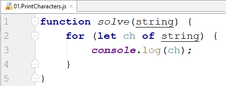
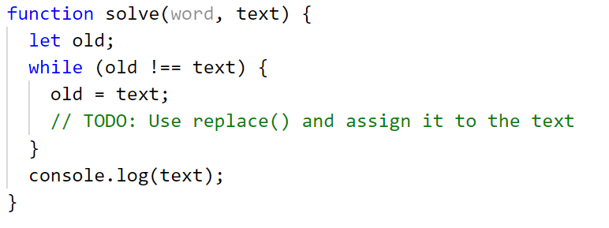
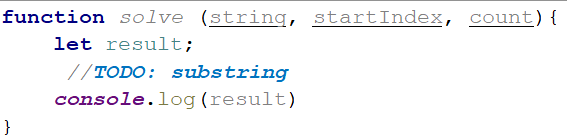
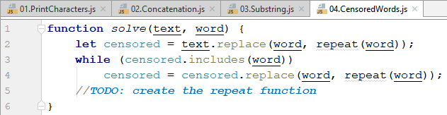
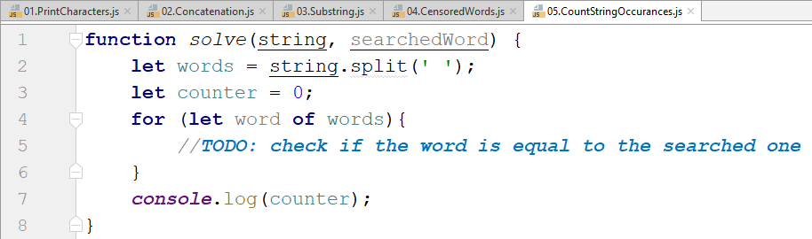

Lab: Text Processing
====================

Problems for in-class lab for the ["JS Fundamentals" course \@
SoftUni](https://softuni.bg/trainings/2343/js-fundamentals-may-2019). Submit
your solutions in the SoftUni Judge system at:
*Text-*[Processing](https://judge.softuni.bg/Contests/1705)

01\. Print Characters
----------------

Write a function that **receives a string** and **prints all the characters** on
separate lines.

### Input / Output

| **Input** | **Output** |
|-----------|------------|
| 'AWord'   | A W o r d  |

### Hints

Loop through the string and print each character.

02\. Remove Occurrences
------------------

Write a function that receives a **text** and a **word** to remove **all
occurrences** of it inside the text.

### Input / Output

| **Input**        | **Output** |
|------------------|------------|
| ice kicegiciceeb | kgb        |

### Hints

Replace the occurrence of the word inside a **while loop** and use
**replace().**

03\. Substring
---------

Write a function that **receives a string** and **two numbers**. The numbers
will be a **starting index** and **count** of elements to substring. Print the
result.

### Input / Output

| **Input**         | **Output** |
|-------------------|------------|
| "ASentance", 1, 8 | Sentance   |

### Hints

Create a new string that takes the needed amount of elements from the given
string.

04\. Censored Words
--------------

Write a function that **receives a text as** a first parameter and a **single
word** as a second. Find **all occurrences** of that word in the text and
replace them with the corresponding count of '\*'.

### Input / Output

| **Input**                                   | **Output**                            |
|---------------------------------------------|---------------------------------------|
| "A small sentence with some words", "small" | A \*\*\*\*\* sentence with some words |

### Hints

Save the new text in a new variable.

The **repeat()** function should take the length of the word and return that
amount of stars '\*'.

05\. Count String Occurrences
------------------------

Write a function that **receives a text** and a **string that you need to
search**. Print all the occurrences of that word in the string.

### Input / Output

| **Input**                                        | **Output** |
|--------------------------------------------------|------------|
| "This is a word and it also is a sentence", "is" | 2          |

### Hints

Split the sentence into words and create a **counter** that stores how many
times the searched word occurs.

