Lab: Regular Expressions
========================

Problems for exercises and homework for the ["JS Fundamentals" course \@
SoftUni](https://softuni.bg/trainings/2343/js-fundamentals-may-2019)  
Please submit your solutions (source code) of all below described problems in
the [Judge
System.](https://judge.softuni.bg/Contests/1708/Regular-Expressions-Lab)

01\. Match Full Name
---------------

Write a JavaScript function to **match full names** from a list of names and
**print** them on the console.

### Writing the Regular Expression

First, write a regular expression to match a valid full name, according to these
conditions:

-   A valid full name has the following characteristics:

    -   It consists of **two words**.

    -   Each word **starts** with a **capital letter**.

    -   After the first letter, it **only contains lowercase letters
        afterwards**.

    -   **Each** of the **two words** should be **at least two letters long**.

    -   The **two words** are **separated** by a **single space**.

To help you out, we've outlined several steps:

1.  Use an online regex tester like <https://regex101.com/>

2.  Check out how to use **character sets** (denoted with square brackets -
    **"[]"**)

3.  Specify that you want **two words** with a space between them (the **space
    character** ' ', and **not** any whitespace symbol)

4.  For each word, specify that it should begin with an uppercase letter using a
    **character set**. The desired characters are in a range – **from 'A' to
    'Z'**.

5.  For each word, specify that what follows the first letter are only
    **lowercase letters**, one or more – use another character set and the
    correct **quantifier**.

6.  To prevent capturing of letters across new lines, put **"\\b"** at the
    beginning and at the end of your regex. This will ensure that what precedes
    and what follows the match is a word boundary (like a new line).

In order to check your RegEx, use these values for reference (paste all of them
in the **Test String** field):

| **Match ALL of these** | **Match NONE of these**                                                      |
|------------------------|------------------------------------------------------------------------------|
| Ivan Ivanov            | ivan ivanov, Ivan ivanov, ivan Ivanov, IVan Ivanov, Ivan IvAnov, Ivan Ivanov |

By the end, the matches should look something like this:

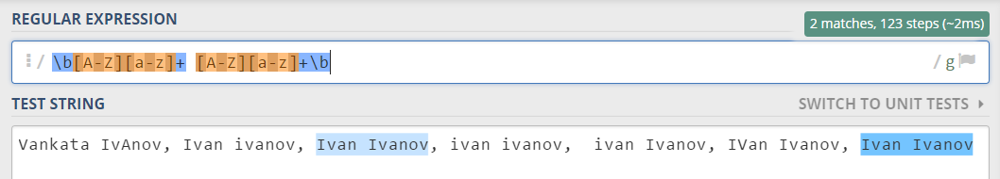

After you’ve constructed your regular expression, it’s time to write the
solution in JavaScript.

### Implementing the Solution in JavaScript

Create a new JavaScript file and copy your **regular expression** into a
variable:

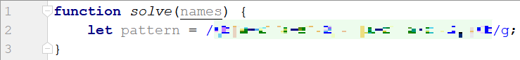

Note: You should put **"/"** before and after the pattern so that it is
interpreted as a RegEx pattern. Also, place the **'g'** (global) flag after it,
so that you get all the matches in the text.

Now, it’s time to **read the input**, to **extract the matches** from it and
push them into an array. For this we can use **exec()**:

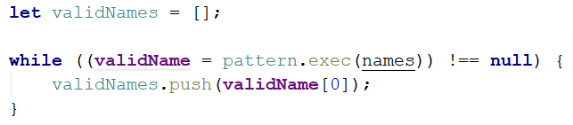

The **exec** method matches the string and the pattern keeps the first index
after the match. This way the next time **exec** runs it starts looking after
the last match. If there are no more matches, it will return **null**.

We are declaring a variable in the while loop's condition because we need to
check every time if there are any more matches.

Now we have an array (**validNames**), which holds all of the valid names in the
input. All that is left is to **join** it by **space** and **print** it (do this
by using **join()**):

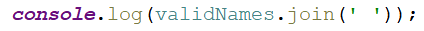

### Examples

| **Input**                                                                      |
|--------------------------------------------------------------------------------|
| "Ivan Ivanov, Ivan ivanov, ivan Ivanov, IVan Ivanov, Test Testov, Ivan Ivanov" |
| **Output**                                                                     |
| Ivan Ivanov Test Testov                                                        |

02\. Match Phone Number
------------------

Write a regular expression to match a **valid phone number** from **Sofia**.
After you find all **valid phones**, **print** them on the console, separated by
a **comma and a space ", "**.

### Compose the Regular Expression

A valid number has the following characteristics:

-   It starts with **"+359"**

-   Then, it is followed by the area code (always **2**)

-   After that, it’s followed by the **number** itself:

    -   The number consists of **7 digits** (separated in **two groups** of
        **3** and **4 digits** respectively).

-   The different **parts** are **separated** by **either a space or a hyphen**
    (**'-'**).

You can use the following RegEx properties to **help** with the matching:

-   Use **quantifiers** to match a **specific number** of **digits**

-   Use a **capturing group** to make sure the delimiter is **only one of the
    allowed characters (space or hyphen)** and **not** a **combination** of both
    (e.g. **+359 2-111 111** has **mixed delimiters**, it is **invalid**). Use a
    **group backreference** to achieve this.

-   Add a **word boundary** at the **end** of the match to avoid **partial
    matches** (the last example on the right-hand side).

-   Ensure that before the **'+'** sign there is either a **space** or the
    **beginning of the string**.

You can use the following table of values to test your RegEx against:

| **Match ALL of these**           | **Match NONE of these**                                                                            |
|----------------------------------|----------------------------------------------------------------------------------------------------|
| \+359 2 222 2222 +359-2-222-2222 | 359-2-222-2222, +359/2/222/2222, +359-2 222 2222 +359 2-222-2222, +359-2-222-222, +359-2-222-22222 |

### Implement the Solution in JavaScript

Now it’s time to write the solution, so let’s start writing!

First, just like in the previous problem, put your RegEx in a variable:

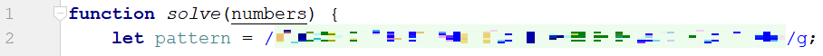

After that, let’s make an array of matches using like in the previous exercise:

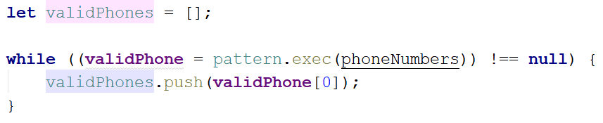

Now let's print **all the matches**, separated by **", "**:

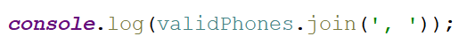

### Examples

| **Input**                                                                                                                            |
|--------------------------------------------------------------------------------------------------------------------------------------|
| "+359 2 222 2222,359-2-222-2222, +359/2/222/2222, +359-2 222 2222 +359 2-222-2222, +359-2-222-222, +359-2-222-22222 +359-2-222-2222" |
| **Output**                                                                                                                           |
| \+359 2 222 2222, +359-2-222-2222                                                                                                    |

03\. Match Dates
-----------

Write a program, which matches a date in the format
**"dd{separator}MMM{separator}yyyy"**.

### Compose the Regular Expression

Every valid date has the following characteristics:

-   Always starts with **two digits**, followed by a **separator**

-   After that, it has **one uppercase** and **two lowercase** letters (e.g.
    **Jan**, **Mar**).

-   After that, it has a **separator** and **exactly 4 digits** (for the year).

-   The separator could be either of three things: a period (**"."**), a hyphen
    (**"-"**) or a forward slash (**"/"**)

-   The separator needs to be **the same** for the whole date (e.g.
    13**.**03**.**2016 is valid, 13**.**03**/**2016 is **NOT**). Use a **group
    backreference** to check for this.

You can follow the table below to help with composing your RegEx:

| **Match ALL of these**                | **Match NONE of these**               |
|---------------------------------------|---------------------------------------|
| 13/Jul/1928, 10-Nov-1934, 25.Dec.1937 | 01/Jan-1951, 23/sept/1973, 1/Feb/2016 |

Use **named capturing groups** for the **day**, **month** and **year**.

Since this problem requires more complex RegEx, which includes **named capturing
groups**, we’ll take a look at how to construct it:

-   First off, we don’t want anything at the **start** of our date, so we’re
    going to use a **word boundary "\\b"**:  
    

    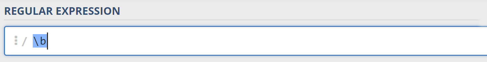

-   Next, we’re going to match the **day**, by telling our RegEx to match
    **exactly two digits**, and since we want to **extract** the day from the
    match later, we’re going to put it in a **capturing group**:  
    

    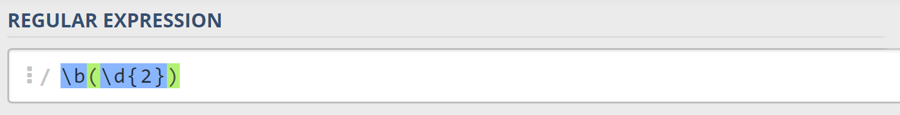

      
    We’re also going to give our group a **name**, since it’s easier to navigate
    by **group name** than by **group index**:  
    

    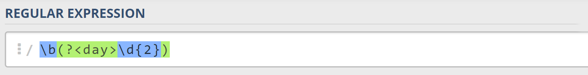

-   Next comes the separator – either a **hyphen**, **period** or **forward
    slash**. We can use a **character class** for this:  
    

    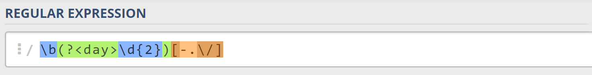

      
    Since we want to use the separator we matched here to match the **same
    separator** further into the date, we’re going to put it in a **capturing
    group**:  
    

    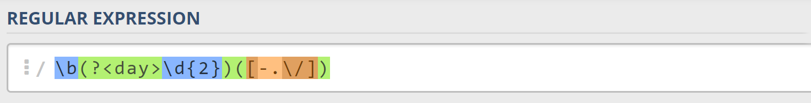

-   Next comes the **month**, which consists of a **capital Latin letter** and
    **exactly two lowercase Latin letters**:  
    

    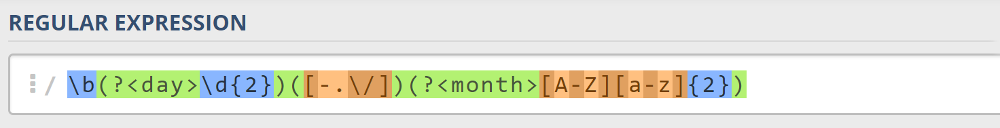

-   Next, we’re going to match the **same separator we matched earlier**. We can
    use a **backreference** for that:  
    

    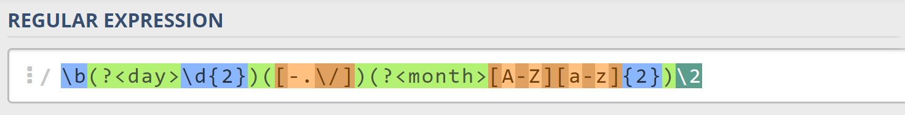

-   Next up, we’re going to match the year, which consists of **exactly 4
    digits**:  
    

    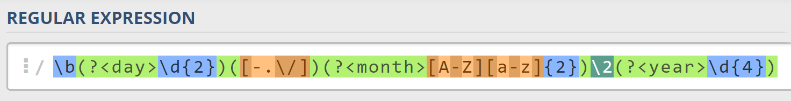

-   Finally, since we don’t want to match the date if there’s anything else
    **glued to it**, we’re going to use another **word boundary** for the end:  
    

    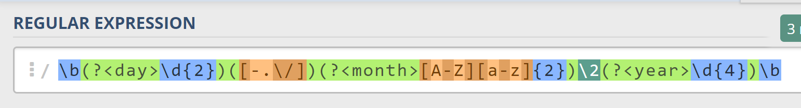

Now it’s time to find all the **valid dates** in the input and **print each
date** in the following format: **"Day: {day}, Month: {month}, Year: {year}"**,
each on a **new line**.

### Implement the Solution in JavaScript

First off, we’re going to put our RegEx in a variable and get the matches from
the string:

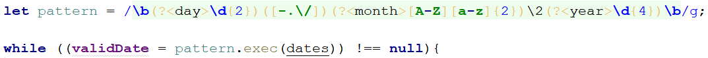

Next, we’re going to **iterate** over every single **element** in the array and
**extract** the **day**, **month** and **year** by making new patterns and
matching them:

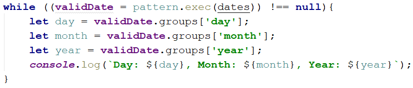

### Examples

| **Input**                                                                                       |
|-------------------------------------------------------------------------------------------------|
| "13/Jul/1928, 10-Nov-1934, , 01/Jan-1951,f 25.Dec.1937 23/09/1973, 1/Feb/2016"                  |
| **Output**                                                                                      |
| Day: 13, Month: Jul, Year: 1928 Day: 10, Month: Nov, Year: 1934 Day: 25, Month: Dec, Year: 1937 |
