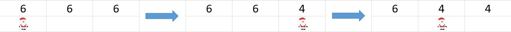

01\. Christmas Spirit
-------------------

*It's time to get in a Christmas mood. You have to decorate the house in time
for the big event, but you have limited days to do so.*

You will receive **allowed quantity** for **one type** of decoration and
**days** left until Christmas day to decorate the house.

There are **4 types** of decorations and each piece costs a **price**

-   Ornament Set – 2\$ a piece

-   Tree Skirt – 5\$ a piece

-   Tree Garlands – 3\$ a piece

-   Tree Lights – 15\$ a piece

Every **second day** you buy an **Ornament Set** quantity of times and
**increase** your Christmas spirit by **5**.

Every **third day** you buy **Tree Skirts** and **Tree Garlands** (both quantity
of times) and **increase** your spirit by **13**.

Every **fifth day** you buy **Tree Lights** quantity of times and **increase**
your Christmas spirit by **17**. If you have bought Tree Skirts and Tree
Garlands at the **same day** you **additionally increase** your spirit by
**30**.

Every **tenth day** you **lose 20 spirit**, because your cat ruins all tree
decorations and you have to rebuild the tree and buy **one** piece of tree
**skirt**, **garlands** and **lights**. That is why you are forced to
**increase** the allowed **quantity with 2** at the **beginning** of every
**eleventh day**.

Also if the **last day** is a **tenth day** the cat decides to demolish even
more and ruins the Christmas turkey and you **lose** additional **30 spirit**.

At the end you must print the **total cost** and the **gained spirit**.

Input / Constraints
-------------------

The input will consist of **exactly 2 lines**:

-   quantity – **integer in range [1…100]**

-   days **– integer in range [1…100]**

Output
------

At the end print the **total cost** and the total gained **spirit** in the
following format:

-   **"Total cost: {budget}"**

-   **"Total spirit: {totalSpirit}"**

Examples
--------

| **Input** | **Output**                        |
|-----------|-----------------------------------|
| 1 7       | Total cost: 37 Total spirit: 58   |
| **Input** | **Output**                        |
| 3 20      | Total cost: 558 Total spirit: 156 |

02\. Santa's List
----------------

*Its Christmas time and Santa needs your help with creating the list of noisy
kids.*

Input
-----

You will receive the **initial list** with noisy kids each of them separated
with **"&"**.

After that you will receive **4 types** of commands until you receive
**"Finished!"**

-   **Bad {kidName} - adds** a kid at the **start** of the list. If the kid
    **already exists** skip this line.

-   **Good {kidName} - removes** the kid with the given name only **if he
    exists** in the list, otherwise skip this line.

-   **Rename {oldName} {newName} –** if the kid with the given **old name**
    exists **change** his name with the **newer** one. If he **doesn't exist**
    skip this line.

-   **Rearrange {kidName} -** If the kid exists in the list **remove** him from
    his **current position** and **add** him at the **end** of the list.

Constraints
-----------

-   You won't receive duplicate names in the initial list

Output
------

Print the **list** of all noisy kids joined by **", ".**

-   **"{firstKid}, {secondKid}, …{nthKid}"**

Examples
--------

| **Input**                                                                                                        | **Output**                         |
|------------------------------------------------------------------------------------------------------------------|------------------------------------|
| Peter&George&Mike Bad Joshua Good Peter Finished!                                                                | Joshua, George, Mike               |
| **Input**                                                                                                        | **Output**                         |
| Joshua&Aaron&Walt&Dustin&William Good Walt Bad Jon Rename Aaron Paul Rearrange Jon Rename Peter George Finished! | Joshua, Paul, Dustin, William, Jon |

03\. Present Delivery
----------------

*Santa has limited time to drop at least some presents for each house. Help him
with his mission!*

You will receive a **string** with **even integers** separated by **"\@"**
representing each house with its **number of members** and a series of **Jump**
commands until you receive **"Merry Xmas!"**

Santa starts at the position of the **first** house and has to jump by a **given
length.** The jump command will be in format: **"Jump {length}"**.

Each time he jumps from one house to another he drops **2 presents** for that
house and **decreases** the needed presents for that house. If Santa jumps on a
house which **doesn't need** more presents (presents = 0) you should instead
print "**House {houseIndex} will have a Merry Christmas.**".

Keep in mind that Santa can have a **bigger jump length** than the **size of the
field** and if he does jump **outside** of it he should **start** from the
**beginning** again**.**

*For example we have a field of size 3 and each house has 6 members. Santa is at
the start and jumps with length of 2. He will end up at index 2 and decrease the
needed presents by 2 (6 – 2 = 4). Next he jumps again with length of 2 and ends
up at index position 1 and again decreases the needed presents.*

Input
-----

-   On the first line you will receive a **string** with **even integers**
    separated by **"\@" –** houses and their number of members.

-   On the next lines until "**Merry Xmas!**" you will receive jump commands in
    format: "**Jump {length}**".

Output
------

At the end print Santa's **last position** and whether or **not** his mission
was successful:

-   "**Santa's last position was {lastPositionIndex}.**"

-   If **all members** of **each house** have presents print:

    -   "**Mission was successful.**"

-   If **not** print the **count** of all houses that **won't** have a Merry
    Christmas:

    -   **"Santa has failed {housesCount} houses."**

Constraints
-----------

-   The **field** can be of size **[1…20]**

-   Each **house** will have an **even number** of **members** [**2** … **10**]

-   Each **jump length** will be an integer [**1** … **20**]

Examples
--------

| **Input**                                              | **Output**                                                                                |
|--------------------------------------------------------|-------------------------------------------------------------------------------------------|
| 10\@10\@10\@2 Jump 1 Jump 2 Merry Xmas!                | Santa's last position was 3. Santa has failed 3 houses.                                   |
| 2\@4\@2 Jump 2 Jump 2 Jump 8 Jump 3 Jump 1 Merry Xmas! | House 0 will have a Merry Christmas. Santa's last position was 1. Mission was successful. |
