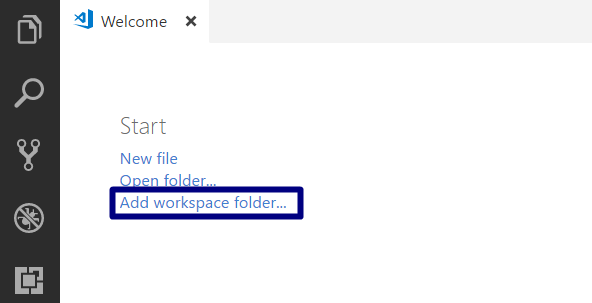
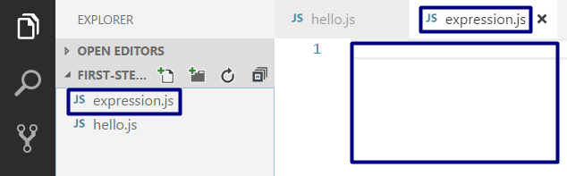
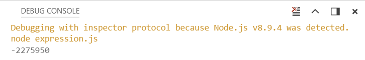
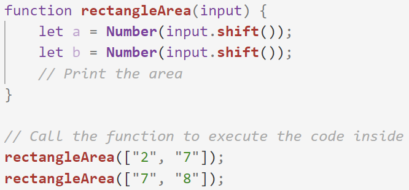

Упражнения: Първи стъпки в програмирането
=========================================

Задачи за упражнение в клас и за домашно към курса ["Основи на програмирането"
\@ СофтУни](https://softuni.bg/courses/programming-basics).

Тествайте решенията си в онлайн **judge системата**:
<https://judge.softuni.bg/Contests/Compete/Index/1010#0>

Празен Visual Studio Code проект
--------------------------------

Създайте празен проект във Visual Studio Code. Ще обединяваме решенията на
всички задачи, под формата на отделни файлове в този проект. Тази възможност е
изключително удобна, когато искаме да работим по няколко проекта и бързо да
превключваме между тях или искаме да обединим логически няколко взаимосвързани
проекта. Това ни помага да запазваме решенията на задачите отделно и да ги
пазим, за да ги използваме за други задачи или преговор.

1.  Стартирайте Visual Studio Code

2.  Създайте нова папка, която ще държи отделните решения. Ще се отвори диалогов
    прозорец, в който ще трябва да изберете нейната директория. Препоръчително е
    да именувате папката според темата на заданието, пример
    "**First-Steps-in-Calculations**"

След това изберете папката като работна среда, за да добавяте файловете с
JavaScript решенията на своите задачи в нея.

Панелът в ляво ще изглежда така:

01\. Конзолна програма "Hello SoftUni"
---------------------------------

Първата задача от тази тема е да се напише **конзолна програма**, която
**отпечатва** на конзолата: "Hello, SoftUni! ".

### Примерен вход и изход

| **вход** | **изход**     |
|----------|---------------|
| (няма)   | Hello SoftUni |

1.  Създайте **нов JavaScript файл** в съществуващата папка и го именувайте
    подходящо. Препоръчително е всеки скриптов файл да се казва както името на
    задачата, чието решение съдържа.

    

    

2.  Съдържанието на новият файл ще се отвори в прозореца в дясно.

    

3.  Отидете във файла hello.js и създайте функцията **hello()**. Можете да си
    помогнете с картинката по-долу:

    

4.  Стартирайте програмата с Ctrl + [F5]. За да получим резултат трябва да
    "повикаме" функцията:

    

Можем да видим резултата в конзолата по-долу:

1.  Сменете стратегията на judge с **"JavaScript code(NodeJS)"**. Трябва да
    получите 100 точки (напълно коректно решение):

02\. Конзолна програма "Expression"
------------------------------

Напишете **конзолна програма**, която пресмята и отпечатва стойността на следния
**числен израз**:

| (3522 + 52353) \* 23 - (2336 \* 501 + 23432 - 6743) \* 3 |
|----------------------------------------------------------|

Забележка: не е разрешено да се пресметне стойността предварително (например с
Windows Calculator).

### Примерен вход и изход

| **вход** | **изход** |
|----------|-----------|
| (няма)   | \-2275950 |

1.  Създайте **нов JavaScript файл** в съществуващата папка и го именувайте
    подходящо.

    

    

2.  Съдържанието на новият файл ще се отвори в прозореца в дясно.

    

3.  Отидете във файла expression.js и създайте функцията **Expression()**.
    Можете да си помогнете с картинката по-долу:

    

4.  Стартирайте програмата с Ctrl + [F5]. За да получим резултат трябва да
    "повикаме" функцията:

Можем да видим резултата в конзолата по-долу:

03\. Числата от 1 до 20
------------------

Напишете конзолна програма, която отпечатва числата от 1 до 20 на отделни редове
на конзолата.

### Примерен вход и изход

| **вход** | **изход**                                          |
|----------|----------------------------------------------------|
| (няма)   | 1 2 3 4 5 6 7 8 9 10 11 12 13 14 15 16 17 18 19 20 |

1.  Създайте **нов JavaScript файл** в съществуващата папка и го именувайте
    "**Nums-1-To-20**". Използвайте тялото на функцията "**nums1To20()**":

2.  Напишете 20 команди **console.log()**, една след друга, за да отпечатате
    числата от 1 до 20.

    

3.  Стартирайте програмата с Ctrl + [F5]. За да получите резултат трябва да
    "повикате" функцията.

4.  Можете ли да напишете програмата по **по-умен начин**, така че да не
    повтаряте 20 пъти една и съща команда? Потърсете в Интернет информация за
    [for loop
    JavaScript](https://www.google.bg/search?q=for+loop+javascript&oq=for+loop+jav&aqs=chrome.2.69i57j0l5.3355j0j7&sourceid=chrome&ie=UTF-8).

04\. Лице на правоъгълник
--------------------

Напишете програма, която прочита от конзолата две числа, **a** и **b,** въведени
от потребителя, пресмята и отпечатва **лицето на правоъгълник** със страни **a**
и **b**.

### Примерен вход и изход

| **вход** | **изход** |   | **вход** | **изход** |   | **вход** | **изход** |
|----------|-----------|---|----------|-----------|---|----------|-----------|
| [2,7]    | 14        |   | [7,8]    | 56        |   | [12,5]   | 60        |

1.  Създайте **нов JavaScript файл** в съществуващата папка и го именувайте
    подходящо.

2.  За да прочетете двете числа, използвайте следния код:

    

3.  Допишете програмата по-горе, за да пресмята лицето на правоъгълника и да го
    проверява.
