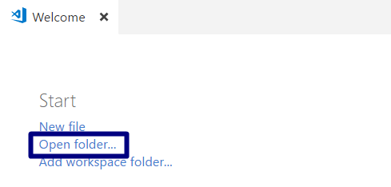
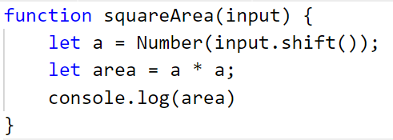

Упражнение: Прости операции и пресмятания
=========================================

Задачи за упражнение в клас и за домашно към курса ["Основи на програмирането"
\@ СофтУни](https://softuni.bg/courses/programming-basics).

Тествайте решенията си в Judge системата:
<https://judge.softuni.bg/Contests/Compete/Index/1011>

01\. Празно Visual Studio Code решение (Blank Solution)
--------------------------------------------------

Създайте празно решение (**Blank Solution**) във Visual Studio. Решенията
(solutions) във Visual Studio обединяват **група проекти**. Тази възможност е
изключително удобна, когато искаме да работим по няколко проекта и бързо да
превключваме между тях или искаме да обединим логически няколко взаимосвързани
проекта.

В настоящото практическо занимание ще използваме **Blank Solution с няколко
проекта** за да организираме решенията на задачите от упражненията – всяка
задача в отделен проект и всички проекти в общ solution.

1.  Стартирайте Visual Studio Code.

2.  Създайте нова папка, която ще държи отделните решения. Ще се отвори диалогов
    прозорец, в който ще трябва да изберете нейната директория. Препоръчително е
    да именувате папката според темата на заданието, пример
    "**Simple-Calculations**"

1.  След това изберете папката като работна среда, за да добавяте файловете с
    JavaScript решенията на своите задачи в нея.

    

Панелът в ляво ще изглежда така:

02\. Поздрав по име
--------------

Напишете програма, която **изважда от аргумента input име на човек** и отпечатва
"**Hello, \<name\>!**", където **\<name\>** е въведеното име от конзолата.

1.  Първо създайте **нов JavaScript** в съществуващата папка и го именувайте
    подходящо. Препоръчително е всеки скриптов файл да се казва, както името на
    задачата, чието решение съдържа.

    

    

2.  Съдържанието на новият файл ще се отвори в прозореца в дясно

    

Създайте променливата **name** и запазете в нея името, което се подава от
(**input**).За да извадим данните, които се съдържат в **input** ще използваме
функцията **shift()**

>   Изведете изхода на конзолата, като използвате следния шаблон:

Как работи примерът? Методът **console.log()** ни позволява в кръглите скоби да
записваме поредица от символи, които държат в себе си стойността на дадена
променлива – **\${name}** и я принтира на конзолата.

Забележете,че за да работи текстът трябва да е ограден от символа **\`** , който
разпознава обикновен текст и променлива. За да бъде разпозната една променлива,
като такава, тя трябва да започва със символа **\$** и да бъде оградена в
къдрави скоби : **{ }** .

1.  Стартирайте програмата с **Ctrl + F5** и тествайте с различни входни
    примери.

2.  За да получим резултат трябва да "повикаме" функцията и да й подадем входни
    данни:

    

    

3.  Тествайте решението си в judge, без да включвате извикването на функцията .

03\. Съединяване на текст и числа
----------------------------

Напишете програма, която **изважда име, фамилия, възраст и град от аргумента
input** и печата съобщение от следния вид: "**You are \<firstName\>
\<lastName\>, a \<age\>-years old person from \<town\>.**"

1.  Добавете към текущото Visual Studio Code решение още един **JavaScript
    файл** с име "**Concatenate-Data**".

2.  Приемете от конзолата входните данни (**input**)

    

    В **input** се съдържа целия подаден вход. За да извадим данните от него
    една по една в реда на подаване, можем да използваме функцията **shift()**

    

3.  Изведете на конзолата форматирания изход:

1.  Стартирайте програмата с **Ctrl + F5** и тествайте с различни входни
    примери. За да изведете локално резултат на конзолата, трябва да извикате
    функцията и да подадете входни данни в реда, в който очаквате да ги
    получите:

    

    

04\. Пресмятане на лице на квадрат
-----------------------------

Да се напише **конзолна програма**, която **изважда цяло число от аргумента
input** и **пресмята лицето на квадрат със страна** "**a"**. Задачата е
тривиално лесна: получавате число в аргумента на функцията, умножавате го само
по себе си и печатате получения резултат на конзолата.

### Примерен вход и изход

| **вход** | **изход** |
|----------|-----------|
| 5        | 25        |

### Насоки

1.  Приемете вход (число) и го запазете в променливата **a**.

2.  Инициализирайте променлива, която държи пресметнатата стойност на лицето,
    получена по формулата

    **a \* a** и принтирайте резултата, като не забравяйте, че за да получите
    локално резултат, трябва да извикате функцията и да й подадете входни данни.  
    

    

05\. От инчове към сантиметри
------------------------

Да се напише програма, която **изважда цяло число от аргумента input** и
преобразува числото **от инчове в сантиметри**. За целта **умножава инчовете по
2.54** (защото 1 инч = 2.54 сантиметра).

### Примерен вход и изход

| **вход** | **Изход** |
|----------|-----------|
| 5        | 12.70     |

1.  Нека функцията приема число, като вход и да го записваме в променливата
    **inches**. След това инициализирайте променливата **centimeteres**, която
    служи за изчисляване на сантиметрите. Накрая изведете резултата на
    конзолата:

    

2.  Стартирайте програмата с **Ctrl + F5** и тествайте с различни входни
    примери.

**Внимание:** в зависимост от регионалните настройки на операционната система, е
възможно вместо **десетична точка** (US настройки) да се използва **десетична
запетая** (BG настройки). Ако програмата очаква десетична точка и бъде въведено
число с десетична запетая или на обратно (бъде въведена десетична точка когато
се очаква десетична запетая), то тя няма да може да се изпълни.

Препоръчително е **да промените настройките на компютъра си**, така че да се
използва **десетична точка**:

06\. Лице на трапец
--------------

Напишете програма, която изважда три числа **b1**, **b2** и **h** от аргумента
input и **пресмята лицето на трапец** с основи **b1** и **b2** и височина **h**.
**Формулата за лице на трапец** е **(b1 + b2) \* h / 2**.

На фигурата по-долу е показан трапец със страни 8 и 13 и височина 7. Той има
лице (8 + 13) \* 7 / 2 = 73.5.

Форматирайте резултата до два знака след десетичната точка. Това можете да
направите чрез функцията **toFixed(2)**

  
Примерен вход и изход

| **вход** | **изход** |
|----------|-----------|
| 8 13 7   | 73.50     |

### Насоки

1.  Добавете към текущото Visual Studio Code решение още един **JavaScript
    файл** с име "**Trapezoid-Area**".

2.  Създайте променливи, които държат входа от конзолата,както и променлива, в
    която записвате информация за изчислената площ с формулата. Преобразувайте
    входните данни от стринг в число.

    "**(a + b) \* h / 2**".

3.  Накрая извеждате резултата на конзолата.  
    

    

4.  Стартирайте програмата с **Ctrl + F5** и тествайте с различни входни
    примери.

07\. Периметър и лице на кръг
------------------------

Напишете програма, която изважда **число r от аргумента input** и пресмята и
отпечатва **лицето** и **периметъра на кръг** / **окръжност** с радиус **r**,
като форматирате изхода до **втория знак** след десетичната запетая.

Отпечатвайте на първия ред **Area** , а на втория **Perimeter.**

### Примерен вход и изход

| **вход** | **изход**   |
|----------|-------------|
| 3        | 28.27 18.85 |
| 4.5      | 63.62 28.27 |

**Насоки**

За изчисленията можете да използвате следните формули:

-   area = Math.PI \* r \* r

-   perimeter = 2 \* Math.PI \* r

1.  Приемете като вход числото **r**.

2.  След това създайте променливите **area** и **perimeter**, които записват
    изчисленията за площ и периметър.

3.  За да изчислите правилно площта и периметъра използвайте вградената функция
    **Math.PI**, чиято работа е да репрезентира числото **π** в програмирането.

4.  Изведете резултата на конзолата.

    

08\. Лице на триъгълник
------------------

Напишете програма, която изважда **страна** и **височина** на **триъгълник от
аргумента input** и пресмята неговото лице. Използвайте **формулата** за лице на
триъгълник: **area = a \* h / 2**. Закръглете резултата до **2 знака след
десетичната точка** използвайки **toFixed(2).**

### Примерен вход и изход

| **вход**        | **изход** |
|-----------------|-----------|
| 20 30           | 300.00    |
| 15 35           | 262.50    |
| 7.75 8.45       | 32.74     |
| 1.23456 4.56789 | 2.82      |

**Насоки**

1.  Приемете вход и го запазете в променливите **a** и **h**.

2.  Създайте променлива, която записва резултата от изчислението на лицето.

3.  Използвайте вградената функция **toFixed()**, за да **закръглите**
    стойността на лицето до **втория знак** след десетичната запетая.

4.  Изведете резултата на конзолата, като използвате примерния изход.

    

09\. Конзолен конвертор: от градуси °C към градуси °F
------------------------------------------------

Напишете програма, която изважда число ( **градуси по скалата на Целзий** (°C))
от аргумента input и ги преобразува до **градуси по скалата на Фаренхайт** (°F).
Потърсете в Интернет подходяща
[формула](https://www.google.bg/search?q=формула+целзий+фаренхайт&gws_rd=cr&dcr=0&ei=cm7mWaqGJ8ana6i-kcgH),
с която да извършите изчисленията. Закръглете резултата до **2 знака след
десетичната точка**.

### Примерен вход и изход

| **вход** | **изход** |   | **вход** | **изход** |   | **вход** | **изход** |   | **вход** | **изход** |
|----------|-----------|---|----------|-----------|---|----------|-----------|---|----------|-----------|
| 25       | 77        |   | 0        | 32        |   | \-5.5    | 22.1      |   | 32.3     | 90.14     |

### Насоки

1.  Приемете входа .

2.  Създайте променлива, която записва конвертирания резултат от градуси °C към
    градуси °F.

3.  Изведете резултата на конзолата, като отново използвате функция
    **toFixed()**.

    

Примерни изпитни задачи
=======================

10\.\* Рожден ден
-------------

За рождения си ден Любомир получил аквариум с формата на паралелепипед.
**Първоначално приемаме, като вход размерите му – дължина, широчина и височина в
сантиметри.** Трябва да се пресметне, колко литра вода ще събира аквариума, ако
се знае, че определен процент от вместимостта му е заета от пясък, растения,
нагревател и помпа.

Един литър вода се равнява на един кубичен дециметър/ 1л=1 дм3/.

**Да се напише програма, която изчислява литрите вода, която са необходими за
напълването на аквариума.**

### Вход

От конзолата се приемат **4 числа**:

1.  **Дължина в см –число в интервала [10 … 500]**

2.  **Широчина в см –число в интервала [10 … 300]**

3.  **Височина в см –число в интервала [10… 200]**

4.  **Процент –число в интервала [0.000 … 100.000]**

### Изход

Да се отпечата на конзолата **едно число**:

-   **литрите вода, които ще събира аквариума**, **форматирани до третия знак
    след десетичната запетая**.

### Примерен вход и изход

| **Вход**       | **Изход** | **Обяснения**                                                                                                                                                                                                                                                  |
|----------------|-----------|----------------------------------------------------------------------------------------------------------------------------------------------------------------------------------------------------------------------------------------------------------------|
| 85 75 47 17    | 248.689   | Изчисляваме **обем на аквариум**: **обем на аквариум**= 85\*75\*47=**299625** см3 **общо литри, които ще събере:** 299625 \* 0.001=**299.625** литра **процент:** 17\*0.01=**0.17 литрите, които реално ще трябват :** 299.625\*(1-0.17) = **248.68875 литра** |
| **Вход**       | **Изход** |                                                                                                                                                                                                                                                                |
| 105 77 89 18.5 | 586.445   |                                                                                                                                                                                                                                                                |

### Насоки

1.  Приемете, като вход четирите числа .

2.  Създайте **променлива**, която записва **резултата за обема на аквариума**.

3.  Създайте още една променлива, която записва **резултата за общите литри**,
    които аквариумът ще събере.

4.  Изчислете **процентите**.

5.  Накрая създайте **още една променлива**, която записва **литрите**, които
    реално ще трябват.

6.  Изведете резултата на конзолата, като **форматирате** до **третия знак**
    след десетичната запетая.

    
