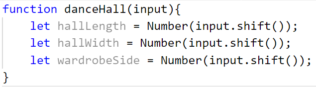

Упражнение: Прости операции и пресмятания
=========================================

Задачи за упражнение в клас и за домашно към курса ["Основи на програмирането"
\@ СофтУни](https://softuni.bg/courses/programming-basics).

Тествайте задачите си в Judge системата:
<https://judge.softuni.bg/Contests/Compete/Index/1160#0>.

01\. Конзолен конвертор: USD към BGN
-------------------------------

Напишете програма за **конвертиране на щатски долари** (USD) **в български
лева** (BGN). **Закръглете** резултата до **2 цифри** след десетичната запетая.
Използвайте фиксиран **курс** между долар и лев: **1 USD** = **1.79549 BGN**.

### Примерен вход и изход

| **вход** | **изход** |   | **вход** | **изход** |   | **вход** | **изход** |
|----------|-----------|---|----------|-----------|---|----------|-----------|
| 20       | 35.91     |   | 100      | 179.55    |   | 12.5     | 22.44     |

### Насоки

1.  Създайте променливата **usd**, която приема като вход от конзолата число.

2.  Изчислете конвертирането на щатските долари към българските лева и
    закръглете резултата до втория знак след десетичната запетая с вградената
    функция **toFixed()**.

3.  Принтирайте изхода на конзолата.

>   Можете да си помогнете със следния код, който е нарочно замъглен, за да
>   помислите как да го напишете сами:

02\. Конзолен конвертор: от радиани в градуси
----------------------------------------

Напишете програма, която чете **ъгъл в**
[радиани](https://bg.wikipedia.org/wiki/%D0%A0%D0%B0%D0%B4%D0%B8%D0%B0%D0%BD)
(radians) и го преобразува в
[градуси](https://bg.wikipedia.org/wiki/%D0%93%D1%80%D0%B0%D0%B4%D1%83%D1%81_(%D1%8A%D0%B3%D1%8A%D0%BB))
(degrees). Използвайте формулата: **градус = радиан \* 180 / π**.Числото **π** в
JavaScript програми е достъпно чрез **Math**.**PI**. Закръглете резултата до
най-близкото цяло число използвайки **"toFixed(0)"**.

### Примерен вход и изход

| **вход** | **изход** |   | **вход** | **изход** |   | **вход** | **изход** |   | **вход** | **Изход** |
|----------|-----------|---|----------|-----------|---|----------|-----------|---|----------|-----------|
| 3.1416   | 180       |   | 6.2832   | 360       |   | 0.7854   | 45        |   | 0.5236   | 30        |

### Насоки

1.  Прочетете входните данни от конзолата (**радианите**):

    

2.  Създайте **нова променлива**, в която ще направите конвертирането от радиани
    къмградуси, като знаете **формулата за изчисление**:

    

3.  Принтирайте получените градуси, като **закръглите** резултата **цяло число**
    (**използвайте toFixed(0)**):

    

03\. Лице на правоъгълник в равнината
--------------------------------

**Правоъгълник** е зададен с **координатите** на два от своите срещуположни
ъгъла (**x1**, **y1**) – (**x2**, **y2**). Да се пресметнат **площта** и
**периметъра** му. **Входът** се приема от конзолата. Числата **x1**, **y1**,
**x2** и **y2** са дадени по едно наред. **Изходът** се извежда на конзолата и
трябва да съдържа два реда с по една число на всеки от тях – лицето и
периметъра. **Закръглете** резултата до **2 цифри** след десетичната запетая

### Примерен вход и изход

| **вход**                    | **изход**         |
|-----------------------------|-------------------|
| 60 20 10 50                 | 1500.00 160.00    |
| 30 40 70 -10                | 2000.00 180.00    |
| 600.25 500.75 100.50 -200.5 | 350449.69 2402.00 |

### Насоки:

1.  Приемете входа от конзолата и го подайте на променливите:

    

2.  Създайте две променливи с подходящо име, в които да се запазят резултатите
    от изчисленията за дължината и широчината на правоъгълника. Използвайте
    вградената функция **Math.Abs()**, за да получите абсолютните стойности от
    изчисленията.

    

3.  Създайте още две променливи с подходящо име, в които да се запазят
    резултатите от изчисленията за площта и периметъра на правоъгълника.

    

4.  Закръглете резултата до втория знак след десетичната запетая с вградената
    функция **toFixed()**.

Примерни изпитни задачи
=======================

04\.\* Шивашки цех
--------------

Шивашки цех приема **поръчки за ушиване на покривки и карета за маси** за
заведения. Покривките са правоъгълни, каретата са квадратни, броят им винаги е
еднакъв. Покривката трябва да виси с **30 см от всеки ръб на масата**. Страната
на каретата е **половината от дължината на масите**. Във всяка поръчка се
включва информация за броя и размерите на масите.

**Напишете програма, която пресмята цената на поръчка в долари и в левове,**
като квадратен метър плат за правоъгълна покривка струва **7 долара**, а за каре
– **9 долара.** Курсът на долара е **1.85 лева.**

### Вход

Потребителят въвежда **3 числа**:

-   **Брой правоъгълни маси – цяло число в интервала [0...500]**

-   **Дължина на правоъгълните маси в метри – реално число в интервала
    [0.00...3.00]**

-   **Широчина на правоъгълните маси в метри – реално число в интервала
    [0.00...3.00]**

### Изход

Да се отпечатат на конзолата **две числа**: **цената на изделията в долари и в
левове.**

-   **"{цена в долари} USD"**

-   **"{цена в левове} BGN"**

**Резултатите да се закръглят до два знака след десетичната запетая.**

### Примерен вход и изход

| **Вход**     | **Изход**             | **Обяснения**                                                                                                                                                                                                                                                                                   |
|--------------|-----------------------|-------------------------------------------------------------------------------------------------------------------------------------------------------------------------------------------------------------------------------------------------------------------------------------------------|
| 5 1.00 0.50  | 72.85 USD 134.77 BGN  | Общата площ на покривките е: 5 броя \* (1.00 + 2 \* 0.30) \* (0.5 + 2 \* 0.30) = 8.80 кв. метра Общата площ на каретата е: 5 броя \* (1.00 /2 ) \* (1.00 / 2) = 1.25 кв. метра Цена в долари: 8.80 \* 7 долара + 1.25 \* 9 долара = 72.85 долара Цена в левове: 72.85 \* 1.85 = 134.77 лева     |
| 10 1.20 0.65 | 189.90 USD 351.32 BGN | Общата площ на покривките е: 10 броя \* (1.2 + 2 \* 0.30) \* (0.65 + 2 \* 0.30) = 22.50 кв. метра Общата площ на каретата е: 10 броя \* (1.20 /2 ) \* (1.20 / 2) = 3.60 кв. метра Цена в долари: 22.50 \* 7 долара + 3.60 \* 9 долара = 189.9 долара Цена в левове: 189.9 \* 1.85 = 351.32 лева |

### Насоки:

1.  Прочетете входа от конзолата и инициализирайте необходимите променливи.

    

2.  Създайте две променливи с подходящо име, в които да запазите резултатите от
    изчисленията за общата площ на покривките и каретата.

    

3.  Създайте още две променливи с подходящо име, в които да запазите резултатите
    от изчисленията за цената в долари и лева.

    

4.  Принтирайте изхода на конзолата.

    

05\.\* Зала за танци
----------------

Група танцьори си търсят нова зала. Залата, която са харесали, е **правоъгълна**
и има размери:

**L - дължина и W - ширина (в метри).** В залата има **квадратен** гардероб със
страна - **A** и **правоъгълна** скамейка с площ **10 пъти по-малка** от площта
на залата.

Мястото, което заема един танцьор е **40 см²** и допълнително за свободно
движение му трябват още **7000см²**.

Напишете програма, която да изчислява колко танцьори могат да се поберат в
залата и да се движат свободно.

Полученият резултат трябва да се **закръгли** до най-близкото **цяло число
надолу**.

### Вход

От конзолата се четат **3 реда**:

1.  **L – дължина на залата в метри – реално число в интервала [10.00 …
    100.00]**

2.  **W – ширина на залата в метри – реално число в интервала [10.00 … 100.00]**

3.  **А – страна на гардероба в метри – реално число в интервала [2.00… 20.00]**

### Изход

Да се отпечата на конзолата едно цяло число – броя танцьори, които могат да се
поберат в свободното пространство на залата, **закръглени до най-близкото цяло
число надолу**.  
**Примерен вход и изход**

| **Вход** | **Изход** | **Чертеж**                                 | **Обяснения**                                                                                                                                                                                                                                                                                                                                                |
|----------|-----------|--------------------------------------------|--------------------------------------------------------------------------------------------------------------------------------------------------------------------------------------------------------------------------------------------------------------------------------------------------------------------------------------------------------------|
| 50 25 2  | 1592      |  | Големина на залата в квадратни сантиметри: (**50** \* 100) \* (**25** \* 100) = **12 500 000**; Големина на гардероба: (**200** \* **200**) = **40000**; Големина на пейката: **12 500 000** / 10 = **1 250 000**; Свободно пространство = **12 500 000** – **40000** – **1 250 000** = **11210000**; Брой танцьори = **11210000** / (40 + 7000) = **1592**; |

### Насоки:

1.  Приемете входа от конзолата и инициализирайте необходимите променливи:

    

2.  Създайте три нови променливи с подходящо име, в които да запазите
    резултатите от изчисленията за площта на залата, гардероба и пейката.

    

3.  Изчислете свободното пространство.

4.  Изчислете броя танцьори, които могат да се поберат в свободното пространство
    на залата, **закръглени до най-близкото цяло число надолу**. Използвайте
    **Math.Floor()**.

    

5.  Принтирайте резултата на конзолата.

06\.\* Благотворителна кампания
---------------------------

В сладкарница се провежда благотворителна кампания за събиране на средства, в
която могат да се включат сладкари от цялата страна. **Първоначално прочитаме от
конзолата броя на дните, в които тече кампанията и броя на сладкарите, които ще
се включат. След това на отделни редове получаваме количеството на тортите,
гофретите и палачинките, които ще бъдат приготвени от един сладкар за един
ден.** Трябва да се има предвид следния ценоразпис:

-   **Торта - 45 лв.**

-   **Гофрета - 5.80 лв.**

-   **Палачинка – 3.20 лв.**

**1/8 от крайната сума ще бъде използвана за покриване на разходите за
продуктите по време на кампанията. Да се напише програма, която изчислява
сумата, която е събрана в края на кампанията.**

### Вход

От конзолата се четат **5 реда**:

1.  **Броят на дните, в които тече кампанията – цяло число в интервала [0 …
    365]**

2.  **Броят на сладкарите – цяло число в интервала [0 … 1000]**

3.  **Броят на тортите – цяло число в интервала [0… 2000]**

4.  **Броят на гофретите – цяло число в интервала [0 … 2000]**

5.  **Броят на палачинките – цяло число в интервала [0 … 2000]**

### Изход

Да се отпечата на конзолата **едно число**:

-   **парите, които са събрани**, **форматирани до втория знак след десетичната
    запетая**.

### Примерен вход и изход

| **Вход**      | **Изход** | **Обяснения**                                                                                                                                                                                                                                                                                                                                                                                                                                   |
|---------------|-----------|-------------------------------------------------------------------------------------------------------------------------------------------------------------------------------------------------------------------------------------------------------------------------------------------------------------------------------------------------------------------------------------------------------------------------------------------------|
| 20 8 14 30 16 | 119728.00 | Изчисляваме **сумата**, която се изкарва **на ден** за всеки **един от продуктите**, направени **от 1 сладкар**: **Торти**: 14 \* 45 = **630 лв**.; **Гофрети**: 30 \* 5.80 = **174 лв.**; **Палачинки:** 16 \* 3.20 = **51.20 лв. Обща сума за един ден:** (630 + 174 + 51.20) \* 8 = **6841.60 лв. Сума събрана от цялата кампания:** 6841.60 \* 20 = **136832лв. Сума след покриване на разходите:** 136832 - 1/8 от 136832 = **119728 лв.** |
| **Вход**      | **Изход** |                                                                                                                                                                                                                                                                                                                                                                                                                                                 |
| 131 5 9 33 46 | 426175.75 |                                                                                                                                                                                                                                                                                                                                                                                                                                                 |

### Насоки:

1.  Прочетете входа от конзолата и инициализирайте променливи.

2.  Създайте променливи с подходящо име, в които да запазите резултатите от
    изчисленията за общия брой торти, гофрети и палачинки.

    

3.  Изчислете общата сума за един ден.

    

4.  Изчислете общата сума събрана от цялата кампания.

5.  Накрая изчислете сумата след покриването на разходите и принтирайте
    резултата на конзолата, като го форматирате до втория знак след десетичната
    запетая.

    

07\.\* Алкохолна борса
------------------

Пешо решава да направи купон и отива до алкохолната борса за да купи бира, вино,
ракия и уиски. **На конзолата се въвежда цената на уискито в лв./л. и
количеството на бирата, виното, ракията и уискито**, **които трябва да закупи**.
**Да се напише програма, която пресмята колко пари са му необходими за да плати
сметката**, като знаете, че:

-   **цената на ракията** е **на половина по-ниска от тази на уискито**;

-   **цената на виното** е с **40% по-ниска от цената на ракията**;

-   **цената на бирата** е с **80% по-ниска от цената на ракията**.

### Вход

От конзолата се четат **5 реда**:

1.  **Цена на уискито в лева – реално число в интервала [0.00 … 10000.00]**

2.  **Количество на бирата в литри – реално число в интервала [0.00 …
    10000.00]**

3.  **Количество на виното в литри – реално число в интервала [0.00 …
    10000.00]**

4.  **Количество на ракията в литри – реално число в интервала [0.00 …
    10000.00]**

5.  **Количество на уискито в литри – реално число в интервала [0.00 …
    10000.00]**

### Изход

Да се отпечата на конзолата **едно число**:

-   **парите, които са необходими** на Пешо, **форматирани до втория знак след
    десетичната запетая**.

### Примерен вход и изход

| **Вход**                 | **Изход** | **Обяснения**                                                                                                                                                                                                                                                                                                                                                                                        |
|--------------------------|-----------|------------------------------------------------------------------------------------------------------------------------------------------------------------------------------------------------------------------------------------------------------------------------------------------------------------------------------------------------------------------------------------------------------|
| 50 10 3.5 6.5 1          | 315.00    | **Цена на ракията** за литър: **25** лв. **Цена на виното** за литър: 25 – (0.4 \* 25) = **15** лв. **Цена на бирата** за литър: 25 – (0.8 \* 25) = **5** лв. **Сума за ракията**: 6.5 \* 25 = **162.50** лв. **Сума за виното**: 3.5 \* 15 = **52.50** лв. **Сума за бирата**: 5 \* 10 = **50** лв. **Сума за уискито**: 1 \* 50 = **50** лв. **Обща сума**: 162.50 + 52.50 + 50 + 50 = **315** лв. |
| **Вход**                 | **Изход** |                                                                                                                                                                                                                                                                                                                                                                                                      |
| 63.44 3.57 6.35 8.15 2.5 | 560.62    |                                                                                                                                                                                                                                                                                                                                                                                                      |

### Насоки:

1.  Приемете входа от конзолата и инициализирайте необходимите променливи.

    

2.  Създайте три нови променливи с подходящо име, в които да запазите
    резултатите от изчисленията за цената на ракията, виното и бирата.

    

3.  Създайте още четири нови променливи с подходящо име, в които да запазите
    резултатите от изчисленията за сумата на ракията, виното, бирата и уискито.

    

4.  Изчислете общата сума и принтирайте резултата на конзолата, като го
    форматирате до втория знак след десетичната запетая.
