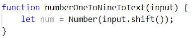

Упражнение: Условни конструкции
===============================

Задачи за упражнение в клас и за домашно към курса ["Основи на програмирането"
\@ СофтУни](https://softuni.bg/courses/programming-basics).

Тествайте решенията си в **Judge** системата:
[https://judge.softuni.bg/Contests/Compete/Index/1012](https://judge.softuni.bg/Contests/Compete/Index/1012#0)

01\. Празно Visual Studio Code проект (Blank Project)
--------------------------

Създайте празен проект във Visual Studio Code. Ще обединяваме решенията на
всички задачи, под формата на отделни файлове в този проект. Тази възможност
е изключително удобна, когато искаме да работим по няколко проекта и бързо
да превключваме между тях или искаме да обединим логически няколко
взаимосвързани проекта. Това ни помага да запазваме решенията на задачите
отделно и да ги пазим, за да ги използваме за други задачи или преговор.

1.  Стартирайте Visual Studio Code.

2.  Създайте нова папка, която ще държи отделните решения. Ще се отвори диалогов
    прозорец, в който ще трябва да изберете нейната директория. Препоръчително е
    да именувате папката според темата на заданието, пример "
    **Conditional-Statements**"

    

3.  След това изберете папката, като работна среда, за да добавите файловете с
    JavaScript решенията на своите задачи в нея.

    

02\. Проверка за отлична оценка
--------------------------

Първата задача от тази тема е да се напише **конзолна програма**, която **чете
оценка**, получена като аргумент и отпечатва "**Excellent!",** ако оценката е
**5.50** или по-висока.

| **вход** | **изход**  |   | **вход** | **изход**      |   | **вход** | **изход**  |   | **вход** | **изход**      |
|----------|------------|---|----------|----------------|---|----------|------------|---|----------|----------------|
| 6        | Excellent! |   | 5        | *(няма изход)* |   | 5.50     | Excellent! |   | 5.49     | *(няма изход)* |

### Насоки

1.  Създайте **нов JavaScript файл** в съществуващата папка и го именувайте
    подходящо. Препоръчително е всеки скриптов файл да се казва, както името на
    задачата чието решение съдържа.

    

1.  Съдържанието на новият файл ще се отвори в прозореца в дясно.

    

2.  Отидете в файла **isExcellent.js** и създайте функцията
    **isExcellent(input)**. Създайте една променлива, в която да запазите
    **реално число** – оценката, което ще прочетете от конзолата:

    

3.  Направете проверка за стойността на оценката. Ако тя е по-голяма или равна
    на 5.50 отпечатайте изхода по условие:

    

4.  Извикайте функцията с различни входни стойности и я стартирайте с **Ctrl +
    F5**:

    

    

    

    

03\. Намиране на по-голямото число
-----------------------------

Да се напише програма, която получава **две цели числа** въведени от потребителя
и отпечатва **по-голямото от двете**.

**Примерен вход и изход**

| **вход** | **изход** |   | **вход** | **изход** |   | **вход** | **изход** |   | **вход** | **изход** |
|----------|-----------|---|----------|-----------|---|----------|-----------|---|----------|-----------|
| 5 3      | 5         |   | 3 5      | 5         |   | 10 10    | 10        |   | \-5 5    | 5         |

### Насоки

1.  Извадете две цели числа от аргомента **input**:

    

2.  Сравнете, дали първото число **num1** e по-голямо от второто **num2**.
    Отпечатайте по-голямото число.

    

04\. Четно или нечетно
-----------------

Да се напише програма, която получава **цяло число** получено, като аргумент и
отпечатва на конзолата, дали е **четно** или **нечетно**.

**Примерен вход и изход**

| **вход** | **изход** |   | **вход** | **изход** |   | **вход** | **изход** |   | **вход** | **изход** |
|----------|-----------|---|----------|-----------|---|----------|-----------|---|----------|-----------|
| 2        | even      |   | 3        | odd       |   | 25       | odd       |   | 1024     | even      |

### Насоки

1.  Първо добавете **нов JavaScript файл** към съществуващия проект

2.  Извадете eдно цяло число от аргумента **input**:

    

3.  Проверете, дали числото е четно, като го разделите на 2 и проверите, дали
    има остатък от делението. Отпечатайте изхода по условие – текста “**even**”:

    

4.  В противен случай отпечатайте “**odd**”:

    

05\. Изписване на число до 9 с думи
------------------------------

Да се напише програма, която получава **цяло число в диапазона [1…9]**, получено
като аргумент и го **изписва с думи** на английски език. Ако числото е извън
диапазона, изписва "**number too big**".

**Примерен вход и изход**

| **вход** | **изход** |   | **вход** | **изход** |   | **вход** | **изход** |   | **вход** | **изход**      |
|----------|-----------|---|----------|-----------|---|----------|-----------|---|----------|----------------|
| 5        | five      |   | 1        | one       |   | 9        | nine      |   | 10       | number too big |

### Насоки

1.  Извадете едно цяло число от аргумента **input**:

    

2.  Направете проверка за размера на числото. Принтирайте с текст някоя от
    думите [“**one**”, “**two**”, “**three**”… “**nine**”] в зависимост от
    стойността.

    

3.  Отпечатайте “**number too big**”, ако числото е по-голямо от 9:

    

06\. Еднакви 3 числа
---------------

Да се въведат 3 числа и да се отпечата, дали са еднакви (yes / no)

### Примерен вход и изход

| **вход** | **изход** |   | **вход** | **изход** |   | **вход** | **изход** |   | **вход** | **изход** |   | **вход** | **изход** |
|----------|-----------|---|----------|-----------|---|----------|-----------|---|----------|-----------|---|----------|-----------|
| 1 1 1    | yes       |   | 5 5 5    | yes       |   | 1 2 3    | no        |   | 11 8 5   | no        |   | 13 14 99 | no        |

**\*Подсказка**: *Потърсете информация* за булевия оператор **&&**.

07\. Число от 100 до 200
-------------------

Да се напише програма, която **получава цяло число**, получено като аргумент и
проверява, дали е **под 100**, **между 100 и 200** или **над 200**. Да се
отпечатат съответно съобщения, като в примерите по-долу:

**Примерен вход и изход**

| **вход** | **изход**     |   | **вход** | **изход**           |   | **вход** | **изход**        |
|----------|---------------|---|----------|---------------------|---|----------|------------------|
| 95       | Less than 100 |   | 120      | Between 100 and 200 |   | 210      | Greater than 200 |

### Насоки:

1.  Извадете едно цяло число от аргумента **input**:

    

2.  Проверете, дали числото е **по-малко от 100**:

    

3.  Ако числото не е по-малко от 100 проверете, дали е **по-малко или равно на
    200**:

    

4.  Ако числото не е по-малко от 200, то то е по-голямо. Изпишете текста по
    условие:

    

08\. Познай паролата
---------------

Да се напише програма, която **получава парола** (един ред с произволен текст),
получено като аргумент и проверява, дали **съвпада** с фразата
"**s3cr3t!P\@ssw0rd**". При съвпадение да се изведе "**Welcome**". При
несъвпадение да се изведе "**Wrong password!**".

**Примерен вход и изход**

| **вход** | **изход**       |   | **вход**         | **изход** |   | **вход**     | **изход**       |
|----------|-----------------|---|------------------|-----------|---|--------------|-----------------|
| qwerty   | Wrong password! |   | s3cr3t!P\@ssw0rd | Welcome   |   | s3cr3t!p\@ss | Wrong password! |

### Насоки:

1.  Извадете текста от аргумента **input** и го запамазете в променлива:

    

2.  Сравнете стойността на получената парола с текста “**s3cr3t!P\@ssw0rd** ”.
    Отпечатайте правилния изход, спрямо въведената парола:

    

09\. Еднакви думи
------------

Да се напише програма, която **получава като аргумент две думи** и проверява,
дали са еднакви. Да не се прави разлика между главни и малки думи. Да се изведе
"**yes**" или "**no**".

**Примерен вход и изход**

| **вход**    | **изход** |   | **вход**        | **изход** |   | **вход** | **изход** |   | **вход**   | **изход** |   | **вход**    | **изход** |
|-------------|-----------|---|-----------------|-----------|---|----------|-----------|---|------------|-----------|---|-------------|-----------|
| Hello Hello | yes       |   | SoftUni softuni | yes       |   | Soft Uni | no        |   | beer vodka | no        |   | HeLlO hELLo | yes       |

### Насоки:

1.  Извадете две думи от **input** и ги запазете в две променливи:

    

2.  След като сте запазили думите, направете всички букви от първата и втората
    дума да бъдат малки, използвайки метода **toLowerCase()**. Можете да
    направите и обратната операция използвайки метода **toUpperCase()**:

    

    или:

    

3.  Сравнете двете думи, след като сте уеднаквили по някой от горепосочените
    начини всички букви и принтирайте изхода по условие:

    

10\. Лица на фигури
--------------

Да се напише програма, в която **получава като аргумент вида и размерите на
геометрична** фигура и пресмята лицето й. Фигурите са четири вида: квадрат
(**square**), правоъгълник (**rectangle**), кръг (**circle**) и триъгълник
(**triangle**). На първия ред на входа се чете вида на фигурата (**square**,
**rectangle**, **circle** или **triangle**). Ако фигурата е **квадрат**, на
следващия ред се чете едно число - дължина на страната му. Ако фигурата е
**правоъгълник**, на следващите два реда четат две числа - дължините на страните
му. Ако фигурата е **кръг**, на следващия ред чете едно число - радиусът на
кръга. Ако фигурата е **триъгълник**, на следващите два реда четат две числа -
дължината на страната му и дължината на височината към нея. Резултатът да се
закръгли до **3 цифри след десетичната точка**.

**Примерен вход и изход**

| **вход** | **изход** |   | **вход**        | **изход** |   | **вход** | **изход** |   | **вход**        | **изход** |
|----------|-----------|---|-----------------|-----------|---|----------|-----------|---|-----------------|-----------|
| square 5 | 25.000    |   | rectangle 7 2.5 | 17.500    |   | circle 6 | 113.097   |   | triangle 4.5 20 | 45.000    |

### Насоки

1.  Извадете тип на фигурата – текст от аргумента **input**:

    

2.  Направете **switch** конструкция, която съдържа случаи за типа фигури:

    

3.  Във всеки случай, извадете от **input** нужния брой страни и извършвайте
    математически операции за намиране на лицето според типа на фигурата.
    Направете променлива **area**, в която да пазите пресметнатото лице на
    фигурата:

    

4.  Принтирайте стойността на променливата **area**, като форматирате стойността
    й до третия знак след десетичната запетая:

    

11\. Ден от седмицата
----------------

Напишете програма, която получава **цяло число** и отпечатва **ден от
седмицата** (на английски език), в граници [1...7] или отпечатва "**Error**" в
случай, че въведеното число е **невалидно**.

### Примерен вход и изход

| **Вход** | **Изход** |
|----------|-----------|
| 1        | Monday    |
| 2        | Tuesday   |
| 3        | Wednesday |
| 4        | Thursday  |
| 5        | Friday    |
| 6        | Saturday  |
| 7        | Sunday    |
| \-1      | Error     |

**\*Подсказка:** Използвайте условната конструкция
[switch-case](https://developer.mozilla.org/en-US/docs/Web/JavaScript/Reference/Statements/switch).

12\. Клас животно
------------

Напишете програма, която отпечатва класа на животното според неговото име,
въведено от потребителя.

-   **dog -\> mammal**

-   **crocodile, tortoise, snake -\> reptile**

-   **others -\> unknown**

### Примерен вход и изход

| **Вход** | **Изход** |
|----------|-----------|
| dog      | mammal    |
| snake    | reptile   |
| cat      | unknown   |

**\*Подсказка:** Използвайте условната конструкция **switch-case**.

**Примерна изпитна задача**

13\. Магазин за детски играчки
-------------------------

Петя има магазин за детски играчки. Тя получава голяма поръчка, която трябва да
изпълни. С парите, които ще спечели иска да отиде на екскурзия. Да се напише
програма, която пресмята печалбата от поръчката.

**Цени на играчките:**

-   **Пъзел - 2.60 лв.**

-   **Говореща кукла - 3 лв.**

-   **Плюшено мече - 4.10 лв.**

-   **Миньон - 8.20 лв.**

-   **Камионче - 2 лв.**

Ако поръчаните играчки са **50 или повече** магазинът прави **отстъпка 25% от
общата цена**. От спечелените пари Петя трябва да даде **10% за наема** на
магазина. Да се пресметне, дали парите ще ѝ стигнат да отиде на екскурзия.

### Вход

От конзолата се четат **6 реда**:

1.  **Цена на екскурзията - реално число в интервала [1.00 … 10000.00]**

2.  **Брой пъзели - цяло число в интервала [0… 1000]**

3.  **Брой говорещи кукли - цяло число в интервала [0 … 1000]**

4.  **Брой плюшени мечета - цяло число в интервала [0 … 1000]**

5.  **Брой миньони - цяло число в интервала [0 … 1000]**

6.  **Брой камиончета - цяло число в интервала [0 … 1000]**

### Изход

На конзолата се отпечатва:

-   Ако **парите са достатъчни** се отпечатва:

    -   **"Yes! {оставащите пари} lv left."**

-   Ако **парите НЕ са достатъчни** се отпечатва:

    -   **"Not enough money! {недостигащите пари} lv needed."**

**Резултатът трябва да се форматира до втория знак след десетичната запетая**.

### Примерен вход и изход

| **Вход**            | **Изход**                           | **Обяснения**                                                                                                                                                                                                                                                                                                                                                                     |
|---------------------|-------------------------------------|-----------------------------------------------------------------------------------------------------------------------------------------------------------------------------------------------------------------------------------------------------------------------------------------------------------------------------------------------------------------------------------|
| 40.8 20 25 30 50 10 | Yes! 418.20 lv left.                | **Сума**: 20 \* 2.60 + 25 \* 3 + 30 \* 4.10 + 50 \* 8.20 + 10 \* 2 = **680** лв. **Брой на играчките**: 20 + 25 + 30 + 50 + 10 = **135 135 \> 50 =\> 25% отстъпка**; 25% от 680 = **170 лв. отстъпка Крайна цена**: 680 – 170 = **510** лв. **Наем**: 10% от 510 лв. = **51** лв. **Печалба**: 510 – 51 = **459** лв. **459 \> 40.8** =\> 459 – 40.8 = **418.20** лв. **остават** |
| **Вход**            | **Изход**                           | **Обяснения**                                                                                                                                                                                                                                                                                                                                                                     |
| 320 8 2 5 5 1       | Not enough money! 238.73 lv needed. | **Сума**: **90.3** лв. **Брой на играчките**: **21 21 \< 50 =\> няма отстъпка**  **Наем**: 10% от 90.3 = **9.03** лв. **Печалба**: 90.3 – 9.03 = **81.27** лв. **81.27 \< 320** =\> 320 – 81.27 = **238.73** лв. **не достигат**                                                                                                                                                  |

### Насоки:

1.  Извадете входните данни от **input**– броя на играчките и цената на
    екскурзията:

    

2.  Пресметнете общата цена на играчките, като умножите броя на всеки тип
    играчки по единичната им цена:

    

3.  Изчислете общия брой на играчките. Създайте променлива **discount**, в която
    да пазите стойността на отстъпката. Направете проверка, дали броя на
    играчките надвишава 50 и ако е вярно, изчислете отстъпката и присвоете
    стойността към променливата **discount**:

    

4.  Изчислете крайната цена, като извадите от сумата за всички играчки
    отстъпката, която сте изчислили, както и парите за наема:

    

5.  Сравнете крайната печалба с цената на екскурзията. Изпишете правилния изход
    спрямо резултата:

    
