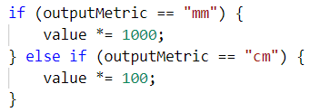
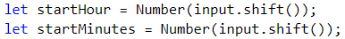

Упражнение: Условни конструкции
===============================

Задачи за упражнение към курса ["Основи на програмирането" \@
СофтУни](https://softuni.bg/courses/programming-basics).

Тествайте решенията си в **judge системата**:
[https://judge.softuni.bg/Contests/Compete/Index/1161](https://judge.softuni.bg/Contests/Compete/Index/1161#2)

01\. Сумиране на секунди 
--------------------

Трима спортни състезатели финишират за някакъв **брой секунди** (между **1** и
**50**). Да се напише програма, която чете времената на състезателите в секунди,
въведени от потребителя и пресмята **сумарното им време** във формат
"**минути:секунди**". Секундите да се изведат с **водеща нула** (2 -> "02", 7 -> "07", 35 -> "35").

| **вход** | **изход** |   | **вход** | **изход** |   | **вход** | **изход** |   | **вход** | **изход** |
|----------|-----------|---|----------|-----------|---|----------|-----------|---|----------|-----------|
| 35 45 44 | 2:04      |   | 22 7 34  | 1:03      |   | 50 50 49 | 2:29      |   | 14 12 10 | 0:36      |

### Насоки

1.  Извадете входните данни (**секундите на състезателите**) от **input**:

    

2.  Създайте **нова променлива**, в която да съхранявате **сбора от секундите на
    тримата състезатели**:

    

3.  След като сте намерили **сбора от секундите** трябва да ги **превърнете в
    минути и секунди** (например, ако сборът е **85 секунди това са 1 минута и
    25 секунди, защото 1 минута има 60 секунди**). Създайте си **две нови
    променливи**. В първата изчислете, **колко минути е сбора от секунди**, като
    **разделите сбора на 60**. Във втората променлива **изчислете секундите с
    помощта на деление с остатък (%)**. Използвайте **деление с остатък (%)**,
    за да вземете **остатъка при деление с 60**, което са останалите секунди.
    Например имате общ сбор от 134 секунди (2 минути и 14 секунди) **след
    целочисленото деление (/) на 60 ще получим 2, а след делението с остатък (%)
    ще получим оставащите секунди(14).**

    

4.  След като вече знаете, **колко минути и секунди** е общия сбор, трябва да ги
    изпринтираме в правилния формат **(минути : секунди**), като ако секундите
    са **по-малки от 10** трябва да изпечатаме **0 преди секундите**, в противен
    случай просто си изпечатваме **резултата в дадения формат**. За целта
    **направете проверка** (if). За принтирането може да използвате **place
    holder**.

    

02\. Бонус точки
-----------

Дадено е **цяло число** – начален брой точки. Върху него се начисляват **бонус
точки** по правилата, описани по-долу. Да се напише програма, която пресмята
**бонус точките, които получава числото** и **общия брой точки** (числото +
бонуса).

-   Ако числото е **до 100** включително, бонус точките са **5**.

-   Ако числото е **по-голямо от 100**, бонус точките са **20%** от числото.

-   Ако числото е **по-голямо от 1000**, бонус точките са **10%** от числото.

-   Допълнителни бонус точки (начисляват се отделно от предходните):

    -   За **четно** число -> + 1 т.

    -   За число, което **завършва на 5** -> + 2 т.

### Примери:

| **вход** | **изход** |   | **вход** | **изход** |   | **вход** | **изход**    |   | **вход** | **изход**      |
|----------|-----------|---|----------|-----------|---|----------|--------------|---|----------|----------------|
| 20       | 6 26      |   | 175      | 37 212    |   | 2703     | 270.3 2973.3 |   | 15875    | 1589.5 17464.5 |

### Насоки:

1.  Извадете входните данни (**числото**):

    

2.  Създайте си **нова променлива**, в която ще си изчислявате **натрупаните
    бонус точки**, като и дадете **начална стойност 0.0**.

    

3.  Направете **if-else-if конструкция** за първите **три проверки**, за да
    проверите големината на числото и да изчислите бонуса.

    

4.  Направете **нова if-else-if конструкция**, за да извършите проверките и
    **изчислите допълнителния бонус**. Ако числото **е четно към до момента
    натрупания бонус добавете 1**, а ако **завършва на 5 към бонуса добавете
    2**. За да проверите, дали едно число **е четно трябва да го разделите на 2
    и ако получавате остатък при делението 0**, то значи числото е **четно**, но
    ако **получите остатък 1**, това означава, че числото е **нечетно**.
    Например числото 34 е четно, защото 34 / 2 = 17 и остатъкът е 0, а числото
    35 е нечетно, защото 35 / 2 = 17 с остатък 1. За да проверите, дали едно
    число завършва на 5 трябва **да разделите числото на 10** и ако **получите
    остатък при делението 5**, то значи числото завършва на 5. Например числото
    245 / 10 = 24 с остатък 5.

    

5.  Принтирайте **на два реда** резултатите. На първия ред **натрупания бонус**,
    а на втория **крайното число**, което ще намерите, като **съберете началния
    брой точки и бонуса**.

    

03\. Информация за скоростта
-----------------------

Да се напише програма, която **чете скорост (реално число)**, въведена от
потребителя и отпечатва **информация за скоростта**. При скорост **до 10**
(включително) отпечатайте "**slow**". При скорост **над 10** и **до 50**
отпечатайте "**average**". При скорост **над 50** и **до 150** отпечатайте
"**fast**". При скорост **над 150** и **до 1000** отпечатайте "**ultra fast**".
При по-висока скорост отпечатайте "**extremely fast**". Примери:

| **вход** | **изход** |   | **вход** | **изход** |   | **вход** | **изход** |   | **вход** | **изход**  |   | **вход** | **изход**      |
|----------|-----------|---|----------|-----------|---|----------|-----------|---|----------|------------|---|----------|----------------|
| 8        | slow      |   | 49.5     | average   |   | 126      | fast      |   | 160      | ultra fast |   | 3500     | extremely fast |

### Насоки:

1.  Извадете входните данни (**скоростта**) от аргумента **input**:

    

2.  Използвайте **if**-**else**-**if** конструкция, за да проверите
    **стойностите за скоростта**.

    

04\. Конвертор за мерни единици
--------------------------

Да се напише програма, която **преобразува разстояние** между следните **3 мерни
единици**: **mm**, **cm**, m. Използвайте съответствията от таблицата по-долу:

| **входна единица**  | **изходна единица**           |
|---------------------|-------------------------------|
| **1** meter (**m**) | **1000** millimeters (**mm**) |
| **1** meter (**m**) | **100** centimeters (**cm**)  |

Входните данни се състоят от три реда, въведени от потребителя:

-   **Първи ред:** число за преобразуване - **реално число**

-   **Втори ред:** входна мерна единица - **текст**

-   **Трети ред:** изходна мерна единица (за резултата) - **текст**

На конзолата да се отпечата **резултатът от преобразуването** на мерните единици
**форматиран** до **третия знак след десетичната запетая**.

| **вход** | **изход** |   | **вход** | **изход** |   | **вход** | **изход** |
|----------|-----------|---|----------|-----------|---|----------|-----------|
| 12 mm m  | 0.012     |   | 150 m cm | 15000.000 |   | 45 cm mm | 450.000   |

### Насоки: 

1.  Извадете входните данни (**числото за преобразуване, входна мерна единица и
    изходна мерна единица**) от **input**:

    

2.  Направете **if-else-if конструкция**, за да конвертирате числото от
    **входната мерна единица към метри**. **Превръщаме в метри, защото в
    таблицата имаме превръщанията от метри в останалите мерни единици.** Ако
    входната мерна единица е **милиметри, за да ги превърнем в метри трябва
    числото да го разделим на 1000**. Аналогично направете **проверките и
    изчисленията за сантиметрите**, като следвате стойностите за преобразуване
    от една мерна единица в друга от таблицата.

    

3.  Направете нова **if-else-if конструкция**, чрез която ще преобразуваме
    **метрите, които изчислихме в предната стъпка, в изходната мерна единица.**
    За да преобразуваме **от метри в милиметри трябва числото да го умножим по
    1000**. Аналогично направете проверките и изчисленията **за сантиметрите**,
    като следвате стойностите за преобразуване от една мерна единица в друга от
    таблицата.

    

4.  Принтирайте преобразуваното число. За да го закръглите **до третия знак след
    десетичната запетая**, използвайте **метода toFixed(3)**.

    

05\. Време + 15 минути
-----------------

Да се напише програма, която **чете час и минути** от 24-часово денонощие,
въведени от потребителя и изчислява колко ще е **часът след 15 минути**.
Резултатът да се отпечата във формат **часове:минути**. Часовете винаги са между
0 и 23, а минутите винаги са между 0 и 59. Часовете се изписват с една или две
цифри. Минутите се изписват винаги с по две цифри, с **водеща нула,** когато е
необходимо.

### Примери:

| **вход** | **изход** |   | **вход** | **изход** |   | **вход** | **изход** |   | **вход** | **изход** |   | **вход** | **изход** |
|----------|-----------|---|----------|-----------|---|----------|-----------|---|----------|-----------|---|----------|-----------|
| 1 46     | 2:01      |   | 0 01     | 0:16      |   | 23 59    | 0:14      |   | 11 08    | 11:23     |   | 12 49    | 13:04     |

### Насоки:

1.  Извадете входните данни (**началнния час и началните минути**):

    

2.  Превърнете получения час в минути. За целта си създайте нова променлива, в
    която ще направите изчислението. Ако часът е 1:45 това са 1 час \* 60 минути
    + 45 минути = 105 минути общо.

    

3.  Създайте нова променлива, в която да добавите 15 минути към началния час,
    който превърнахте в минути. Ако часът ви е 1:25 (85 минути и добавите 15
    минути = 100 минути).

    

4.  След като сте изчислили общото време след 15 минути трябва новополучените
    минути след добавянето да ги превърнете обратно в часове и минути (100
    минути = 1 час и 40 минути). За да получите часовете трябва да разделите
    общите минути на 60, а за да получите минутите трябва да вземете остатъка от
    делението на общите минути на 60. Създайте си две променливи и извършете
    действията в тях.

    

5.  Понеже часът след добавяне на 15-те минути може да стане със стойност 24 или
    повече, трябва да направите следната проверка:

    

6.  Принтирайте вече изчислените краен час и крайни минути, като спазвате
    формата часове:минути и минутите да се принтират с водеща нула, т.е. ако
    минутите са по-малко от 10 да се принтира пред тях 0. За целта направете
    проверка и проверете минутите.

    

Примерни изпитни задачи
=======================

06\. Световен рекорд по плуване
--------------------------

Иван решава да подобри Световния рекорд по плуване на дълги разстояния. **На
конзолата се въвежда рекордът в секунди, който Иван трябва да подобри,
разстоянието в метри, което трябва да преплува и времето в секунди, за което
плува разстояние от 1 м.** Да се напише програма, която изчислява дали се е
справил със задачата, като се има предвид, че: **съпротивлението на водата го
забавя на всеки 15 м. с 12.5 секунди.** Когато се изчислява колко пъти Иванчо ще
се забави, в резултат на съпротивлението на водата, **резултатът трябва да се
закръгли надолу до най-близкото цяло число.**

**Да се изчисли времето в секунди, за което Иванчо ще преплува разстоянието и
разликата спрямо Световния рекорд.**

### Вход

От конзолата се четат **3 реда**:

1.  **Рекордът в секунди – реално число в интервала [0.00 … 100000.00]**

2.  **Разстоянието в метри – реално число в интервала [0.00 … 100000.00]**

3.  **Времето в секунди, за което плува разстояние от 1 м. - реално число в
    интервала [0.00 … 1000.00]**

### Изход

Отпечатването на конзолата зависи от резултата:

-   Ако **Иван е подобрил Световния рекорд** отпечатваме:

    -   **" Yes, he succeeded! The new world record is {времето на Иван}
        seconds."**

-   Ако **НЕ е подобрил рекорда** отпечатваме:

    -   **"No, he failed! He was {недостигащите секунди} seconds slower."**

**Резултатът трябва да се форматира до втория знак след десетичната запетая**.

### Примерен вход и изход

| **Вход**           | **Изход**                                                    | **Обяснения**                                                                                                                                                                                                                                                                                         |
|--------------------|--------------------------------------------------------------|-------------------------------------------------------------------------------------------------------------------------------------------------------------------------------------------------------------------------------------------------------------------------------------------------------|
| 10464 1500 20      | No, he failed! He was 20786.00 seconds slower.               | **Иван трябва да преплува 1500 м.: 1500 \* 20 = 30000 сек. На всеки 15 м. към времето му се добавят 12.5 сек.:**  **1500 / 15 = 100 \* 12.5 = 1250 сек. Общо време: 30000 + 1250 = 31250 сек. 10464 \< 31250 Времето, което не му е стигнало за да подобри рекорда:**  **31250 – 10464 = 20786 сек.** |
| **Вход**           | **Изход**                                                    | **Обяснения**                                                                                                                                                                                                                                                                                         |
| 55555.67 3017 5.03 | Yes, he succeeded! The new world record is 17688.01 seconds. | **Иван трябва да преплува 3017 м.: 3017 \* 5.03 = 15175.51 сек. На всеки 15 м. към времето му се добавят 12.5 сек.:**  **3017/ 15 = 201 \* 12.5 = 2512.50 сек. Общо време: 15175.51 + 2512.50 = 17688.01 сек. Рекордът е подобрен: 55555.67 \> 17688.01**                                             |
