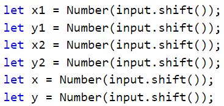

Упражнения: Вложени условни конструкции
=======================================

Задачи за упражнение в клас и за домашно към курса ["Основи на програмирането"
\@ СофтУни](https://softuni.bg/courses/programming-basics).

**Тествайте** решението си в **judge системата**:
<https://judge.softuni.bg/Contests/Compete/Index/1013#0>

Празен Visual Studio Code проект
--------------------------------

Създайте празен проект във Visual Studio Code. Ще обединяваме решенията на
всички задачи, под формата на отделни файлове в този проект. Тази възможност е
изключително удобна, когато искаме да работим по няколко проекта и бързо да
превключваме между тях или искаме да обединим логически няколко взаимосвързани
проекта. Това ни помага да запазваме решенията на задачите отделно и да ги
пазим, за да ги използваме за други задачи или преговор.

1.  Стартирайте Visual Studio Code

2.  Създайте нова папка, която ще държи отделните решения. Ще се отвори диалогов
    прозорец, в който ще трябва да изберете нейната директория. Препоръчително е
    да именувате папката според темата на заданието, пример
    "**Nested-Conditional-Statements**"

След това изберете папката като работна среда, за да добавяте файловете с
JavaScript решенията на своите задачи в нея.

Панелът в ляво ще изглежда така:

01\. Обръщение според възраст и пол
------------------------------

Да се напише **конзолна програма**, която **прочита възраст** (реално число) и
**пол** ('**m**' или '**f**'), въведени от потребителя, и отпечатва
**обръщение** измежду следните:

-   "**Mr.**" – мъж (пол '**m**') на 16 или повече години

-   "**Master**" – момче (пол '**m**') под 16 години

-   "**Ms.**" – жена (пол '**f**') на 16 или повече години

-   "**Miss**" – момиче (пол '**f**') под 16 години

### Примерен вход и изход

| **вход** | **изход** |   | **вход** | **изход** |   | **вход** | **изход** |   | **вход** | **изход** |
|----------|-----------|---|----------|-----------|---|----------|-----------|---|----------|-----------|
| 12 f     | Miss      |   | 17 m     | Mr.       |   | 25 f     | Ms.       |   | 13.5 m   | Master    |

### Насоки

1.  Създайте **нов JavaScript файл** в съществуващата папка и го именувайте
    подходящо. Препоръчително е всеки скриптов файл да се казва както името на
    задачата, чието решение съдържа.

1.  Съдържанието на новият файл ще се отвори в прозореца в дясно.

    

2.  Приемете като вход аргумента **input** и извадете от него променливите
    "**age**" (число) и "**gender**" ( стринг).

1.  Направете проверка за пола, и ако върне резултат **true,** направете
    проверка за годините. В тялото на проверките за възраст принтирайте желаното
    обръщение.

1.  **Стартирайте** програмата с [Ctrl+F5] и я **тествайте**, като извиквате
    функцията най-отдолу и й подадете различни входни стойности:

    

Трябва да получите **100 точки** (напълно коректно решение):

02\. Квартално магазинче
-------------------

Предприемчив българин отваря **квартални магазинчета** в **няколко града** и
продава на **различни цени според града**:

| град / продукт | **coffee** | **water** | **beer** | **sweets** | **peanuts** |
|----------------|------------|-----------|----------|------------|-------------|
| **Sofia**      | 0.50       | 0.80      | 1.20     | 1.45       | 1.60        |
| **Plovdiv**    | 0.40       | 0.70      | 1.15     | 1.30       | 1.50        |
| **Varna**      | 0.45       | 0.70      | 1.10     | 1.35       | 1.55        |

Напишете програма, която приема входен аргумент и изважда от него **продукт**
(низ), **град** (низ) и **количество** (число), и пресмята и отпечатва **колко
струва** съответното количество от избрания продукт в посочения град.

### Примерен вход и изход

| **вход**       | **изход** |   | **вход**          | **изход** |   | **вход**     | **изход** |   | **вход**        | **изход** |   | **вход**          | **изход** |
|----------------|-----------|---|-------------------|-----------|---|--------------|-----------|---|-----------------|-----------|---|-------------------|-----------|
| coffee Varna 2 | 0.9       |   | peanuts Plovdiv 1 | 1.5       |   | beer Sofia 6 | 7.2       |   | water Plovdiv 3 | 2.1       |   | sweets Sofia 2.23 | 3.2335    |

### Насоки

1.  Създайте **нов JavaScript файл** в съществуващата папка и го именувайте
    подходящо

2.  Приемете като вход аргумента **input**, и извадете от него необходимите
    променливи. След товa инициализирайте променлива **price**, като и зададете
    стойност "0".

1.  Направете серия от проверки, като за всеки град проверете за дадения
    продукт. Във всяка проверка за продукт, променяйте стойността на
    променливата **price** и я принтирайте. Вижте примера по-долу.

03\. Точка в правоъгълник
--------------------

Напишете програма, която проверява дали **точка {x, y}** се намира **вътре в
правоъгълник {x1, y1} – {x2, y2}**. Приема се аргумента input като вход и от
него се изваждат 6 числа: **x1**, **y1**, **x2**, **y2**, **x** и **y** (като се
гарантира, че **x1 \< x2** и **y1 \< y2**). Една точка е вътрешна за даден
правоъгълник, ако се намира някъде във вътрешността му или върху някоя от
страните му. Отпечатайте "**Inside**" или "**Outside**".

### Примерен вход и изход

| **вход**         | **изход** | **визуализация**                           |   | **вход**            | **изход** | **визуализация**                           |
|------------------|-----------|--------------------------------------------|---|---------------------|-----------|--------------------------------------------|
| 2 -3 12 3 8 -1   | Inside    |  |   | 2 -3 12 3 11 -3.5   | Outside   |  |
| **вход**         | **изход** | **визуализация**                           |   | **вход**            | **изход** | **визуализация**                           |
| \-1 -3 4 1 0.5 1 | Inside    |  |   | \-1 -3 4 1 -1.2 1.4 | Outside   |  |

\* **Подсказка**: една точка е вътрешна за даден многоъгълник, ако едновременно
са изпълнени следните четири условия:

-   Точката е надясно от лявата стена на правоъгълника (**x \>= x1**)

-   Точката е наляво от дясната стена на правоъгълника (**x \<= x2**)

-   Точката е надолу от горната стена на правоъгълника (**y \>= y1**)

-   Точката е нагоре от долната стена на правоъгълника (**y \<= y2**)

### Насоки

1.  Приемете входа и инициализирайте нужните променливи:

    

2.  Направете проверка на горепосочените условия използвайки **if** проверка с
    логическо "**и**" - оператор **&&** и в тялото на проверката принтирайте
    **"Inside"**.

    

3.  Akо горепосочената e **"false"**, принтирайте **"Outside"**.

    

04\. Плод или зеленчук?
------------------

Да се напише програма, която приема входен аргумент input и от него изважда
**име на продукт**, и проверява дали е **плод** или **зеленчук**.

-   Плодовете "**fruit**" имат следните възможни стойности: **banana**,
    **apple**, **kiwi**, **cherry**, **lemon** и **grapes**

-   Зеленчуците "**vegetable**" имат следните възможни стойности: **tomato**,
    **cucumber**, **pepper** и **carrot**

-   Всички останали са "**unknown**"

Да се изведе "**fruit**", "**vegetable**" или "**unknown**" според въведения
продукт.

### Примерен вход и изход

| **вход** | **изход** |   | **вход** | **изход** |   | **вход** | **изход** |   | **вход** | **изход** |
|----------|-----------|---|----------|-----------|---|----------|-----------|---|----------|-----------|
| banana   | fruit     |   | apple    | fruit     |   | tomato   | vegetable |   | water    | unknown   |

### Насоки

1.  Приемете входните данни и инициализирайте променливата **product**:

    

2.  Проверете името на продукта дали съвпада с имената на плодове с помощта на
    логическо **"или"** - оператор **"\|\|"** и ако проверката върне **"true"**,
    отпечатайте на конзолата **"fruit"**.

    

3.  Ако горепосочената проверка върне **"false"** проверете дали името на
    продукта не съвпада с някое от имената на зеленчуците отново с помощта на
    логическо **"или"** - оператор **"\|\|"**, при **"true"** отпечатайте на
    конзолата **"vegetable"**.

    

05\. Невалидно число
---------------

Дадено **число е валидно**, ако е в диапазона [**100**…**200**] или е **0**. Да
се напише програма, която приема аргумента input и изважда от него **цяло
число**, и печата "**invalid**" ако въведеното число **не е валидно**.

### Примерен вход и изход

| **вход** | **изход** |   | **вход** | **изход**      |   | **вход** | **изход**      |   | **вход** | **изход**      |
|----------|-----------|---|----------|----------------|---|----------|----------------|---|----------|----------------|
| 75       | invalid   |   | 150      | *(няма изход)* |   | 220      | invalid        |   | 199      | *(няма изход)* |
| **вход** | **изход** |   | **вход** | **изход**      |   | **вход** | **изход**      |   | **вход** | **изход**      |
| \-1      | invalid   |   | 100      | *(няма изход)* |   | 200      | *(няма изход)* |   | 0        | *(няма изход)* |

### Насоки

1.  Приемете вход и инициализирайте нужната променлива:

    

2.  Направете проверка дали дадено число **не** е валидно като в **if** проверка
    използвате логически оператор за отрицание **"!"** и проверите дали даденото
    число **"number"** е по-голямо или равно на 100 и същевременно е по-малко
    или равно на 200 **"number \>= 100 && number \<= 200"**, или числото е равно
    на 0, **"number == 0"**. Ако проверката върне **"true"**, принтирайте на
    конзолата **"invalid"**.

    

06\. Магазин за плодове
------------------

Магазин за плодове през **работните дни** работи на следните **цени**:

| **плод** | **banana** | **apple** | **orange** | **grapefruit** | **kiwi** | **pineapple** | **grapes** |
|----------|------------|-----------|------------|----------------|----------|---------------|------------|
| **цена** | 2.50       | 1.20      | 0.85       | 1.45           | 2.70     | 5.50          | 3.85       |

**Събота** и **неделя** магазинът работи на **по-високи цени**:

| **плод** | **banana** | **apple** | **orange** | **grapefruit** | **kiwi** | **pineapple** | **grapes** |
|----------|------------|-----------|------------|----------------|----------|---------------|------------|
| **цена** | 2.70       | 1.25      | 0.90       | 1.60           | 3.00     | 5.60          | 4.20       |

Напишете програма, която приема като вход аргумента **input** и изважда от него
**плод** (banana / apple / orange / grapefruit / kiwi / pineapple / grapes),
**ден от седмицата** (Monday / Tuesday / Wednesday / Thursday / Friday /
Saturday / Sunday) и **количество** (число, и пресмята **цената** според цените
от таблиците по-горе. Резултатът да се отпечата **закръглен с 2 цифри** след
десетичната точка. При невалиден ден от седмицата или невалидно име на плод да
се отпечата "**error**".

### Примерен вход и изход

| **вход**        | **изход** |   | **вход**        | **изход** |   | **вход**        | **изход** |   | **вход**            | **изход** |   | **вход**          | **изход** |
|-----------------|-----------|---|-----------------|-----------|---|-----------------|-----------|---|---------------------|-----------|---|-------------------|-----------|
| apple Tuesday 2 | 2.40      |   | orange Sunday 3 | 2.70      |   | kiwi Monday 2.5 | 6.75      |   | grapes Saturday 0.5 | 2.10      |   | tomato Monday 0.5 | error     |

### Насоки

1.  Прочетете входа и обърнете името на плода и деня от седмицата в **малки
    букви** използвайки метода **.toLowerCase();**

    

2.  Първоначално задайте цена **0**:

    

3.  Използвайте вложени **if** проверки, като в условието на проверката можете
    да използвате и логическия оператор "**или**" - "**\|\|**", за да изчислите
    цената за дадения плод и ден от седмицата:

    

    

4.  Накрая проверете цената. Ако все още е **0**, значи даденият плод или денят
    от седмицата е **невалиден**. За да отпечатате точно **2 цифри след
    десетичната точка** използвайте **toFixed(2)**

    

07\. Търговски комисионни
--------------------

Фирма дава следните **комисионни** на търговците си според **града**, в който
работят и обема на **продажбите**:

| **Град** | **0 ≤ s ≤ 500** | **500 \< s ≤ 1 000** | **1 000 \< s ≤ 10 000** | **s \> 10 000** |
|----------|-----------------|----------------------|-------------------------|-----------------|
| Sofia    | 5%              | 7%                   | 8%                      | 12%             |
| Varna    | 4.5%            | 7.5%                 | 10%                     | 13%             |
| Plovdiv  | 5.5%            | 8%                   | 12%                     | 14.5%           |

Напишете **конзолна програма**, която приема входен аргумент **input** и
извадете от него име на **град** (стринг) и обем на **продажби** (число) и
изчислява и извежда размера на търговската **комисионна** според горната
таблица. Резултатът да се изведе форматиран до **2 цифри след десетичната
точка**. При **невалиден** град или обем на продажбите (отрицателно число) да се
отпечата "**error**".

### Примерен вход и изход

| **вход**   | **изход** |   | **вход**       | **изход** |   | **вход**      | **изход** |   | **вход**      | **изход** |
|------------|-----------|---|----------------|-----------|---|---------------|-----------|---|---------------|-----------|
| Sofia 1500 | 120.00    |   | Plovdiv 499.99 | 27.50     |   | Varna 3874.50 | 387.45    |   | Kaspichan -50 | error     |

### Насоки

1.  Приемете входа и **обърнете града в малки букви** (като в предходната
    задача).

    

2.  Първоначално задайте **комисионна -1**. Тя ще бъде променена, ако градът и
    ценовият диапазон бъдат намерени в таблицата с комисионните.

    

3.  Използвайте вложени **if** проверки, за **да изчислите комисионната** според
    града и според обема на продажбите. Може да си помогнете с кода по-долу:

    

4.  Ако градът е невалиден отпечатайте **"error"**.
