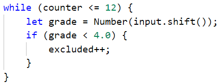

Упражнение: Повторения с цикли – while-цикъл
============================================

Задачи за упражнение и домашно към курса ["Основи на програмирането" в
СофтУни](https://softuni.bg/courses/programming-basics).

**Тествайте** решението си в **judge системата**:
<https://judge.softuni.bg/Contests/Compete/Index/1014>.

01\. Число в диапазона [1…100] 
--------------------------

Напишете програма, която въвежда цяло положително **число** n **в диапазона
[1…100]**. При въвеждане на число извън посочения диапазон, да се отпечата
съобщение за грешка и **да се въведе ново число**.

### Примерен вход и изход

| **Вход / Изход**                                                                                |
|-------------------------------------------------------------------------------------------------|
| **35** The number is: 35                                                                        |
| **105** Invalid number! **0** Invalid number! **-200** Invalid number! **77** The number is: 77 |

### Насоки

1.  Създайте **нов js файл** в съществуващата папка с подходящо име например:
    **"Number-In-Range"**.

2.  **Извадете входните данни от аргумента input в искания вид – число number.**

    

3.  Направете един **while** цикъл, който да се повтаря **докато** съответното
    число **number е по-малко от 1 или по-голямо от 100.**

    

4.  Ако програмата **влезе в тялото на цикъла,** то това ще означава, че сте
    получили число, което не е в диапазона [1...100]. В тялото на цикъла първо
    печатайте "**Invalid number!**", след което **извадете ново число** и
    **присвоете стойността му на променливата number.**

    

5.  **След тялото на цикъла** отпечатайте промеливата **number** в желания
    формат. Тя ще има стойност **между 1 и 100**, понеже програмата ще е
    **излезнала от цикъла.**

    

6.  **Стартирайте** програмата с [Ctrl+F5] и я **тествайте** с различни
    стойности.

02\. Редица числа 2k+1
-----------------

Напишете програма, която чете число **n**, въведено от потребителя и отпечатва
**всички числа ≤ n от редицата**: 1, 3, 7, 15, 31, …. Всяко следващо число се
изчислява като умножим **предишното** с **2** и добавим **1**.

### Примерен вход и изход

| **вход** | **изход** |   | **вход** | **изход** |   | **вход** | **изход** |   | **вход** | **изход**   |
|----------|-----------|---|----------|-----------|---|----------|-----------|---|----------|-------------|
| 3        | 1 3       |   | 8        | 1 3 7     |   | 17       | 1 3 7 15  |   | 31       | 1 3 7 15 31 |

### Насоки

1.  Вземете от **input** число.

    

2.  Създайте променлива, която ще е брояч и има **първоначална стойност 1**.

    

3.  Създайте **while** цикъл, който се повтаря докато **брояча е по-малък** от
    числото, което сте прочели от конзолата.

    

4.  При всяко повторение на цикъла **принтирайте стойноста на брояча** и му
    **прибавяйте дадената стойност**.

    

03\. Баланс по сметка
----------------

Напишете програма, която пресмята колко общо пари има в сметката, след като
направите определен брой вноски. На първия ред ще получите **колко вноски трябва
да се направят**. На всеки следващ ред ще получавате сумата, която трябва да
внесете в сметката, **докато не се достигне броя вноски**. При всяка получена
сума на конзолата трябва да се извежда **"Increase: "** + сумата и тя да се
**прибавя в сметката**. Ако получите число **по-малко от 0** на конзолата трябва
да се изведе **"Invalid operation!"** и **програмата да приключи**. Когато
програмата приключи трябва да се принтира **"Total: "** + общата сума в сметката
закръглена до втория знак след десетичната запетая.

### Примерен вход и изход

| **вход**         | **изход**                                                  |   | **вход**         | **изход**                                                      |
|------------------|------------------------------------------------------------|---|------------------|----------------------------------------------------------------|
| 3 5.51 69.42 100 | Increase: 5.51 Increase: 69.42 Increase: 100 Total: 174.93 |   | 5 120 45.55 -150 | Increase: 120 Increase: 45.55 Invalid operation! Total: 165.55 |

### Насоки

1.  Извадете число от аргумента на функцията, което определя, колко вноски
    трябва да се направят.

    

2.  Създайте **две променливи**, една променлива, за да пазите сумата, която е
    внесена и една променлива, която ще е брояч.

    

3.  Създайте **while** цикъл, който ще продължава, докато брояча е по-малък от
    броя вноски.

    

4.  При всяко повтаряне на цикъла ще вземаме сума от аргумента на функцията
    **(число)**.

    

5.  Създайте проверка, **която проверява, дали полученото число е отрицателна
    сума** и ако е така принтирайте на конзолата нужното съобщение и
    прекратявате цикъла, ако сумата е положителна, **увеличавайте баланса по
    сметката**, принтирайте на конзолата с колко сте увеличили баланса и
    **увеличавайте брояча с едно.**

    

6.  След цикъла принтирайте тоталния баланс.

    

04\. Най-голямо число
----------------

Напишете програма, която получава **n-на брой числа** (**n** \> 0) и намира
**най-голямото** измежду тях. Първо се получава броят числа **n**, а след това
самите **n** числа, по едно на ред.

### Примерен вход и изход

| **вход** | **изход** |   | **вход**     | **изход** |   | **вход**      | **изход** |   | **вход** | **изход** |   | **вход** | **изход** |
|----------|-----------|---|--------------|-----------|---|---------------|-----------|---|----------|-----------|---|----------|-----------|
| 2 100 99 | 100       |   | 3 -10 20 -30 | 20        |   | 4 45 -20 7 99 | 99        |   | 1 999    | 999       |   | 2 -1 -2  | \-1       |

### Насоки

1.  Първо прочетете едно число **n** (броят числа, които предстои да бъдат
    получени).

    

2.  Създайте променливите **count,** която ще брои колко числа сме прочели и
    **max** като за стойност сложете **минималната стойност на Number, като
    използвате Number.MAX_SAFE_INTEGER**

    

>   Повече информация за обхвата на типовете данни можете да прочетете
>   [тук](https://developer.mozilla.org/en-US/docs/Web/JavaScript/Reference/Global_Objects/Number/MIN_SAFE_INTEGER)

3.  Направете цикъл до **n**, на който четете число **num** и увеличава брояча с
    1**.**

    

4.  Направете **проверка,** дали числото **num е по-голямо от max** и ако е,
    приравнете стойността на **max** до **num**

    

5.  Накрая отпечатайте най-голямото число

05\. Най-малко число
---------------

Напишете програма, която получава **n-на брой числа** (**n** \> 0) и намира
**най-малкото** измежду тях. Първо се въвежда броят числа **n**, а след това
самите **n** числа, по едно на ред.

### Примерен вход и изход

| **вход** | **изход** |   | **вход**     | **изход** |   | **вход**      | **изход** |   | **вход** | **изход** |   | **вход** | **изход** |
|----------|-----------|---|--------------|-----------|---|---------------|-----------|---|----------|-----------|---|----------|-----------|
| 2 100 99 | 99        |   | 3 -10 20 -30 | \-30      |   | 4 45 -20 7 99 | \-20      |   | 1 999    | 999       |   | 2 -1 -2  | \-2       |

### Насоки

1.  Задачата е аналогична на предходната.

2.  Използвайте за първоначална стойност на **min = Number.MAX_SAFE_INTEGER** –
    най-голямата стойност на типа **int**

06\. Завършване
----------

Напишете програма, която изчислява **средната оценка** на ученик от цялото му
обучение. На първия ред ще получите **името на ученика**, а на всеки следващ ред
неговите годишни оценки. Ученикът преминава в следващия клас, **ако годишната му
оценка е по-голяма или равна на 4.00**. **Ако оценката му е под 4.00**, той ще
повтори класа.

При успешно завършване на **12-ти** клас да се отпечата:

"**{име на ученика} graduated. Average grade: {средната оценка от цялото
обучение}**"

**Стойността трябва да бъде форматирана до втория знак** след десетичната
запетая.

### Примерен вход и изход

| **вход**                                   | **изход**                            |   | **вход**                                  | **изход**                          |
|--------------------------------------------|--------------------------------------|---|-------------------------------------------|------------------------------------|
| Pesho 4 5.5 6 5.43 4.5 6 5.55 5 6 6 5.43 5 | Pesho graduated. Average grade: 5.37 |   | Ani 5 5.32 6 5.43 5 6 5.5 4.55 5 6 5.56 6 | Ani graduated. Average grade: 5.45 |

### Насоки

1.  Извадете от аргумента на функцията **името**. Създайте **две помощни
    променливи** – една променлива **брояч с начална стойност 1** и една
    променлива с начална стойност 0, в която ще държим **сумата от всички
    оценки** на дадения ученик.

    

2.  Направете **един while цикъл**, който да се повтаря, **докато брояча е
    по-малък или равен на 12**.

    

3.  **В тялото на цикъла четете оценката на ученика за съответния клас.**

4.  След това направете **една проверка, дали въведената оценка е по-голяма от
    4.00** и **ако е**, **я добавете към помощната променлива за сума**, която
    направихте в началото. **Увеличете стойността на брояча с 1**, понеже **щом
    оценката е 4 или повече**, **то ученикът е преминал в следващия клас**.

    

5.  **След тялото на while цикъла**, изчислете **средната оценка от цялото
    обучение**, като разделите **сумата от всички оценка на 12.**

    

6.  **Принтирайте** резултата в желания формат.

    

07\. Завършване - част 2
-------------------

Напишете програма, която изчислява **средната оценка** на ученик от цялото му
обучение. На първия ред ще получите **името на ученика**, а на всеки следващ ред
неговите годишни оценки. Ученикът преминава в следващия клас, **ако годишната му
оценка е по-голяма или равна на 4.00**. **Ако ученикът бъде скъсан повече от
един път, то той бива изключен и програмата приключва,** като се отпечатва
**името на ученика и в кой клас бива изключен**.

При успешно завършване на **12-ти** клас да се отпечата :

"**{име на ученика} graduated. Average grade: {средната оценка от цялото
обучение}**"

**В случай, че ученикът е изключен от училище,** да се отпечата:

"**{име на ученика} has been excluded at {класа, в който е бил изключен}
grade**"

**Стойността трябва да бъде форматирана до втория знак** след десетичната
запетая.

### Примерен вход и изход

| **вход**                                   | **изход**                            |   | **вход**               | **изход**                         |
|--------------------------------------------|--------------------------------------|---|------------------------|-----------------------------------|
| Gosho 5 5.5 6 5.43 5.5 6 5.55 5 6 6 5.43 5 | Gosho graduated. Average grade: 5.53 |   | Mimi 5 6 5 6 5 6 6 2 3 | Mimi has been excluded at 8 grade |

### Насоки

1.  Използвайте решението от предната задача и добавете нужната функционалност:

2.  Направете **още две помощни променливи в началото**, които да следят, **дали
    ученика трябва да бъде изключен**. Едната променлива ще е **брояч** и трябва
    да е с **първоначална стойност нула**. С нея ще следим, **колко пъти
    ученикът е трябвало да повтаря**. Другата променлива трябва да е **с
    началната стойност false**.

    

3.  **В тялото на while цикъла** проверявайте, **дали съответната оценка е
    по-ниска от 4.00** и ако е, **увеличавайте брояча с 1**.

    

    

    4. Направете **още една проверка, дали ученикът е бил изключван 2 пъти**
    (като използвате съответния брояч) и ако е, **променете стойността на
    булевата променлива на true и излезте от цикъла**.

    

4.  След тялото на цикъла, **печатайте изхода в зависимост от това, дали
    ученикът е бил изключен или не**.

    
