Упражнение: Повторения с цикли – while-цикъл
============================================

Задачи за упражнение и домашно към курса ["Основи на програмирането" в
СофтУни](https://softuni.bg/courses/programming-basics).

**Тествайте** решението си в **judge системата**:
<https://judge.softuni.bg/Contests/Compete/Index/1163>

01\. Старата Библиотека
-------------------

Ани отива до родния си град след много дълъг период извън страната. Прибирайки се вкъщи тя вижда старата библиотека на баба си и си спомня за любимата си книга. Помогнете на Ани, като напишете програма в която тя въвежда търсената от нея **книга**(**текст**) и **капацитета на библиотеката**(**цяло число**). **Докато Ани не намери любимата си книга или не провери всички в библиотеката, програмата трябва да чете всеки път на нов ред името на всяка следваща книга (текст).**

-   **Ако не открие книгата да се отпечата на два реда:**

-   **"The book you search is not here!"**

-   **"You checked {брой} books."**

-   **Ако открие книгата си се отпечатва един ред:**

    -   **"You checked {брой} books and found it."**

### Примерен вход и изход

| **Вход**                                                                                                     | **Изход**                                             | **Обяснения**                                                                                                                                                                                                                                                         |
|--------------------------------------------------------------------------------------------------------------|-------------------------------------------------------|-----------------------------------------------------------------------------------------------------------------------------------------------------------------------------------------------------------------------------------------------------------------------|
| Troy 8 Stronger Life Style Troy                                                                              | You checked 2 books and found it.                     | Книгата която Ани търси, в случая е Troy, а библиотеката съдържа 8 книги. Първата е Stronger, втората е Life Style, третата книга е търсената – Troy и програмата приключва.                                                                                          |
| The Spot 4 Hunger Games Harry Potter Torronto Spotify                                                        | The book you search is not here! You checked 4 books. | Книгата, която търси Ани е "The Spot". Библиотеката съдържа 4 книги. Първата е Hunger Games, втората Harry Potter, третата Torronto, а четвъртата Spotify. Понеже няма повече книги в библиотеката четенето на имена приключва. Ани не намери книгата, която търсеше. |
| Bourne 32 True Story Forever More Space The Girl Spaceship Strongest Profit Tripple Stella The Matrix Bourne | You checked 10 books and found it.                    |                                                                                                                                                                                                                                                                       |

### Насоки

1.  Извадете входните данни от аргумента, който приема функцията.

    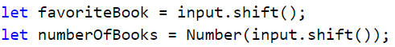

2.  Направете **още две помощни променливи в началото**, които да следят, **дали
    книгата е намерена или всички книги са проверени**. Едната променлива ще е
    **брояч** и трябва да е **число** и с **първоначална стойност нула**. С нея
    ще следим, **колко книги са проверени**. Другата променлива трябва да е **с
    началната стойност false**.

    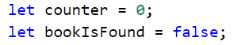

3.  Направете **while** цикъл, в който **всеки път** ще вземате от аргумента
    нова книга, дакато книгите в библиотеката **се изчерпат**.

    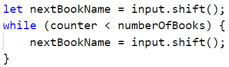

4.  Ако книгата, която получихте от аргумента **съвпада с любимата книга на
    Ани**, презапишете стойността на **променливата от булев тип**, и
    **прекратете цикъла**, в противен случай **увеличете брояча с едно**.

    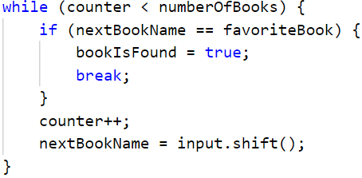

5.  Според това, дали книгата е намерена, **принтирайте нужните съобщения**.

    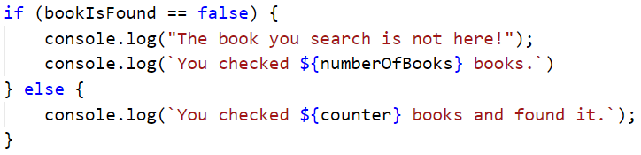

02\. Подготовка за изпит
-------------------

Напишете програма, в която Марин решава задачи от изпити **докато не получи** съобщение **"Enough"** от лектора си. При всяка решена задача той получава оценка. **Програмата трябва да приключи прочитането на данни при команда "Enough" или ако Марин получи определеният брой незадоволителни оценки.** **Незадоволителна е всяка оценка, която е по-малка или равна на 4.**

### Вход

-   **На първи ред - брой незадоволителни оценки - цяло число в интервала
    [1…5]**

-   **След това многократно се четат по два реда:**

    -   **Име на задача - текст (низ)**

-   **Оценка - цяло число в интервала [2…6]**

### Изход

-   Ако Марин стигне до командата **"Enough", отпечатайте на 3 реда:**

-   **"Average score: {средна оценка}"**

-   **"Number of problems: {броя на всички задачи}"**

    -   **"Last problem: {името на последната задача}"**

-   **Ако получи определеният брой незадоволителни оценки:**

-   **"You need a break, {брой незадоволителни оценки} poor grades."**

**Средната оценка да бъде форматирана до втория знак след десетичната запетая.**

### Примерен вход и изход

| **Вход**                                     | **Изход**                                                   | **Обяснения**                                                                                                                                                                                                                                                                                                                                                                      |
|----------------------------------------------|-------------------------------------------------------------|------------------------------------------------------------------------------------------------------------------------------------------------------------------------------------------------------------------------------------------------------------------------------------------------------------------------------------------------------------------------------------|
| 3 Money 6 Story 4 Spring Time 5 Bus 6 Enough | Average score: 5.25 Number of problems: 4 Last problem: Bus | Броя на позволени незадоволителни оценки е 3. Първата задача се казва Money, оценката на Марин е 6. Втората задача е Story, оценката на Марин е 4. Третата задача е Spring Time, оценката на Марин е 5. Четвъртата задача е Bus, оценката на Марин е 6. Следващата команда е Enough, програмата приключва. Средна оценка: 21 / 4 = 5.25 Брой решени задачи: 4 Последна задача: Bus |
| **Вход**                                     | **Изход**                                                   | **Обяснения**                                                                                                                                                                                                                                                                                                                                                                      |
| 2 Income 3 Game Info 6 Best Player 4         | You need a break, 2 poor grades.                            | Броят незадоволителни оценки е 2. Първата задача е Income, оценката на Марин е 3. Втората задача е Game Info, оценката на Марин е 6. Третата задача е Best Player, оценката на Марин е 4. Марин достигна допустимия брой незадоволителни оценки, време е за почивка.                                                                                                               |

### Насоки

1.  Извадете входните данни от аргумента на функцията.

    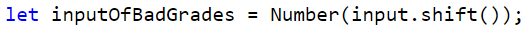

2.  Направете **четири помощни променливи** в началото, които да следят **броя
    добри оценки, броя незадоволителни оценки, сумата на всички оценки и коя е
    последната задача**. Първата, втората и третата променливи са с първоначална
    **стойност нула**. Четвъртата е с първоначална стойност **празен текст**.

    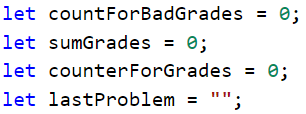

3.  Създайте **while** цикъл, който продължава докато **броя на незадоволителни
    оценки е по-малък от числото, което сте получили от аргумента**. При
    **всяко** повторение на цикъла, вземете **името на задачата и оценката за
    нея**.

    

    1.  В случай, че получите команда **Enough**, намерете **средната оценка на
        Марин** и **принтирайте** нужните съобщения и **прекратете цикъла**.

4.  При **всяко повторение на цикъла**, **прибавете** оценката на Марин към
    **сбора на всичките му оценки** и увеличете брояча за **оценките**. Ако
    оценката е **по-ниска или равна на 4** увеличете брояча за **незадоволителни
    оценки**. Презапишете името на **последната задача**.

    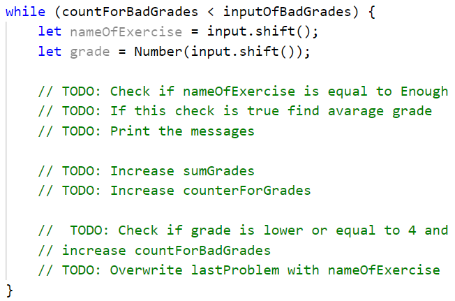

5.  След цикъла ако броя **незадоволителни оценки** е достигнал **максималните
    незадоволителни оценки**, принтирайте нужното съобщение.

    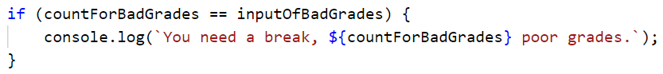

03\. Почивка
-------------------
Джеси е решила да събира пари за екскурзия и иска от вас да ѝ помогнете да разбере **дали ще успее да събере необходимата сума**. **Тя спестява** или **харчи част от парите** си **всеки ден**. Ако иска да **похарчи повече от наличните си пари**, то тя ще похарчи **всичко, което има и ще ѝ останат 0 лева**.

### Вход

От конзолата се четат:

-   **Пари нужни за екскурзията** - **реално число в интервала [1.00..
    .25000.00]**

-   **Налични пари** - **реално число в интервала [0.00... 25000.00]**

    **След това многократно се четат по два реда:**

-   **Вид действие – текст с възможности "spend" и "save".**

    -   **Сумата, която ще спести/похарчи - реално число в интервала [0.01…
        25000.00]**

### Изход

Програмата трябва да приключи при следните случаи:

-   Ако **5 последователни дни** Джеси **само харчи, на конзолата да се
    изпише:**

-   **"You can't save the money."**

-   **"{Общ брой изминали дни}"**

-   **Ако Джеси събере парите за почивката** на **конзолата се изписва:**

-   **"You saved the money for {общ брой изминали дни} days."**

### Примерен вход и изход

| **Вход**                                            | **Изход**                       | **Обяснения**                                                                                                                                                                                                                                                                                                                                                         |                                 |
|-----------------------------------------------------|---------------------------------|-----------------------------------------------------------------------------------------------------------------------------------------------------------------------------------------------------------------------------------------------------------------------------------------------------------------------------------------------------------------------|---------------------------------|
| 2000 1000 spend 1200 save 2000                      | You saved the money for 2 days. | Пари нужни за почивката: 2000 Наличните пари: 1000 spend – изваждаме от парите следващото число 1200 - ние разполагаме с 1000, но се опитваме да похарчим 1200, тъй като не разполагаме с толкова, харчим наличните си 1000 и оставаме 0 лева. save – прибавяме към парите следващото число 2000 – разполагаме с 0, добавяме 2000 и събираме парите успешно за 2 дни. |                                 |
| 110 60 spend 10 spend 10 spend 10 spend 10 spend 10 | You can't save the money. 5     | 250 150 spend 50 spend 50 save 100 save 100                                                                                                                                                                                                                                                                                                                           | You saved the money for 4 days. |

### Насоки

1.  Извадете входните данни от аргумента на функцията.

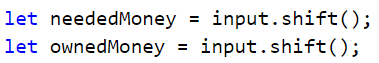

2.  Направете **две помощни променливи** в началото, които да следят **броя
    изминали дни и броя последователно дни, в които Джеси харчи пари**.
    Променливите са числа, с първоначална **стойност нула**.

    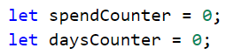

3.  Създайте **while** цикъл, който продължава докато парите на Джеси са
    по-малко от парите, които са й нужни за екскурзията и брояча за
    последователните дни е по-малък от 5.

    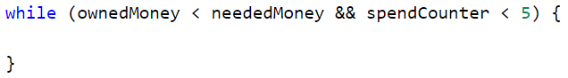

4.  При **всяко повторение на цикъла**, извадете от аргумента **два елемента** и
    увеличете брояча за дните. Първият ред е текст **spend** или **save**, а
    вторият ред е **число** парите, които Джеси е спестила или похарчила.

    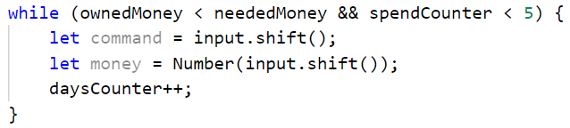

5.  Проверете дали Джеси **харчи или спестява** за дадения ден. Ако **спестява**
    прибавете спестените пари към нейните и **нулирайте брояча за поредните
    дни**. Ако **харчи** извадете от нейните пари сумата, която е похарчила,
    **увеличете брояча за поредните дни,** в които харчи. Проверете, дали парите
    на Джеси са станали **по-малко от нула,** и ако е така, то значи е похарчила
    всичко и са й останали нула лева.

    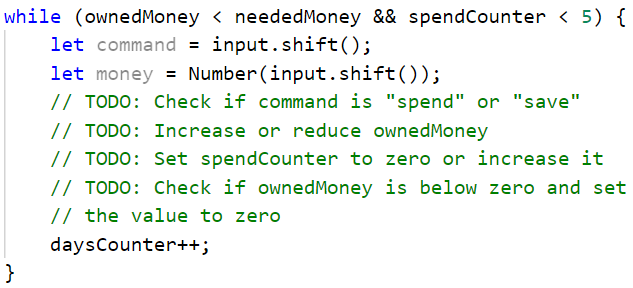

6.  След цикъла проверете, дали Джеси е харчила пари в **пет последователни
    дни** и принтирайте съобщението.

    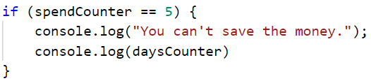

7.  Проверете, дали Джеси е **събрала парите** и ако е успяла принтирайте
    съобщението.

    

04\. Стъпки
---------

Габи иска да започне здравословен начин на живот и си е поставила за цел да върви **10 000 стъпки всеки ден**. Някои дни обаче е много уморена от работа и
ще иска да се прибере преди да постигне целта си. Напишете програма, която **чете от конзолата по колко стъпки изминава** тя всеки път като излиза през деня и **когато постигне целта си да се изписва** "**Goal reached! Good job!**"

Ако иска да се **прибере преди това**, тя ще въведе **командата** "**Going home**" и **ще въведе стъпките, които е извървяла докато се прибира**. След което, ако не е успяла да постигне целта си, на конзолата трябва да се изпише: "**{разликата между стъпките} more steps to reach goal.**"

### Примерен вход и изход

| **Вход**                                | **Изход**               | **Вход**                          | **Изход**                      |
|-----------------------------------------|-------------------------|-----------------------------------|--------------------------------|
| 1000 1500 2000 6500                     | Goal reached! Good job! | 1500 300 2500 3000 Going home 200 | 2500 more steps to reach goal. |
| **Вход**                                | **Изход**               | **Вход**                          | **Изход**                      |
| 1500 3000 250 1548 2000 Going home 2000 | Goal reached! Good job! | 125 250 4000 30 2678 4682         | Goal reached! Good job!        |

### Насоки

1.  Създайте променлива, чрез която **ще следите, колко стъпки е извървяла
    Габи** и **while**, който ще продължава, **докато Габи не достигне целта
    си**.

    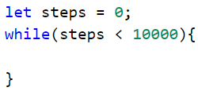

2.  При всяко повторение на цикъла взимайте **по един елемент от аргумента на
    функцията**.

    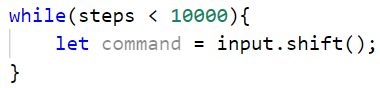

3.  Проверете, дали полученият елемент е **Going home** и ако е, **прибавяйте
    стъпките, които е извървяла до тях**, в противен случай, **прибавяйте
    стъпките, които е извървяла**.

    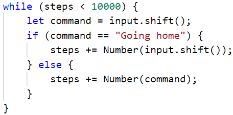

4.  В случая, в който Габи се прибира, проверете, дали е достигнала целта си,
    ако не е успяла **намерете разликата между нейната цел и стъпките, които е
    успяла да извърви**, отпечатайте нужното съобщение и след това прекъснете
    цикъла чрез командата **break**.

    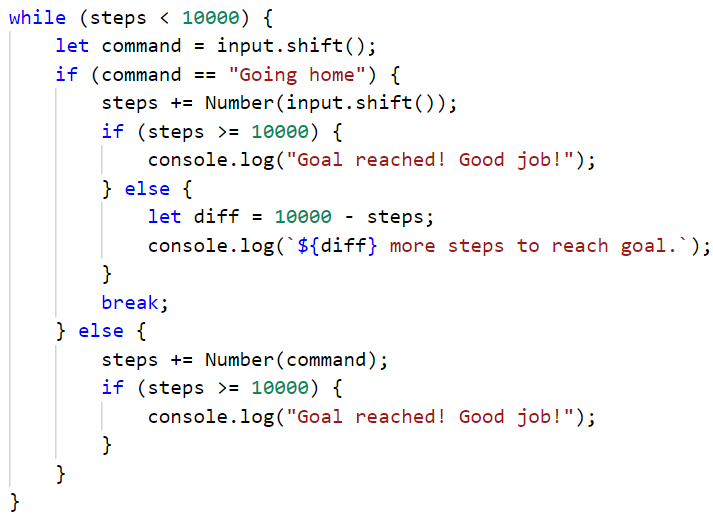

Примерни изпитни задачи
=======================

05\. Монети
------

Производителите на вендинг машини искали да направят машините си да връщат възможно **най-малко монети ресто**. Напишете програма, която приема **сума** - **рестото**, което трябва да се върне и изчислява **с колко най-малко монети може да стане това**.

### Примерен вход и изход

| **Вход** | **Изход** | **Обяснения**                                                                                                                                                                    |
|----------|-----------|----------------------------------------------------------------------------------------------------------------------------------------------------------------------------------|
| 1.23     | 4         | Рестото ни е 1 лев и 23 стотинки. Машината ни го връща с 4 монети: монета от 1 лев, монета от 20 стотинки, монета от 2 стотинки и монета от 1 стотинка.                          |
| 2        | 1         | Рестото ни е 2 лева. Машината ни го връща с 1 монета от 2 лева.                                                                                                                  |
| 0.56     | 3         | Рестото ни е 56 стотинки. Машината ни го връща с 3 монети: монета от 50 стотинки, монета от 5 стотинки и монета от 1 стотинка.                                                   |
| 2.73     | 5         | Рестото ни е 2 лева и 73 стотинки. Машината ни го връща с 5 монети: монета от 2 лева, монета от 50 стотинки, монета от 20 стотинки, монета от 2 стотинки и монета от 1 стотинка. |

06\. Торта
-----

Поканени сте на 30-ти рожден ден, на който рожденикът черпи с огромна торта. Той
обаче не знае **колко парчета могат да си вземат гостите от нея**. Вашата задача
е да напишете програма, която изчислява **броя на парчетата**, които гостите са
взели, преди тя да свърши. Ще получите **размерите на тортата** (широчина и
дължина – **цели числа** в интервала [1...1000]) и след това на всеки ред, до
получаване на командата "**STOP**" или **докато не свърши тортата**, броят на
парчетата, които гостите вземат от нея.

**Бележка: Едно парче торта е с размер 1х1 см.**

Да се **отпечата** на конзолата **един** от следните редове:

-   **"{брой парчета} pieces are left."** - ако стигнете до **STOP** и не са
    свършили парчетата торта

-   **"No more cake left! You need {брой недостигащи парчета} pieces more."**

### Примерен вход и изход

| **Вход**             | **Изход**                                  | **Обяснения**                                                                                                                                |
|----------------------|--------------------------------------------|----------------------------------------------------------------------------------------------------------------------------------------------|
| 10 10 20 20 20 20 21 | No more cake left! You need 1 pieces more. | Размер на тортата: 10\*10 = 100. Въвеждат се многократно брой парчета които са взети: 20+20+20+20+21=101 Не ни достига едно парче: 101-100=1 |
| 10 2 2 4 6 STOP      | pieces are left.                           |                                                                                                                                              |
