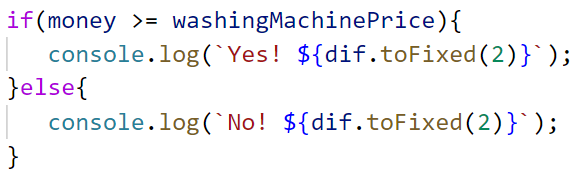

Упражнение: Повторения с цикли – for-цикъл
==========================================

Задачи за упражнение в клас и за домашно към курса ["Основи на програмирането"
\@ СофтУни](https://softuni.bg/courses/programming-basics).

Тествайте решението си тук:
<https://judge.softuni.bg/Contests/Compete/Index/1015#0>

01\. Числа от 1 до 100
-----------------

Напишете програма, която отпечатва числата от 1 до 100, всяко на нов ред.

### Примерен вход и изход

| **вход** | **изход**         |
|----------|-------------------|
| (няма)   | 1 2 3 … 98 99 100 |

### Насоки

1.  Създайте **нов файл с име** "**numbers1To100**".

2.  Отидете в тялото на функцията и напишете решението на задачата. Можете да си
    помогнете с кода от картинката по-долу:

    

02\. Всички латински букви
---------------------

Напишете програма, която отпечатва всички букви от латинската азбука: **a**, **b**, **c**, …, **z**.

### Насоки

1.  Направете цикъл от **'a'** до **'z'** и принтирайте.

    

03\. Сумиране на числа
-----------------

Да се напише програма, която **получава n-**на брой **цели числа и ги сумира**.

-   От първия ред на входа се получава броят числа **n**.

-   От следващите **n** елемента се получава по едно цяло число.

Програмата трябва да вземе числата, да ги сумира и да отпечата сумата им.

### Примерен вход и изход

| **вход** | **изход** |   | **вход**      | **изход** |   | **вход**      | **изход** |   | **вход** | **изход** |   | **вход** | **изход** |
|----------|-----------|---|---------------|-----------|---|---------------|-----------|---|----------|-----------|---|----------|-----------|
| 2 10 20  | 30        |   | 3 -10 -20 -30 | \-60      |   | 4 45 -20 7 11 | 43        |   | 1 999    | 999       |   | 0        | 0         |

### Насоки

1.  Първо вземете едно число **n** (броят числа, които предстои да бъдат
    получени).

    

2.  Създайте променлива **sum = 0** , която ще държи сумата на числата. (в
    началото няма още прочетени числа, и съответно сумата е равна на 0).

    

3.  В цикъл **n пъти** вземете по едно цяло число **num** и го прибавете към
    сумата **(sum = sum + num**).

    

4.  Накрая отпечатайте получената сума.

    

04\. Редица цели числа
-----------------

Напишете програма, която прочита **n на брой числа**. Принтирайте **най-голямото** и **най-малкото** число сред въведените.

### Примерен вход и изход

| **вход**         | **изход**                     |   | **вход**             | **изход**                      |
|------------------|-------------------------------|---|----------------------|--------------------------------|
| 5 10 20 304 0 50 | Max number: 304 Min number: 0 |   | 6 250 5 2 0 100 1000 | Max number: 1000 Min number: 0 |

### Насоки

1.  Създайте две променливи, като променливата, в която ще пазите **най-голямото
    число започва от възможно най-малкото число**, а променливата, в която ще
    пазите **най-малкото число започва от възможно най-голямото число**.

    

2.  Създайте променлива **n**, която да чете броя числа, които ще бъдат
    прочетени.

3.  В цикъл **n пъти** прочетете по едно цяло число.

    

4.  Проверете дали стойността е по-голяма и по-малка от променливите, които
    създадохте и ако е, **ги презаписвайте**. След края на цикъла изпечатаите
    най-голямото и най-малкото число.

    

05\. Лява и дясна сума
-----------------

Да се напише програма, която чете **2\*n-на брой** цели числа и проверява, дали
**сумата на първите n числа** (лява сума) е равна на **сумата на вторите n
числа** (дясна сума). При равенство печата " **Yes, sum =** " + **сумата**;
иначе печата " **No, diff =** " + **разликата**. Разликата се изчислява, като
положително число (по абсолютна стойност).

### Примерен вход и изход

| **вход**      | **изход**      | **коментар**        |   | **вход**     | **изход**    | **коментар**                             |
|---------------|----------------|---------------------|---|--------------|--------------|------------------------------------------|
| 2 10 90 60 40 | Yes, sum = 100 | 10+90 = 60+40 = 100 |   | 2 90 9 50 50 | No, diff = 1 | 90+9 ≠ 50+50 Difference = \|99-100\| = 1 |

### Насоки

1.  Въведете **n**.

    

2.  Създайте променливи за сумата на лявата и дясната половина.

    

3.  Направете **цикъл за лявата половина,** като прочитате число **num** на
    всеки ред и го сумирайте към **leftSum**.

    

4.  Аналогично направете същото и за дясната половина.

    

5.  Изчислете **разликата** между сумите по абсолютна стойност:
    **Math.Abs(leftSum - rightSum)** и проверете, ако разликата е **0**,
    отпечатайте "**Yes**" + **сумата**; иначе отпечатайте "**No**" +
    **разликата**.

    

06\.Четна / нечетна сума
--------------------

Да се напише програма, която получава **n-на брой** цели числа и проверява, дали
**сумата от числата на четни позиции** е равна на **сумата на числата на нечетни
позиции**. При равенство да се отпечатат "**Yes**" и на нов ред "**Sum =** " +
**сумата**; иначе да се отпечата "**No**" и на нов ред "**Diff =** " +
**разликата**. Разликата се изчислява по абсолютна стойност.

### Примерен вход и изход

| **вход**      | **изход**    | **коментар**       |   | **вход**   | **изход**   | **коментар**                |   | **вход** | **изход**   | **коментар**              |
|---------------|--------------|--------------------|---|------------|-------------|-----------------------------|---|----------|-------------|---------------------------|
| 4 10 50 60 20 | Yes Sum = 70 | 10+60 = 50+20 = 70 |   | 4 3 5 1 -2 | No Diff = 1 | 3+1 ≠ 5-2 Diff =            |   | 3 5 8 1  | No Diff = 2 | 5+1 ≠ 8 Diff =            |
|               |              |                    |   |            |             | \|4-3\| = 1                 |   |          |             | \|6-8\| = 2               |

### Насоки

1.  Вземете **n** и направете **цикъл от 1 до n включително,** като на всеки ред
    четете число **num**.

    

2.  Създайте две променливи, които ще съдържат **сумата на четните и нечетните
    позиции**.

    

3.  Проверете числото, дали е на **четна** или **нечетна** позиция и увеличете
    съответната сума, като имате в предвид , че **променливата i отговаря на
    позицията**.

    

    Изчислете **разликата** между сумите по абсолютна стойност: **Math.Abs(even
    - odd)** и проверете, ако разликата е **0**, отпечатайте "**Yes**" и на нов
    ред "**Sum =** " + **сумата**; иначе отпечатайте "**No**" и на нов ред
    "**Diff =** " + **разликата**.

07\. Сумиране на гласните букви
--------------------------

Да се напише програма, която получава **текст** (стринг) и изчислява и отпечатва
**сумата от стойностите на гласните букви** според таблицата по-долу:

| **буква**    | a | e | i | o | u |
|--------------|---|---|---|---|---|
| **стойност** | 1 | 2 | 3 | 4 | 5 |

### Примерен вход и изход

| **вход** | **изход** | **коментар**              |
|----------|-----------|---------------------------|
| hello    | 6         | e + o = 2 + 4 = 6         |
| hi       | 3         | i = 3                     |
| bamboo   | 9         | a + o + o = 1 + 4 + 4 = 9 |
| beer     | 4         | e + e = 2 + 2 = 4         |

### Насоки

1.  Вземете входните данни и ги запазете в променлива **word**. Създайте
    променлива за сумата на буквите.

    

2.  Направете **for** цикъл от **0** до **word.length** (дължината на текста).

    

3.  Проверете всяка буква **word[i]**, дали е гласна и съответно добавете към
    сумата стойността й:

    

Примерна изпитна задача
=======================

08\. Умната Лили
------------

Лили вече е на **N години**. За всеки свой **рожден ден** тя получава подарък.
За **нечетните** рождени дни (**1, 3, 5...n**) получава **играчки**, а за всеки
**четен** (**2, 4, 6...n**) получава **пари**. За **втория рожден ден** получава
**10.00 лв**, като **сумата се увеличава с 10.00 лв, за всеки следващ четен
рожден ден** (**2 -\> 10**, **4 -\> 20**, **6 -\> 30**...и т.н.). През годините
Лили тайно е спестявала парите. **Братът** на Лили, **в годините**, които тя
**получава пари**, **взима по 1.00 лев** от тях. Лили **продала играчките**
получени през годините, **всяка за P лева** и **добавила** сумата **към
спестените пари**. С парите искала да си **купи пералня за X лева**. Напишете
програма, която да пресмята, **колко пари е събрала** и дали ѝ **стигат да си
купи пералня**.

### Вход

Програмата прочита **3 числа**, въведени от потребителя, на отделни редове:

-   **Възрастта** на Лили - **цяло число** в интервала **[1...77]**

-   **Цената на пералнята** - число в интервала **[1.00...10 000.00]**

-   **Единична цена на играчка** - **цяло число** в интервала **[0...40]**

### Изход

Да се отпечата на конзолата един ред:

-   Ако парите на Лили са достатъчни:

    -   **“Yes! {N}”** - където **N** е остатъка пари след покупката

-   Ако парите не са достатъчни:

    -   **“No! {М}“** - където **M** е сумата, която не достига

-   Числата **N** и **M** трябва да за **форматирани до вторият знак след
    десетичната запетая**.

### Примерен вход и изход

| **вход**     | **изход**  | **Коментари**                                                                                                                                                                                                                                                                                                                                                                                                                                                                                                                                                              |
|--------------|------------|----------------------------------------------------------------------------------------------------------------------------------------------------------------------------------------------------------------------------------------------------------------------------------------------------------------------------------------------------------------------------------------------------------------------------------------------------------------------------------------------------------------------------------------------------------------------------|
| 10 170.00 6  | Yes! 5.00  | **Първи рожден ден** получава **играчка**; **2ри -\> 10лв**; 3ти -\> играчка; **4ти** -\> 10 + 10 = **20лв**; **5ти** -\> играчка; **6ти** -\> 20 + 10 = **30лв**; **7ми** -\> играчка; **8ми** -\> 30 + 10 = **40лв**; **9ти** -\> играчка; **10ти** -\> 40 + 10 = **50лв**. **Спестила е** -\> 10 + 20 + 30 + 40 + 50 = **150лв**. Продала е **5 играчки по 6 лв** = **30лв**. **Брат ѝ взел 5 пъти по 1 лев** = **5лв**. **Остават** -\> 150 + 30 – 5 = **175лв**. **175 \>= 170** (цената на пералнята) **успяла** е да я купи и са и **останали** 175-170 = **5 лв.** |
| 21 1570.98 3 | No! 997.98 | **Спестила е 550лв**. **Продала** е **11** играчки по **3 лв** = **33лв**. Брат ѝ **взимал 10** години по **1 лев** = **10лв**. **Останали** 550 + 33 – 10 = **573лв 573 \< 1570.98** – **не е успяла** да купи пералня. **Не ѝ достигат** 1570.98–573 = **997.98лв**                                                                                                                                                                                                                                                                                                      |

### Насоки

1.  Вземете **входните данни - възрастта** на Лили, **цената на пералнята** и
    **цената на една играчка**:

    

2.  Създайте променливи, които ще пазят **броя години**, в които Лили получава
    **пари** и **играчки**.

    

3.  Във **for** цикъл от **1** до **годините на Лили**, добавяйте към броя на
    годините в, който получава пари или към годините на получените играчки.

    

4.  Създайте променлива **money**, която ще пази парите на Лили. Във **for**
    цикъл от **1** до броя на годините, в които Лили получава пари, увеличавайте
    **money** с **10 \*** за всяка година.

    

5.  Към **money**, добавете произведението от броя на годините, когато получава
    играчки **умножено по** цената на играчките, като извадите броя на годините,
    през които е получавала пари.

    

6.  Създайте променлива, която ще има за **стойност**, абсолютната стойност **на
    разликата от цената на пералнята и парите**, с който разполага Лили.

    

7.  Проверете дали **парите**, с които разполага Лили са достатъчни да купи
    **пералнята машина** и съответно принтирайте **"Yes!" + diff**. Ако парите
    не са достатъчни, принтирайте **"No!" + diff**.

    
