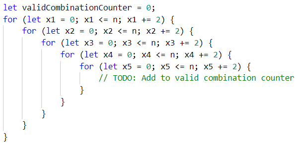

Упражнение: Вложени цикли
=========================

Задачи за упражнение в клас и за домашно към курса ["Основи на програмирането"
\@ СофтУни](https://softuni.bg/courses/programming-basics).

**Тествайте** решенията си в **Judge системата**:
[judge.softuni.bg/Contests/Compete/Index/1016](https://judge.softuni.bg/Contests/Compete/Index/1016)

01\. Числата от N до 1 в обратен ред
-------------------------------

Напишете програма, която чете цяло положително число **n**, въведено от
потребителя, и печата **числата от n до 1 в обратен ред** (от най-голямото към
най-малкото).

### Примерен вход и изход

| **вход** | **изход** |   | **вход** | **изход** |   | **вход** | **изход** |
|----------|-----------|---|----------|-----------|---|----------|-----------|
| 2        | 2 1       |   | 3        | 3 2 1     |   | 5        | 5 4 3 2 1 |

### Насоки:

1.  Извадете **едно число** от input – **n:**

    

2.  Направете **един for цикъл от n до 0**, но **вместо да увеличавате
    променливата i** с 1, я **намаляйте с 1** при **всяка итерация на цикъла**:

    

3.  **В тялото на цикъла принтирайте променливата i**:

    

02\. Числата от 1 до N през 3
------------------------

Напишете програма, която чете число **n**, въведено от потребителя, и отпечатва
**числата от 1 до n през 3** (със стъпка 3).

### Примерен вход и изход

| **вход** | **изход** |   | **вход** | **изход** |   | **вход** | **изход**   |
|----------|-----------|---|----------|-----------|---|----------|-------------|
| 10       | 1 4 7 10  |   | 7        | 1 4 7     |   | 15       | 1 4 7 10 13 |

### Насоки: 

1.  Вземете елемент от аргумента на функцията – **едно число n**

    

2.  Направете **for цикъл от 1 до n** (**включително**) и задайте **стъпка 3**.
    Това означава, че при всяка итерация на цикъла, променливата **i ще
    увеличава стойността си с 3, вместо с 1:**

    

      
    **В тялото на цикъла принтирайте променливата i**:

    

03\. Четни степени на 2
------------------

Да се напише програма, която чете число **n**, въведено от потребителя, и
**печата четните степени на 2 ≤ 2n**: **20**, **22**, **24**, **28**, …, **2n**.

### Примерен вход и изход

| **вход** | **изход** |   | **вход** | **изход** |   | **вход** | **изход** |   | **вход** | **изход** |   | **вход** | **изход** |
|----------|-----------|---|----------|-----------|---|----------|-----------|---|----------|-----------|---|----------|-----------|
| 3        | 1 4       |   | 4        | 1 4 16    |   | 5        | 1 4 16    |   | 6        | 1 4 16 64 |   | 7        | 1 4 16 64 |

### Насоки: 

1.  Вземете от аргумента – **едно число n:**

    

2.  **Инициализирайте** помощна **променлива** и **й задайте първоначална
    стойност 1** (Ще я използваме, за да печатаме една степен на числото 2 при
    всяка итерация на цикъла).

    

3.  Направете **for цикъл от 0 до n (включително)** и за да отпечатате **само
    четните степени на 2** му задайте **стъпка 2**:

    

4.  В **тялото на цикъла принтирайте** помощната **променлива**, която
    **създадохме**, след което я **умножавайте по 4:**

    

04\. Комбинации
----------

Напишете програма, която изчислява **колко решения в естествените числа**
(включително и нулата) има уравнението:

**x1 + x2 + x3 + x4 + x5 = n**

**Числото n е цяло число и се въвежда от конзолата.**

### Примерен вход и изход

| **Вход** | **Изход** | **Обяснения**                                                                                                                                                                                                                                                                                                                                                                                                                       | **Вход** | **Изход** | **Вход** | **Изход** |
|----------|-----------|-------------------------------------------------------------------------------------------------------------------------------------------------------------------------------------------------------------------------------------------------------------------------------------------------------------------------------------------------------------------------------------------------------------------------------------|----------|-----------|----------|-----------|
| 25       | 23751     | Генерираме всички комбинации от 5 числа, като първата е: 0+0+0+0+0=0, но понеже не е равна на 25, продължаваме: 0+0+0+0+1=1 – също не е 25 и т.н Стигаме до първата валидна комбинация: 0 + 0 + 0 + 0 + 25 = 25, увеличаваме броя на валидни комбинации с 1,втората валидна комбинация е: 0 + 0 + 0 + 1 + 24 = 25 Третата: 0 + 0 + 0 + 2 + 23 = 25 и т.н След генериране на всички възможни комбинации, броят на валидните е 23751. | 20       | 10626     | 5        | 126       |

### Насоки:

1.  Извадете входните данни – едно число и го запаметете в променлива:

    

2.  Създайте 5 вложени **for**-цикъла, с които да итерирате всяка възможна
    стойност на едно от 5те числа в уравнението:

    

3.  Направете проверка в най-вътрешния вложен цикъл за стойностите на **x1**,
    **x2**, **x3**, **x4**, **x5** във всяка една итерация. За да бъде валидно
    уравнението техният сбор трябва да е равен на **n**. Създайте променлива
    **validCombinationsCount**, която да пази броя на валидните комбинации и
    добавяйте към нея всеки път, когато генерирате такава:

    

4.  Накрая принтирайте броя на валидните комбинации
    (**validCombinationsCount**).

05\. Сграда
------

Напишете програма, която извежда на конзолата номерата на стаите в една сграда
(в низходящ ред), като са изпълнени следните условия:

-   На **всеки четен етаж има само офиси**

-   На **всеки нечетен етаж има само апартаменти**

-   Всеки **апартамент** се означава по следния начин : **А**{**номер на
    етажа**}{**номер на апартамента**}, **номерата на апартаментите започват от
    0.**

-   Всеки **офис** се означава по следния начин : **О**{**номер на
    етажа**}{**номер на офиса**}, **номерата на офисите също започват от 0.**

-   **На последният етаж винаги има апартаменти** и те са по-големи от
    останалите, за това **пред номера им пише 'L', вместо 'А'. Ако има само един
    етаж, то има само големи апартаменти!**

От конзолата се прочитат две **цели числа - броят на етажите и броят на стаите
за един етаж.**

### Примерен вход и изход

| **Вход** | **Изход**                                                                                                                                                                           | **Обяснения**                                                                                         |                                                                 |
|----------|-------------------------------------------------------------------------------------------------------------------------------------------------------------------------------------|-------------------------------------------------------------------------------------------------------|-----------------------------------------------------------------|
| 6 4      | L60 L61 L62 L63 A50 A51 A52 A53 O40 O41 O42 O43 A30 A31 A32 A33 O20 O21 O22 O23 A10 A11 A12 A13                                                                                     | Имаме общо 6 етажа, с по 4 стаи на етаж. Нечетните етажи имат само апартаменти, а четните само офиси. |                                                                 |
| **Вход** | **Изход**                                                                                                                                                                           | **Вход**                                                                                              | **Изход**                                                       |
| 9 5      | L90 L91 L92 L93 L94 O80 O81 O82 O83 O84 A70 A71 A72 A73 A74 O60 O61 O62 O63 O64 A50 A51 A52 A53 A54 O40 O41 O42 O43 O44 A30 A31 A32 A33 A34 O20 O21 O22 O23 O24 A10 A11 A12 A13 A14 | 4 4                                                                                                   | L40 L41 L42 L43 A30 A31 A32 A33 O20 O21 O22 O23 A10 A11 A12 A13 |

### Насоки:

1.  Извадете от аргумента – **цели числа**, които представляват **броя на
    етажите** и **стаите** на всеки един етаж и ги запазете в променливи:

    

2.  Създайте **for**-цикъл, който да итерира **броят на етажите от сградата в
    низходящ ред**:

    

3.  Създайте вложен **for**-цикъл, който да итерира **броят на стаите за всеки
    етаж**:

    

4.  Създайте една помощна променлива, в която ще добавяте всяка стая от етажа.
    Инициализирайте я във външния цикъл, за да може при всяка негова итерация тя
    да бъде създавана отново.

    

5.  Извършете множество проверки за **номера на етажа от итерацията на цикъла**
    и **добавяйте в променливата, която създадохте по-рано.**

    

6.  Отпечатвайте всеки път, когато вътрешния цикъл направи необходимия брой
    итерации.

06\. Пътуване
--------

Ани обича да пътува и иска тази година да посети **няколко** различни
дестинации. Като си избере дестинация, ще прецени **колко пари ще й трябват**,
за да отиде до там и ще започне да **спестява**. Когато е спестила
**достатъчно**, ще може да пътува.

От **конзолата всеки път ще се четат първо дестинацията и минималния бюджет**,
който ще е нужен за пътуването.

След това ще се четат **няколко суми**, които Ани спестява като работи и
**когато успее да събере достатъчно за пътуването, ще заминава, като на
конзолата трябва да се изпише:**

**"Going to {дестинацията}!"**

Когато е посетила всички дестинации, които иска, **вместо дестинация ще въведе
"End"** и програмата ще приключи.

### Примерен вход и изход

| **Вход**                                                           | **Изход**                        | **Вход**                                                                                                  | **Изход**                                           |
|--------------------------------------------------------------------|----------------------------------|-----------------------------------------------------------------------------------------------------------|-----------------------------------------------------|
| Greece 1000 200 200 300 100 150 240 Spain 1200 300 500 193 423 End | Going to Greece! Going to Spain! | France 2000 300 300 200 400 190 258 360 Portugal 1450 400 400 200 300 300 Egypt 1900 1000 280 300 500 End | Going to France! Going to Portugal! Going to Egypt! |

### Насоки:

1.  Вземете първата дестинация от аргумента, която Ани иска да посети:

    

2.  В **while**-цикъл, докато дестинацията (**destination**) е различна от
    текста “**End**”, извършвайте повторения:

    

3.  За всяка дестинация извадете нужната сума пари за пътуването:

    

4.  Създайте променлива **savedMoney**, в която да пазите размера на спестените
    пари на Ани. Във вложен **while** цикъл взимайте броя спестени пари и ги
    добявяйте към **savedMoney**, докато не са достатъчно, за да посети
    дестинацията:

    

07\. Война на имена
--------------

Напишете програма, която **изчислява ASCII стойността на няколко имена**, като
**името с най-голяма стойност е победител**. Стойността на името се изчислява
като съберем **ASCII стойностите на всички букви, от които се състои то**. От
конзолата ще се четат имена до получаването на команда „**STOP**“, след което
трябва да се изпише:

"Winner is {**името на победителя**} – {**стойността на името му**}!".

### Примерен вход и изход

| **Вход**                       | **Изход**                    | **Обяснения**                                                                                                                                                                                                                                                       |
|--------------------------------|------------------------------|---------------------------------------------------------------------------------------------------------------------------------------------------------------------------------------------------------------------------------------------------------------------|
| Petar Georgi Stanimir STOP     | Winner is Stanimir - 839!    | Първата буква е P и тя отговаря на 80 в ASCII, e отговаря на 101, t отговаря на 116, а отговаря на 97, r отговаря на 114. Сумата им е 508. Продължаваме да правим същите изчисления и за останалите и полуваме, че името на Stanimir има най-голяма стойност – 839. |
| Ivo Niki Valio Konstantin STOP | Winner is Konstantin - 1065! |                                                                                                                                                                                                                                                                     |

### Насоки:

1.  Вземете първото име от аргумента:

    

2.  В **while**-цикъл, докато стойността на променливата **name** e различна от
    “**STOP**”, извършвайте повторения:

    

3.  Създайте променлива **maxSum**, в която да пазите максималната сума за
    буквите от всяко въведено име, както и oще една променлива, в която да
    пазите името с най-голяма сума на ASCII стойностите на буквите:

    

4.  Направете вложен for-цикъл с крайна стойност на контролната променлива
    дължината на въведеното име, като достъпите неговата дължина чрез
    **.length**. Използвайте метода **charCodeAt() ,** който приема индекс, като
    параметър и като резултат връща цифровата репрезентация на буквата, която се
    намира на сътветния индекс.

    

    Прочетете повече за структурата на **string** типа данни и методите, които
    може да използвате за достъпването на отделните символи
    [тук](https://developer.mozilla.org/en-US/docs/Web/JavaScript/Reference/Global_Objects/String/charCodeAt).

5.  След като **обходите всички букви в прочетеното име**, направете проверка,
    **дали получената сума е по-голяма от максималната** и ако е, запеметете
    **новата максимална сума** и **името на победителя** в променливата
    **winner**:

    

    Вземето ново име от аргумента.

6.  След като сте прочели всички имена и сте намерили **най-голямата сума** и
    **победителя**, принтирайте изхода според условието на задачата.

Примерни изпитни задачи
=======================

08\. Магически числа
------------------

**Тествайте** решението си
[тук.](https://judge.softuni.bg/Contests/Compete/Index/1016#8)

Да се напише програма, която чете едно цяло **„магическо“** число, въведено от
потребителя, и изкарва **всички** възможни **6-цифрени числа**, за които
**произведението от всички цифри** е **равно** на **„магическото“ число.**

**Пример:** „Магическо число“ -\> 2

-   111112 -\> 1 \* 1 \* 1 \* 1 \* 1 \* 2 = 2

-   111121 -\> 1 \* 1 \* 1 \* 1 \* 2 \* 1 = 2

-   111211 -\> 1 \* 1 \* 1 \* 2 \* 1 \* 1 = 2

-   112111 -\> 1 \* 1 \* 2 \* 1 \* 1 \* 1 = 2

-   121111 -\> 1 \* 2 \* 1 \* 1 \* 1 \* 1 = 2

-   211111 -\> 2 \* 1 \* 1 \* 1 \* 1 \* 1 = 2

### Вход

Входът се чете от конзолата и се състои от **едно цяло число** в интервала
[**1**…**600000**].

### Изход

На конзолата трябва да се отпечатат **всички “магически” числа**, разделени с
**интервал**.

### Примерен вход и изход

| **вход** | **изход**                                                                                                                                                                                                                                                                                                                                                                                               |
|----------|---------------------------------------------------------------------------------------------------------------------------------------------------------------------------------------------------------------------------------------------------------------------------------------------------------------------------------------------------------------------------------------------------------|
| 2        | 111112 111121 111211 112111 121111 211111                                                                                                                                                                                                                                                                                                                                                               |
| 8        | 111118 111124 111142 111181 111214 111222 111241 111412 111421 111811 112114 112122 112141 112212 112221 112411 114112 114121 114211 118111 121114 121122 121141 121212 121221 121411 122112 122121 122211 124111 141112 141121 141211 142111 181111 211114 211122 211141 211212 211221 211411 212112 212121 212211 214111 221112 221121 221211 222111 241111 411112 411121 411211 412111 421111 811111 |
| 531441   | 999999                                                                                                                                                                                                                                                                                                                                                                                                  |

### Насоки:

1.  Вземете магическото число от аргумента на функцията:

    

2.  Създайте 6 вложени **for**-цикъла, които да итерират всяка възможна цифра
    **от 1 до 9** и за да получите комбинации от тях под формата на 6-цифрени
    числа:

    

3.  Проверете, дали генерираната комбинация от цифри отговаря на условието на
    задачата и ако е валидна отпечатайте цифрите:

    
