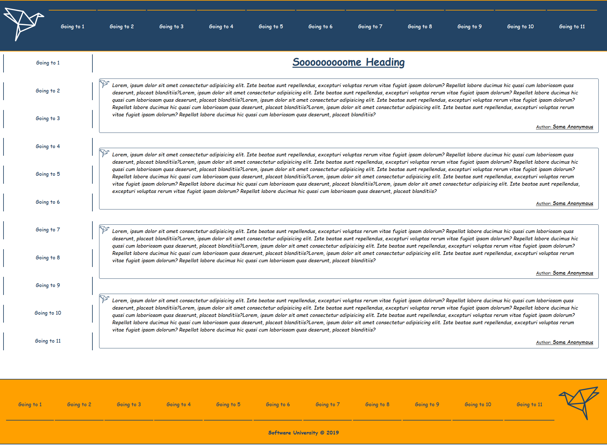
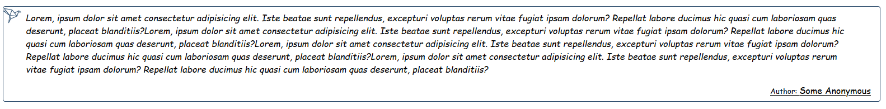

# Origami Platform Workshop - Part 1

## 1\. Task Requirements

Use the provided **styles** to **create** a page with the following structure:

#### Navigation

#### Link

Each **Link Component** inside the header navigation should have the class name called **listItem** and the following structure

#### Aside

**Aside Component** should have \"**Aside**\" **class name**

#### Link

Each **Link Component** inside the aside navigation should have the class name called **listItem** and the following structure

#### Main

**Main** Component should have \"**Main\"** class name

#### Posts

**Posts** **component** should have \"**Posts**\" **class** **name**

#### Post

Each **Post Component** should have \"**Post**\" **class** **name**

Here is an example of one post component structure

Each **post** **component** is consisting of:

-   **Image** which is provided with the resources (the origami logo)

-   **Paragraph** with class name \"**description**\" which holds the current post description

-   **Div** **wrapper** for **span** which holds the current **post** **author**

**Try to separate the styles and the structure for (div wrapper) into another component called postAuthor or something like that.**

### Footer

**Footer** **component** should have \"**Footer**\" **class name**

#### Link

Each **Link Component** inside the footer navigation should have the class name called **listItem** and the following structure

## 2\. Database

Use the provided **REST API** build with **Express.js** and **MongoDB**

You can download **MongoDB** from [here](https://www.mongodb.com/download-center/community) and use a GUI with it like [Robo3T](https://robomongo.org/)

Each **Post** should have a **post description (string)** and a **post author (objectId)**.

Use **Postman** to create some entities or use **\"mongoimport\"** to
[import the data](https://stackoverflow.com/questions/15171622/mongoimport-of-json-file) that is provided to you.

## 3\. Initialize the App

Use the **\"npx create-react-app origami-workshop\"** command to create
a new React App.

If you face any trouble, check the following link:\
<https://github.com/facebook/create-react-app#create-react-app-->

#### Server

Use the provided server to fetch all posts and list them into the
front-end. The server will listen on port **9999** by default. In order
to fetch the data that you fed in the database you will have to make a
**get request** on **\'localhost:9999/api/origami/\'**

## 4\. Implementation

Make sure you assign every **required** **attribute** to each Component,
so the result is the same as the example above. If at some point
something is not right, be free to check the structure picture for each
element or directly to the provided CSS. Also be free to extends the
workshop as much as you want!
