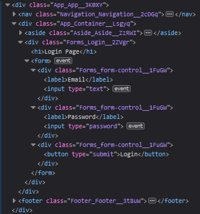
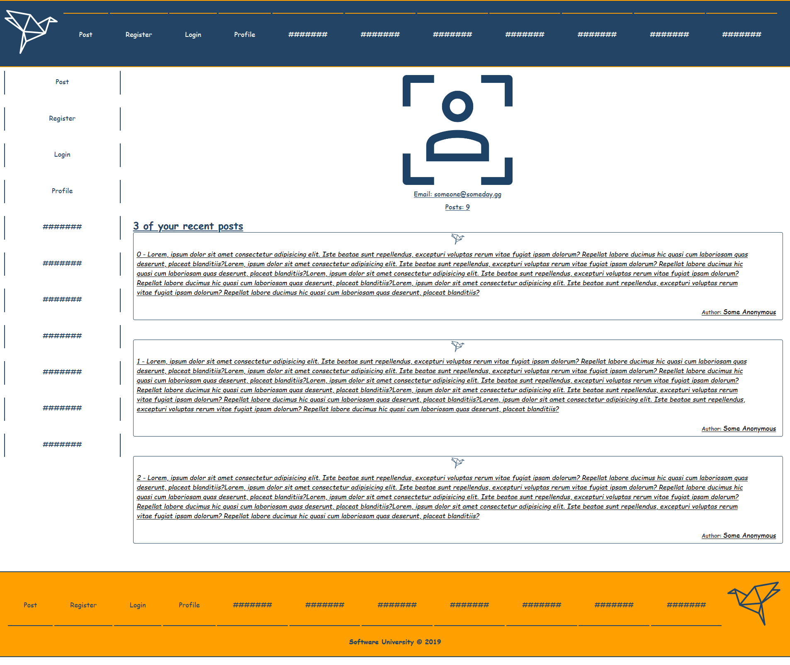
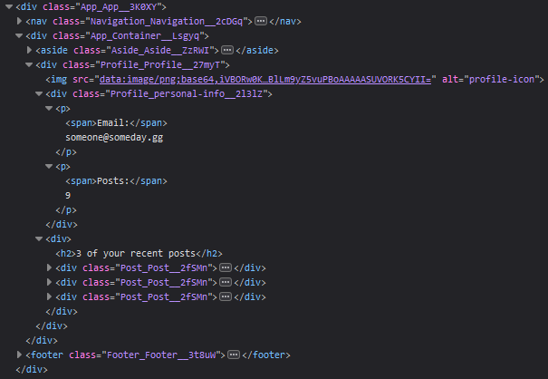

# Origami Platform Workshop - Part 2

## 1\. Overview

#### First Path

**Publications view**, which shows all created posts ever.

#### Second Path

**Share your thoughts view,** where the user can see the textarea where the post will be created and the last 3 posts ever.

#### Third Path

**Register** **view**, where the users will be registered.

#### Fourth Path

**Login** **view**, where the users will be logged.

Use these **styles** for **Login** and **Register** **views**

#### Fifth Path

**Profile** **view**, where the user can see his own account information and his top 3 recent posts.

#### Sixth Path

**404 view for any invalid path.**

## 2\. Database

Use the provided **REST API** build with **Express.js** and **MongoDB**

You can download **MongoDB** from [here](https://www.mongodb.com/download-center/community) and use a GUI with it like [Robo3T](https://robomongo.org/)

Each **Post** should have a **post description (string)** and a **post author (objectId)**.

Use **Postman** to create some entities or use **\"mongoimport\"** to [import the data](https://stackoverflow.com/questions/15171622/mongoimport-of-json-file) that is provided to you.

#### Server

Use the provided server to fetch all posts and list them into the
front-end. The server will listen on port **9999** by default. In order
to fetch the data that you fed in the database you will have to make a
**get request** on **\'localhost:9999/api/origami/\'**

## 3\. Implementation

Make sure you assign every **required** **attribute** to each Component,
so the result is the same as the example above. If at some point
something is not right, be free to check the structure picture for each
element or directly to the provided CSS. **[Also be free to extends the
workshop as much as you want!]{.underline}**
