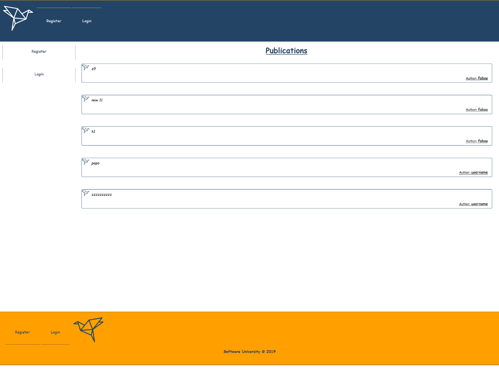
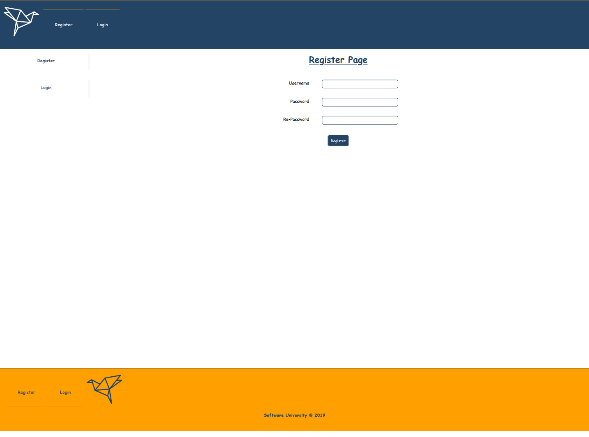
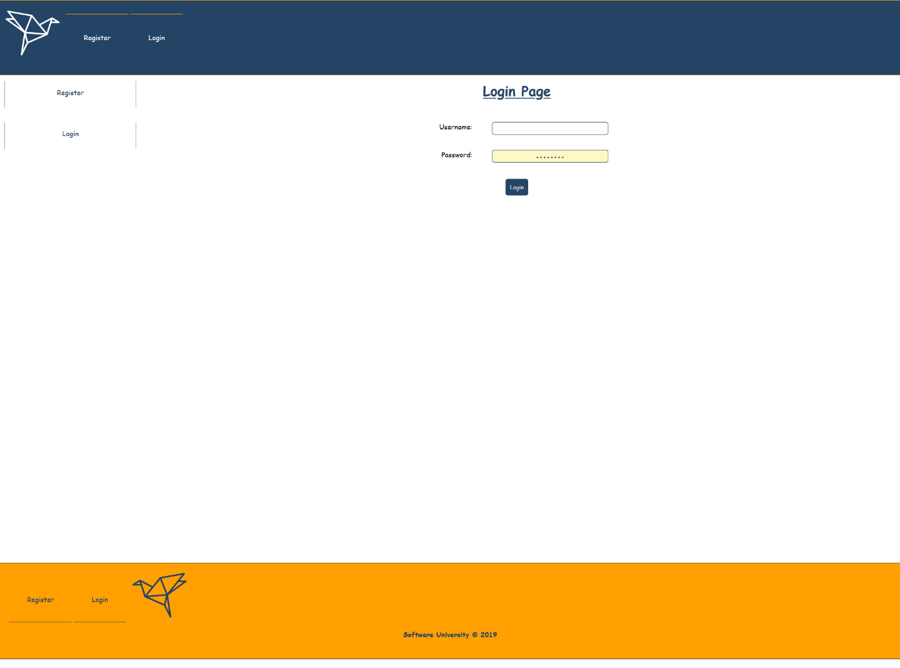
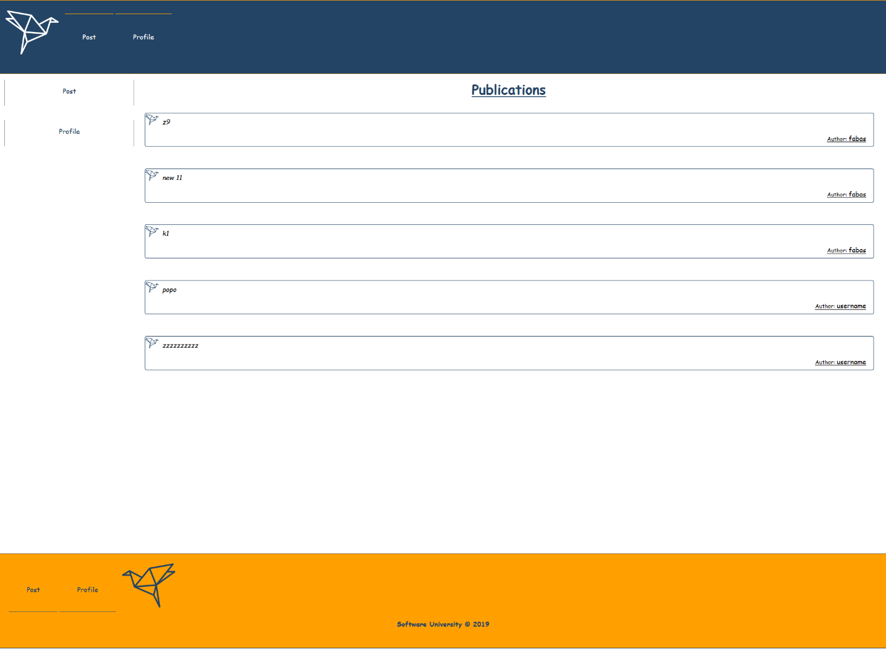
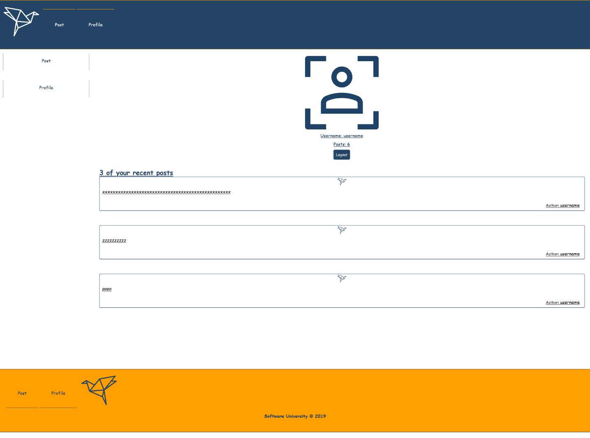
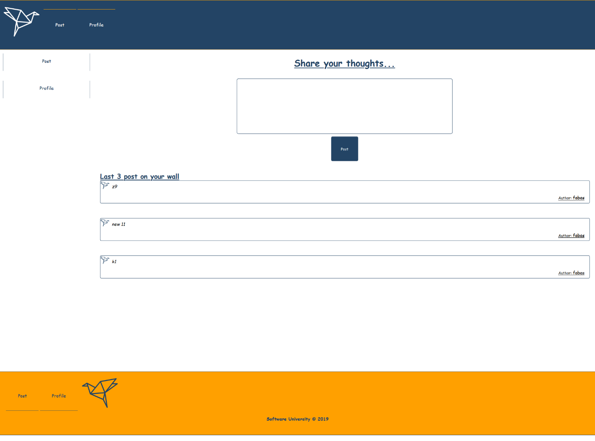

# Origami Platform Workshop - Part 3

## 1\. Overview

Now it\'s time to implement **private** and **public parts** for our app. And to make the already existing **forms** to **work**.

### Public Parts

This parts can be accessed by any **guest user** (not logged in)

#### Publications

Publications view **shows all created posts** from the database.

#### Register

**Register form** should make a **post request** with the given data to the **API** and create a user

#### Login

Login form should also make a **post request** with the given data to the **API**, and if the **provided data** is **valid,** you should authorize the user (**can see the public parts**).

### Private Parts

Private parts should be accessed only by **logged in users** (**authorized with jwt token from the given API**)

#### Publications

Publications view **shows all created posts** from the database

#### Profile

Profile page **shows** information about the currently logged-in user. This is his **username**, **total posts count** and the **top 3 of his recent posts**. Also, you should show a [**Logout**] **button**, which can be pressed and clear the **provided jwt** token from the API and redirect the user to the **publications page**.

#### Post

In **Post view,** the form with the textarea should be able to make a **post request** with the given **post** **description**. If that happens, the user should be redirected to the **publication view**.

Also, this view, show the **top 3 recent posts** from the database.

## 2\. Database

Use the provided **REST API** build with **Express.js** and **MongoDB**

### Server

The server will listen on port **9999** by default and **recognize** the following **paths** with **methods**:

-   **Get request - \'localhost:9999/api/origami/\'**

-   **Post request - \'localhost:9999/api/origami/\'**

-   **Post request - \'localhost:9999/api/user/register\'**

-   **Post request - \'localhost:9999/api/user/login\'**

-   **Post request - \'localhost:9999/api/user/logout**
